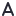
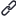
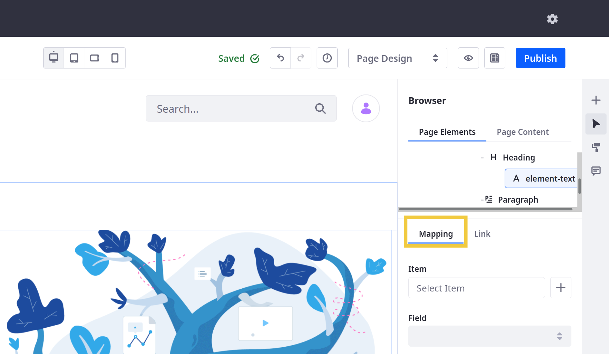
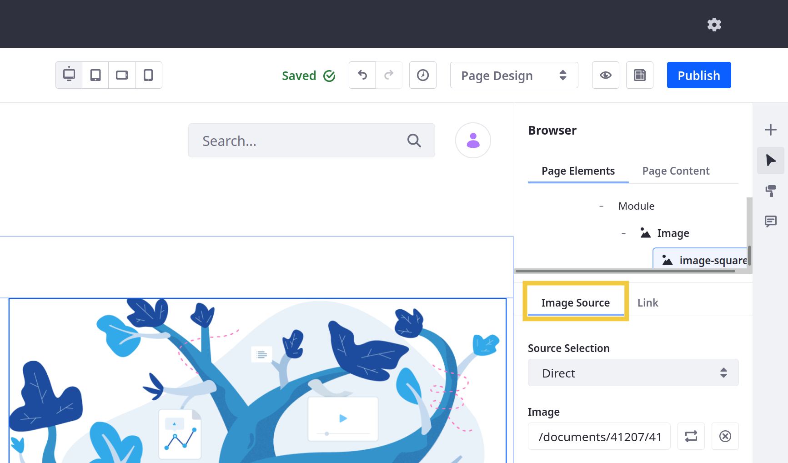
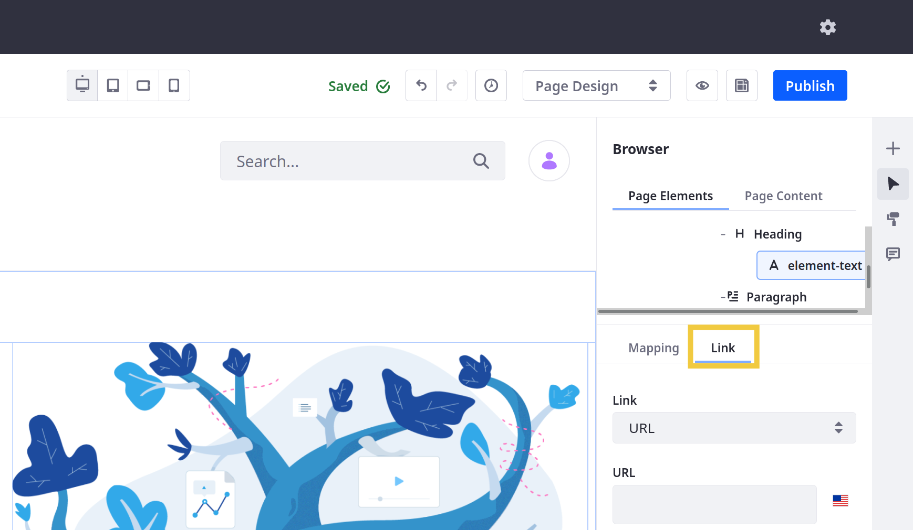

# Fragment Sub-Elements Reference

In addition to [General](./general-settings-reference.md) and [Style](./styles-reference.md) settings, many Fragments include sub-elements with their own configuration options. To access these options, begin editing a Page or Template (), click the desired *Fragment*, and select one of its sub-elements in the Browser () sidebar menu.

Available options depend on the sub-element's type and are organized into tabs: Mapping, Image Source, and Link.

| Sub-Element Type | [Mapping Tab](#mapping-settings) | [Image Source Tab](#image-source-settings) | [Link Tab](#link-settings) |
| :--- | :--- | :--- | :--- |
| Simple Text Element () | &#10004; | | &#10004; |
| Link Element () | &#10004; | | &#10004; |
| Rich Text Element ( | &#10004; | | |
| HTML Element () | &#10004; | | |
| Image Element () | | &#10004; | &#10004; |
<!--TASK: Confirm naming for sub-element types. Specifically, should I rename "HTML Element" to "Code Element"? -->

The following reference lists available options in each tab.

## Mapping Settings

Map the selected element to a field in an existing asset.

| Field | Description |
| :--- | :--- |
| Item  | Select an asset from Documents and Media, Web Content, Blogs, or Categories. The selected asset provides fields for mapping. |
| Field | Map the element to the desired field from the selected item. |

## Image Source Settings

Configure the image displayed in the selected image element.

| Field | Description |
| :--- | :--- |
| Source Selection | Select whether the image element uses *Direct* or *Mapping* for its source. When using Direct, you can select an image from Documents and Media or enter an image URL. When using Mapping, you can select an asset from Documents and Media, Web Content, Blogs, or Categories, and then map the image element to a field from the selected asset. |
| Image (*Direct*) | Select the desired image from the Document Library or enter an image URL. |
| Resolution (*Direct*) | Select a resolution for the image. By default, Liferay includes the following options: Auto, Thumbnail (300px), or Preview (1000px). However, you can use Adaptive Media to generate alternative resolutions. <!--TASK: Link to article when finished.--> |
| Image Description (*Direct*) | Enter a localizable image description. To set a description for other languages, first switch the language for the Page or Template via the editing bar. Then, enter the desired text. See [Localizing Fragment Configuration Fields](./localizing-fragment-configuration-fields.md) for more information. |
| Item (*Mapping*) | Select an asset from Documents and Media, Web Content, Blogs, or Categories. The selected asset provides fields for mapping. |
| Field (*Mapping*) | Map the image element to the desired field from the selected item. |

## Link Settings

Set a URL, Page reference, or asset mapping to add a clickable link to the selected element.

| Field | Description |
| :--- | :--- |
| Link | Determine whether the field uses a *URL*, *Page*, or *Mapped URL*. |
| URL (*URL*) | Enter a localizable URL for the element. To set a URL for other languages, first switch the language for the Page or Template via the editing bar. Then, enter the desired URL. See [Localizing Fragment Configuration Fields](./localizing-fragment-configuration-fields.md) for more information. |
| Page (*Page*) | Select a Liferay Page for the element. |
| Item (*Mapped*) | Select an asset from Documents and Media, Web Content, Blogs, or Categories. The selected asset provides fields for mapping. |
| Field (*Mapped*) | Map the element to an available URL field from the item. Selecting a valid field automatically populates the URL field. |
| URL (*Mapped*) | This field is auto-populated by the mapped URL field. |
| Open in New Tab | Determine whether clicking the link opens a new tab. |

## Additional Information

* [Configuring Fragments](../configuring-fragments.md)
* [General Settings Reference](./general-settings-reference.md)
* [Fragment Styles Reference](./styles-reference.md)
