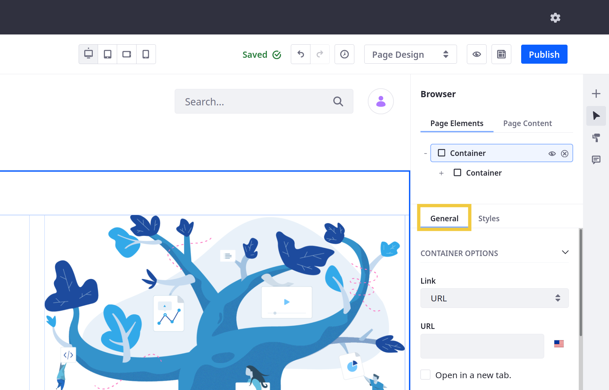

# General Settings Reference

Nearly all Fragments include General settings. Some of these options are standard (e.g., visibility and frame), while others are unique to each Fragment. The following reference only includes Fragments with General settings.

```{note}
HTML, Paragraph, Separator, and Social do not have General settings. 
```

Follow these steps to access a Fragment's *General* menu:

1. Begin editing a Page or Template that supports Fragments.

1. Open the *Browser* panel () in the sidebar menu and select the desired *Fragment* under Page Elements.

   Alternatively, you can click on the desired Fragment in the Page or Template to open this menu.

1. Click the *General* tab in the Page Elements side menu.



## Standard General Settings

### Hide Fragment

| Field | Description |
| :--- | :--- |
| Hide Fragment | Check the box to hide the Fragment for different viewports. See [Configuring Fragment Visibility](../configuring-fragment-visibility.md) to learn more about how this setting interacts with Page viewports. |

### Frame
<!--CONFIRM-->
| Field | Description |
| :--- | :--- |
| Width/Height | Determine the default height and width of the Fragment's frame. |
| Min Width/Max Width | Determine the min and max width for the frame when displayed in different viewports. |
| Min Height/Max Height | Determine the min and max height for the frame when displayed in different viewports. |
| Overflow | Determine whether to allow Fragment content to overflow its frame. By default, Fragment content is restricted to its frame. If overflow is allowed, you can determine how it is displayed (e.g., Scroll). |

## Container Options

| Field | Description |
| :--- | :--- |
| Link | Determine if the Container links to a URL, Page, or Mapped URL. |
| URL (*URL*) | Enter a localizable URL for the Container. To set a URL for other languages, first switch the language for the Page or Template via the editing bar. Then, enter the desired URL. |
| Page (*Page*) | Select a Liferay Page for the Container. |
| Item (*Mapped*) | Select an item from Documents and Media, Web Content, Blogs, or Categories. The selected item provides fields for mapping. |
| Field (*Mapped*) | Select the URL field you want to map to the Container. Selecting a valid field automatically populates the *URL* field. |
| URL (*Mapped*) | This field is auto-populated with the selected *Field* URL. |
| Open in New Tab | Determine whether the link is opened in a new tab. |
| Content Display | Determine whether the Container's content is displayed in a Block, Flex Row, or Flex Column. |
| Container Width | Determine whether the Container uses a Fluid or Fixed Width. |

## Grid Options

| Field | Description |
| :--- | :--- |
| Number of Modules | Determine the Grid's number of drop zone modules: 1-6. |
| Show Gutter | Add or remove padding between the drop zone modules. |
| Layout | Determine how many drop zone modules are on each row: 1, 2, 3, or 6. Available options depends on the number of modules. |
| Inverse Order (*for 1 Module per Row*) | Check the box to reverse the order of modules. |
| Vertical Alignment | Determine the vertical alignment of the module's content: Top, Middle, or Bottom. |

## Button Options

| Field | Description |
| :--- | :--- |
| Type | Determine the Button's style: Primary, Secondary, Link, Outline Primary, or Outline Secondary. |
| Size | Determine the Button's size: Small, Normal, or Large. |

## Card Options

| Field | Description |
| :--- | :--- |
| Image Size | Determine the image's size: Fit or Original Size. |
<!--CLARIFY: how does this setting relate to the Image Source settings?-->
## Dropdown Options

| Field | Description |
| :--- | :--- |
| Type | Determine the Button's style: Primary, Secondary, Link, Outline Primary, or Outline Secondary. |
| Size | Determine the Button's size: Small, Normal, or Large. |
| Panel Type | Determine the size of the dropdown menu panel: Regular, Full Width, or Mega Menu. |
| Display on Hover | Check the box to determine if the menu panel is displays when a cursor hovers over the button. |
| Keep Panel Open in Edit Mode | Check the box to determine if the panel remains open while editing. |

<!-- See [Using the Dropdown Fragment]() for more information. -->

## External Video Options

| Field | Description |
| :--- | :--- |
| Video | Enter a URL to the desired video or select an External Video Shortcut from Documents and Media.  |
| Width/Height | Determine the embedded video's dimensions. |
| Align | Determine the video's alignment: Left, Center, or Right. |

## Heading Options

| Field | Description |
| :--- | :--- |
| Heading Level | Determine the header's style: H1-H6. |

## Image Options

| Field | Description |
| :--- | :--- |
| Image Size | Determine the image's size: Fit or Original Size. |
<!--CLARIFY: how does this setting relate to the Image Source settings?-->

## Separator Options

| Field | Description |
| :--- | :--- |
| Bottom Spacing | Determine how much padding is added after the Separator: 1-5. |
| Separator Color | Select a color for the Separator. |
| Clear | Click Clear to remove the selected color. |
<!-- For Liferay DXP 7.4 U9+, these settings are listed under the [Styles](./styles-reference.md) tab.-->
## Slider Options

| Field | Description |
| :--- | :--- |
| Number of Slides | Determine how many slides are included in the Fragment. |

```{tip}
There is no limit to the number of slides you can add to a Slider. However, high numbers of slides can negatively impact performance.
```

## Spacer Options

| Field | Description |
| :--- | :--- |
| Height | Determine the thickness of the Spacer: 1-5. |

## Tabs Options

| Field | Description |
| :--- | :--- |
| Number of Tabs | Determine how many tabs are included in the Fragment. |

```{tip}
There is no limit to the number of tabs you can add to a Tabs Fragment. However, a high number of tabs can negatively impact performance.
```

## Video URL Options

| Field | Description |
| :--- | :--- |
| URL | Enter a valid video URL. |
| Autoplay | Determine if the video plays automatically when the page is loaded. |
| Loop | Determine if the video restarts once it's finished. |
| Mute | Determine if the video is muted by default. |
| Hide Controls | Determine if users can access video controls. |
| Width/Height | Determine the embedded video's dimensions. |
| Align | Determine the video's alignment: Left, Center, or Right. |

## Content Display Options

| Field | Description |
| :--- | :--- |
| Item | Select an item to display from Documents and Media, Web Content, Blogs, or Categories. |
| Template | Select a template to determine how the item is displayed. Available templates depend on the selected content type. |

## Content Flags Options

| Field | Description |
| :--- | :--- |
| Item | Select the item you want to associate with the flag from Documents and Media, Web Content, Blogs, or Categories. |
| Message | Enter a message to display in the UI with the content flag. |

## Collection Filter Options

| Field | Description |
| :--- | :--- |
| Target Collection | Select a Collection to use with the filter. |
| Filter | Determine the filter's type: Keywords or Category. When using Category, end users can select from predefined filter categories. When using Keywords, they can manually enter their own filter values. |
| Source (*Category*) | Select the Vocabulary or Category used for filtering the target Collection. |
| Single Selection (*Category*) | Determine whether end users can apply only one or more filters to the Collection.  |
| Include Search Field (*Category*) | Determine whether to include a field for end users to search available filter values. |
| Show Label | Check to show a label for the filter in the UI. |
| Label Text | Enter localizable text for the label. To set label text for another language, first switch the language for the Page or Template via the editing bar. Then, enter the desired text. See [Localizing Fragment Configuration Fields](./localizing-fragment-configuration-fields.md) for more information. |

## Applied Filters Options

| Field | Description |
| :--- | :--- |
| Target Collection | Select a Collection to use with the Fragment. This Fragment displays all filters applied to the selected Collection. |
| Include Clear Filters Option | Determine whether to include the Clear Filters option to end users. |

```{note}
This fragment is only displayed when a filter is applied to the target Collection.
```

## Content Ratings Options

| Field | Description |
| :--- | :--- |
| Item | Select the item you want to associate with the Fragment from Documents and Media, Web Content, Blogs, or Categories. |

## Collection Display Options

| Field | Description |
| :--- | :--- |
| Collection | Select a Collection or Collection Provider to display in the Fragment. Once selected, you can click the Actions button to access additional options. Available actions depend on the selected Collection or Collection Provider. |
| List Style | Select from available styles to determine how items are listed. Available styles depend on the selected Collection or Collection Provider. |
| Layout (*Grid*) | Determine how many columns the Collection list has: 1-6. |
| List Item Style (*Templates*) | Select from available styles to determine how each entry is displayed. Available styles depend on the selected Collection asset type. |
| Pagination | Determine whether to use pagination for the Collection. When enabled, you can select from two style options: Numeric or Simple. |
| Display All Collection Items | Determine whether to display all items in the selected Collection or Collection Provider. |
| Maximum Number of Items | Set the maximum number of items to display from the selected Collection or Collection Provider. |
| Maximum Number of Items per Page | Determine the number of items included in each Fragment page. This value cannot exceed 200. |

## Additional Information

* [Configuring Fragments](../configuring-fragments.md)
* [Fragment Styles Reference](./styles-reference.md)
* [Fragment Sub-Elements Reference](./fragment-sub-elements-reference.md)
