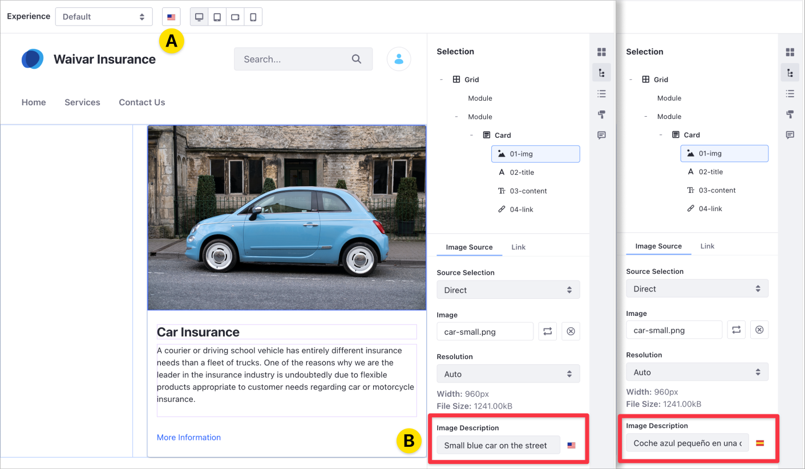
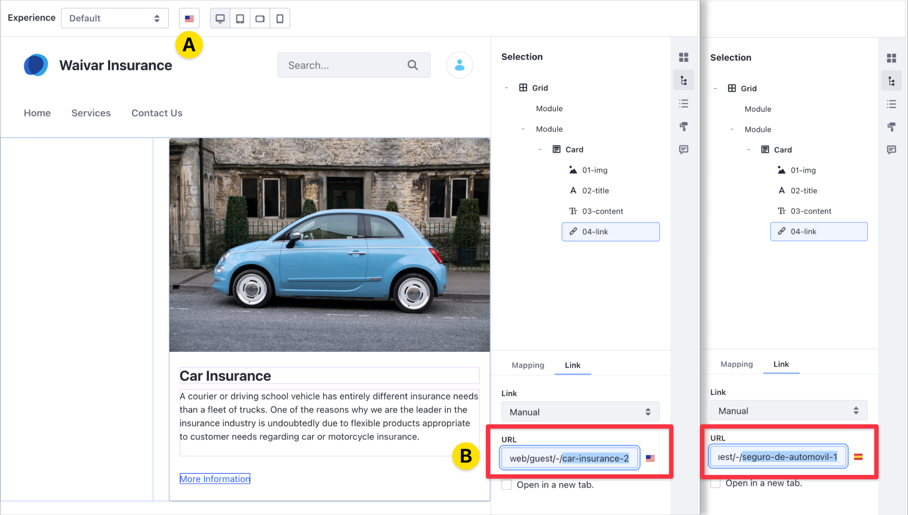

# Localizing Fragment Configuration Fields

> Available: Liferay DXP/Portal 7.4+

When using Liferay Fragments, you can localize the following Fragment configuration fields to match your target audience's language:

* [Image Description (*alt text*)](#localizing-alternative-text-for-images)
* [Editable URLs](#localizing-editable-urls)
<!-- * [Collection Filter Label Text](#localizing-collection-filter-label-text) -->

During fragment development, you can use the `localizable` attribute to make a fragment's configuration field localizable. For more information, read the [Fragment Specific Tags and Attributes Reference](../../../../developer-guide/reference/fragments/fragment-specific-tags-reference.md).

## Localizing Image Descriptions

You can add localization in different languages for the image description (also known as *alternative text* or *alt text*) in built-in and custom Fragments. When you change the target language for your Content Page using the language selector in the editor toolbar (A), you can edit the Image Description, adapting the text for the target language (B).



```{tip}
Localizable fields show a flag icon next to their Image Descriptions. 
```

If the Image Description doesn't have a translation, the description shows the default Content Page language.

## Localizing Editable URLs

When you localize a URL or link in your Content Page, you can redirect to different URLs and content, based on the target language. When you change the target language for your Content Page using the language selector in the editor toolbar (A), you can update the URL to the link of your choice (B).



You can localize links you enter manually and links from a content field. If the link doesn't have a translation, the active URL is the one for the default Content Page language.

<!--TASK: explain.
## Localizing Collection Filter Label Text -->

## Additional Information

- [Using Content Pages](../../../using-content-pages.md)
- [Content Page Editor UI Reference](../../../using-content-pages/content-page-editor-ui-reference.md)
- [Using Fragments](../../using-fragments.md)
