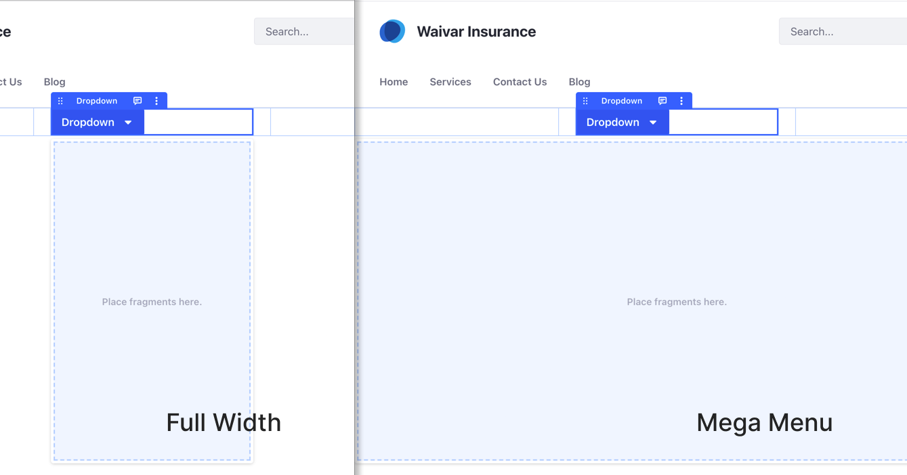

# Creating Dropdown Menus with Fragments

> Available: Liferay DXP/Portal 7.4+.

Liferay provides the Dropdown Fragment to create advanced drop-down menus (A). With it, you can define drop zones for additional Page Fragments and widgets. These elements are then displayed to end users when they click on or hover over the Dropdown fragment.


The following table lists the Dropdown Fragment's General options (B):

| Option | Description |
| :--- | :--- |
| *Type* | Controls the Dropdown Fragment style. |
| *Size* | Sets the Dropdown Fragment size. |
| *Panel Type* | Defines the drop zone size:</br><ul><li>*Regular:* Standard drop zone size.</li><li>*Full Width:* The drop zone size corresponds to the Module's width containing the Fragment.</li><li>*Mega Menu:* The drop zone size corresponds to the Page's width.</li></ul> |
| *Display on Hover* | When you check this option, the Dropdown Fragment opens on mouse-over. |
| *Keep Panel Open in Edit Mode* | Check this option to keep the drop-zone open while you edit the Dropdown Fragment content. |



```{tip}
Place the Dropdown Fragment inside a Grid Fragment to observe the differences between the *Full Width* and *Mega Menu* panel types.
```


## Additional Information

* [Using Fragments](../using-fragments.md)
* [Configuring Fragments](./configuring-fragments.md)
* [Default Fragments Reference](./default-fragments-reference.md)
