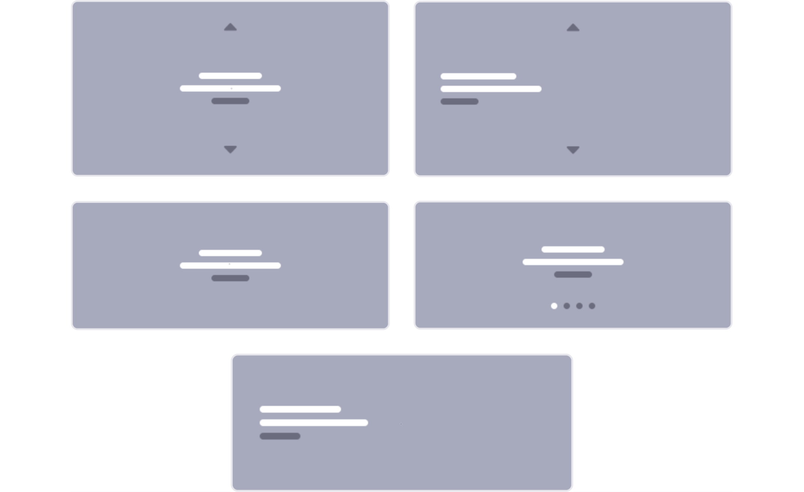
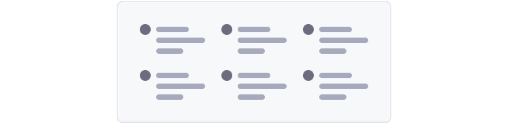
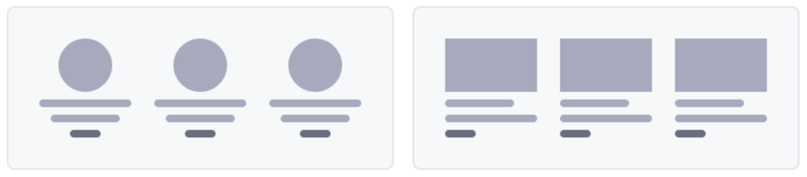
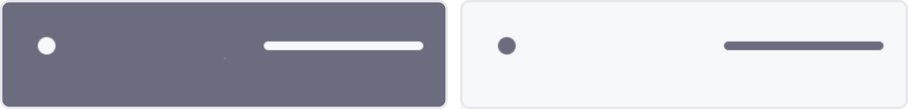

# Default Fragments Reference

Liferay provides a variety of Fragments out-of-the-box, so you can start building your solution right away. To view available fragments, begin editing a Content Page or Page Template. While editing, open the *Fragment and Widgets* tab () in the editing Sidebar Menu.

Fragments are organized into the following sets:

* [Layout Elements](#layout-elements)
* [Basic Components](#basic-components)
* [Content Display](#content-display)
* [Cookie Banner](#cookie-banner)
* [Featured Content](#featured-content)
* [Footers](#footers)
* [Navigation Bars](#navigation-bars)
* [Menu Displays](#menu-display)

```{note}
Available configuration options vary by Fragment and Fragment sub-element. See [Configuring Fragments](./configuring-fragments.md) for more information.
```

## Layout Elements

> Available: Liferay Portal 7.3 GA2+; previously called Layouts with *panels* and *rows*.

*Layout Elements* define drop zones that you can use to design Page and Template layouts. By Default, Liferay includes two Layout Elements: *Containers* and *Grids*.

| Fragment | Description |
| :--- | :--- |
| Container | Adds a configurable drop zone. |
| Grid | Adds multiple drop zone modules. These modules can be configured and arranged vertically or horizontally. |

## Basic Components

These are simple design elements that add basic functionality to a page. Examples include buttons, headings, and tabs. With these Components, you can build your page piece by piece. DXP includes the following Basic Components.

| Fragment | Description |
| :--- | :--- |
| Button | Adds a [link element](./configuring-fragments/fragment-sub-elements-reference.md) with five available button types: Primary, Secondary, Link, Outline Primary, and Outline Secondary. |
| Card | Adds [image](./configuring-fragments/fragment-sub-elements-reference.md), [rich text](./configuring-fragments/fragment-sub-elements-reference.md), and [link](./configuring-fragments/fragment-sub-elements-reference.md) elements arranged as a display card. |
| Dropdown (Available 7.4+) | Adds a [simple text element](./configuring-fragments/fragment-sub-elements-reference.md) and drop zone. You can drag-and-drop other Fragments and widgets into the drop zone to create an advanced drop-down menu. |
| External Video (Available 7.4+) | Embeds an external video in a Page or Template. Supported video sources include YouTube, Facebook, Twitch, Vimeo, and videos stored in Documents and Media. See [Embedding Videos](../../../../content-authoring-and-management/documents-and-media/videos/embedding-videos-into-liferay-assets-and-pages.md) for more information. |
| Heading | Adds a [simple text element](./configuring-fragments/fragment-sub-elements-reference.md) that can be configured to use H1-H6 style. |
| HTML | Adds an editable [HTML element](./configuring-fragments/fragment-sub-elements-reference.md). Double-clicking the element opens a modal window where you can edit its content using HTML syntax. |
| Image | Adds a configurable [image element](./configuring-fragments/fragment-sub-elements-reference.md). When configuring, determine whether to use the image's original size, or adjust it to fit its context. |
| Paragraph | Adds a [rich text element](./configuring-fragments/fragment-sub-elements-reference.md). When editing, highlight the fragment's text to access additional formatting options. |
| Separator | Adds a horizontal line between Page elements. You can configure its spacing and color. |
| Slider | Adds multiple [images](./configuring-fragments/fragment-sub-elements-reference.md) with [rich text](./configuring-fragments/fragment-sub-elements-reference.md) overlay that are grouped into slides. Users can manually cycle through each slide. |
| Social | Adds [image elements](./configuring-fragments/fragment-sub-elements-reference.md) with Facebook, Twitter, and LinkedIn icons, which you can link to pages on each platform. |
| Spacer | Adds a horizontal blank space between Fragments on a page. You can configure its height. |
| Tabs | Adds multiple tabs with [simple text elements](./configuring-fragments/fragment-sub-elements-reference.md) and individual drop zones for adding widgets and other Fragments. |
| Video URL (previously *Video Fragment*) | Embeds a video from Youtube or Documents and Media in a Page or Template. You can set the video to autoplay, loop, or mute. You can also hide video controls from end users. See [Embedding Videos](../../../../content-authoring-and-management/documents-and-media/videos/embedding-videos-into-liferay-assets-and-pages.md) for more information. |

## Content Display

> Available: Liferay DXP/Portal 7.3+

Use *Content Display* Fragments to display Site content individually or as part of a Collection. You can also add Page elements for rating or flagging Page content. DXP includes the following Content Display Fragments.

| Fragment | Description |
| :--- | :--- |
| Content Display | Displays a single content item from Documents and Media, Web Content, Blogs, or Categories. Available configuration options depend on the selected content type. |
| Content Flags | Adds an element for flagging a content item. |
| Content Ratings | Adds an element for rating a content item. |
| Collection Filter (Available 7.4+) | Adds an element for filtering a Collection Display using a Vocabulary or Category. |
| Applied Filters (Available 7.4+) | Adds an element for displaying and managing filters applied to a Collection Display. |
| Collection Display | Displays manually and dynamically defined Collections, as well as Collections defined by a Collection Provider. You can configure whether the Collection is displayed in a *grid*, or with a list *template* (i.e., bordered, bulleted, inline, numbered, and unstyled). See [Displaying Collections](../../../displaying-content/additional-content-display-options/displaying-collections.md) for more information. |

## Cookie Banner

> Available Liferay DXP/Portal 7.4+
<!--TASK: Add more details.-->
| Fragment | Description |
| :--- | :--- |
| Cookie Banner Simple | Adds [rich text](./configuring-fragments/fragment-sub-elements-reference.md) and [link](./configuring-fragments/fragment-sub-elements-reference.md) elements for accepting site cookies. |

## Featured Content

Featured Content Fragments are complex page elements composed of multiple components. To preview a Fragment's layout, switch to Card View in the Fragment's and Widgets Panel. DXP includes the following Featured Content Fragments.

```{note}
For Liferay DXP/Portal 7.3, you can preview layouts by hovering over each Fragment's *Information* icon ().
```

### Banners

Use *Banner* Fragments to add text and link elements to a Content Page for creating CTA (Call to Action) banners. DXP includes the following layouts.



### Features

Use the *Features* Fragment to add text, images, and link elements to a Content Page for promoting key features. DXP includes the following layouts.



### Highlights

Use the *Highlights* Fragment to add image, text, and link elements to a Content Page for highlighting. DXP provides the following layouts.



## Footers

> Available: Liferay DXP 7.3+; previously included in the *Sections* panel.

Use *Footer* Fragments to add a custom footer to [Master Page Templates](../../defining-headers-and-footers/master-page-templates.md) for Content Pages. Each footer includes a navigation menu, sign-in link, image element, and copyright text. DXP includes the following layouts for Footer Fragments:



## Navigation Bars

> Available: Liferay DXP 7.3+; previously included in the *Sections* panel.

Use *Navigation Bar* Fragments to add a custom header to [Master Page Templates](../../defining-headers-and-footers/master-page-templates.md) for Content Pages. Each navigation bar includes a navigation menu, sign-in link, and image element for your logo. DXP includes the following layouts for Navigation Bar Fragments:


## Menu Display

> Available: Liferay DXP/Portal 7.4+.
<!--TASK: Revisit -->
Using the Menu Display Fragment, you can create a navigation menu anywhere in your Content Page. This navigation menu is based on your Site's Public or Private Pages hierarchy, or any other hierarchy you define using Liferay DXP  [Navigation Menus](../../../site-navigation/using-the-navigation-menus-application.md). To learn more about how to configure the Menu Display Fragment for your Site navigation, read [Managing Site Navigation](../../../site-navigation/managing-site-navigation.md).

## Additional Information

* [Using Content Pages](../../using-content-pages.md)
* [Content Page Editor UI Reference](../../using-content-pages/content-page-editor-ui-reference.md)
* [Using Fragments](../using-fragments.md)
* [Managing Site Navigation](../../../site-navigation/managing-site-navigation.md)
