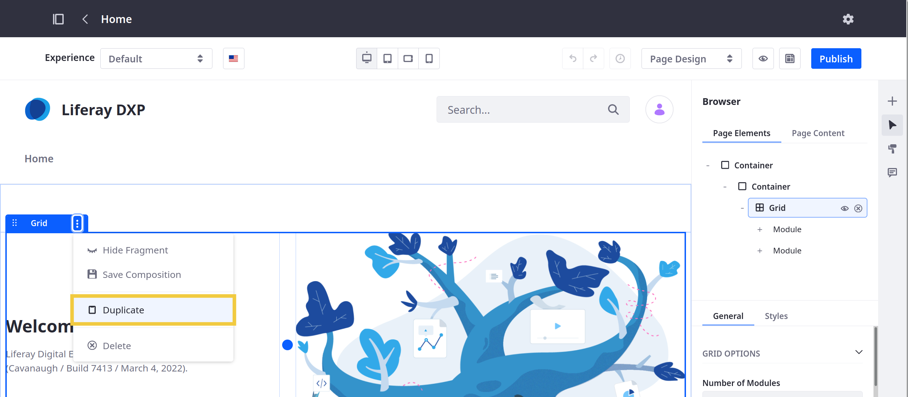

# Duplicating Fragments

When building a Page or Template with Fragments, you can duplicate configured Fragments to save time. A duplicated Fragment includes the original Fragment's settings, including its mappings and other customizations.

```{tip}
If you want to save Fragment configurations for reuse in other Pages and Templates, you can save them as new Fragments. See [Saving Fragment Compositions](./saving-fragment-compositions.md) for more information.
```

Follow these steps to duplicate a Fragment:

1. Begin editing a Page or Template that supports Page Fragments.

1. Click the *Fragment* you want to duplicate.

1. Click the Fragment's *Actions* button () and select *Duplicate*.

   This immediately creates a duplicate of the Fragment in the Page or Template.

   

```{warning}
Layouts (Sections or Rows) containing instanceable Widgets cannot be duplicated. In this case, a message appears indicating the Widget preventing the duplication.
```

## Additional Information

* [Using Fragments](../using-fragments.md)
* [Configuring Fragments](../using-fragments/configuring-fragments.md)
* [Saving Fragment Compositions](../using-fragments/saving-fragment-compositions.md)
