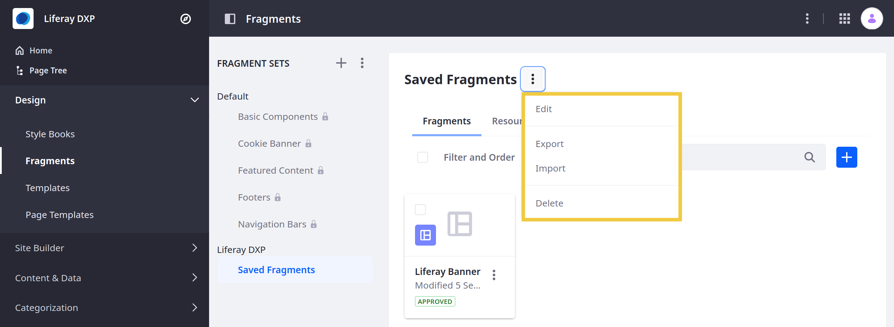
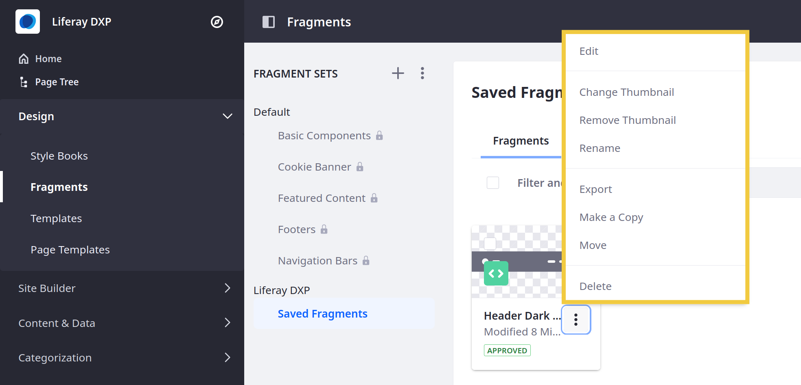
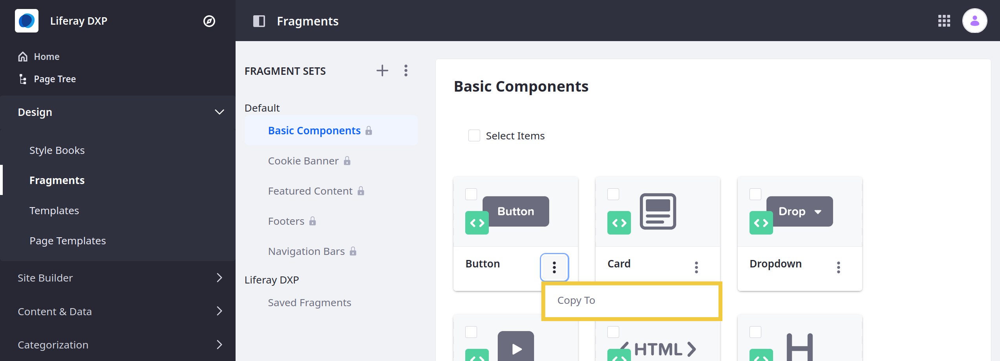

# Managing Fragments

Liferay DXP provides tools for managing Fragments and Fragment Sets in the Liferay UI. With out-of-the-box tools, you can quickly edit Fragment code, export and import Fragments and Sets between Sites, or move and copy Fragments between Sets.

```{note}
For Liferay DXP 7.4+, Fragment Collections are called Fragment Sets in the Liferay UI.
```

## Managing Fragment Sets

Follow these steps to access management options for Fragment Sets:

1. Open the *Site Menu* () and go to *Design* &rarr; *Fragments*.

    ```{note}
    For Liferay DXP/Portal 7.3 and earlier, it's located under *Product Menu* &rarr; *Site Menu* &rarr; *Site Builder* &rarr; *Page Fragments*.
    ```

1. Select the desired Set in the *Fragment Sets* list and click its *Actions* button ().

   

1. Select an action:

   **Edit**: Change the name or description for the Fragment Set.

   **Export**: Download the code for the Set's Fragments as a `.zip` file. This does not export the Fragments with Set data. To export the Fragment Set with its data, click the *Actions* button () for Fragment Sets and select *Export*. Then, check which Fragment Sets to export. Each Set is downloaded in a separate `.zip` file.

   **Import**: Select a `.zip` file to upload to the Set. During import, check *Overwrite Existing Files* to determine whether the imported code overwrites the Set's existing Fragments. You can import Sets created in Liferay DXP, Sets created using external tools, or Page Fragments without a Set. If an imported Fragment has invalid rules, it is automatically saved as a draft.

   **Delete**: Remove the current Fragment Set and all its contents.

```{tip}
Exporting and importing Page Fragments is the preferred way to share Fragment code between Sites.
```

## Managing Individual Page Fragments

Follow these steps to manage individual Page Fragments:

1. Open the *Site Menu* () and go to *Design* &rarr; *Fragments*.

    ```{note}
    For Liferay DXP/Portal 7.3 and earlier, it's located under *Product Menu* &rarr; *Site Menu* &rarr; *Site Builder* &rarr; *Page Fragments*.

1. Select the desired Set in the *Fragment Sets* list.

1. Click the *Actions* button () for the desired Fragment.

   

1. Select an action:

    **Edit**: Modify the Fragment's code and configuration.

    **Rename**: Change the Fragment's name.

    **Move**: Move the Fragment to a different Fragment Set.

    **Make a Copy**: Duplicate the Fragment. Duplicated Fragments share the same name with *(Copy)* appended to the end.

    **Change Thumbnail**: Change the Fragment's thumbnail image.

    **Export**: Download the Fragment as a `.zip` file.

    **Delete**: Remove the Fragment.

```{important}
Users cannot edit or copy [saved Fragment compositions](./saving-fragment-compositions.md).
```

## Copying Default Fragments

> Availability: Liferay DXP 7.2 SP1+ and Liferay Portal 7.2 GA2+.

[Default Page Fragments](./default-fragments-reference.md) cannot be directly edited. However, you can copy default Fragments into a custom Set and edit them there.

Follow these steps:

1. Open the *Site Menu* () and go to *Design* &rarr; *Fragments*.

    ```{note}
    For Liferay DXP/Portal 7.3 and earlier, it's located under *Product Menu* &rarr; *Site Menu* &rarr; *Site Builder* &rarr; *Page Fragments*.

1. Select the desired Default Set in the *Fragment Sets* list.

1. Click the *Actions* button () for the desired Fragment and select *Copy To*.

   

1. Select the Set where you want to copy the default Fragment.

## Additional Information

* [Using Fragments](../using-fragments.md)
* [Configuring Fragments](./configuring-fragments.md)
* [Default Fragments Reference](./default-fragments-reference.md)
