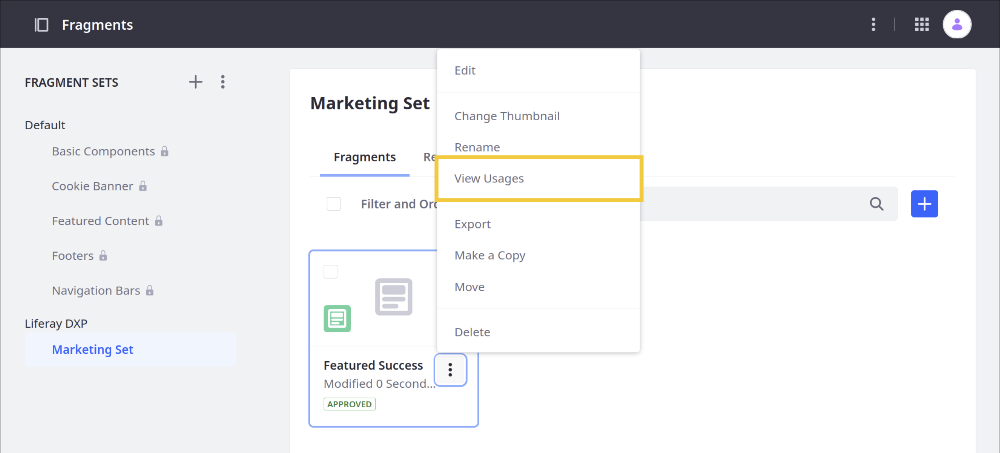
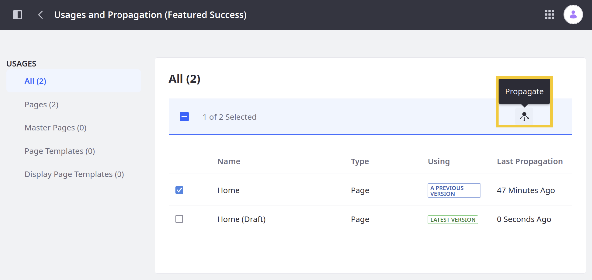
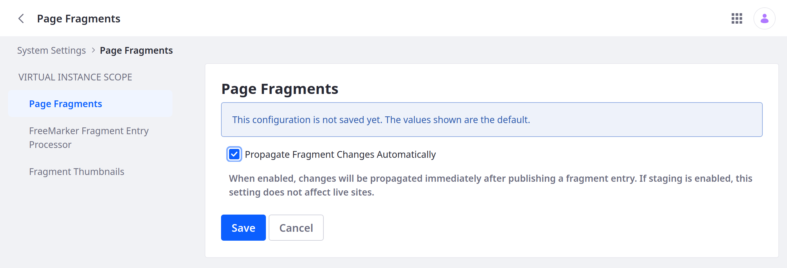

# Propagating Fragment Changes

By default, [changes](../../../developer-guide/developing-page-fragments/using-the-fragments-editor.md) made to a custom Fragment's code are not propagated to deployed instances of the Fragment. Using *Fragment Propagation*, you can propagate changes to Fragment instances in one of two ways:

* [Manually for individual instances of a Fragment](#manually-propagating-changes)
* [Automatically for all instances of a Fragment](#automatically-propagating-changes)

```{important}
To avoid overwriting data, changes made to *editable* fields cannot be directly propagated to the Fragment. However, you can force propagation by changing the Fragment's field ID. When propagated, the field's content is no longer displayed, though you can retrieve its content from the database using the old field ID. To learn more, see [Fragment Specific Tags and Attributes Reference](../../../developer-guide/reference/fragments/fragment-specific-tags-reference.md) in the developer documentation.
```

## Manually Propagating Changes

Follow these steps to manually propagate changes to individual instances of a Fragment:

1. Open the *Site Menu* () and go to *Design* &rarr; *Fragments*.

1. Navigate to the *Fragment Set* for the desired Fragment.

1. Click the *Actions* button () for the desired Fragment and select *View Usages*.

   

   ```{tip}
   If the *View Usages* option is unavailable, the Fragment is not in use.
   ```

1. In the Usages and Propagation page, check the Fragment instances you want to update to the latest version.

   In the table, you can review whether a Page or Template is using a *Previous Version* or the *Latest Version*.

   

1. Click the *Propagate* button () to update the selected instances of the Fragment.

Changes made to non-editable fields are automatically propagated to the selected Fragment instances.

## Automatically Propagating Changes

Follow these steps to automatically propagate changes to all instances of a Fragment:

```{warning}
Automatic propagation can lead to unintended consequences in the production environment, such as typos or inaccurate content being published. Use Automatic propagation only for testing or development purposes.
```

1. Open the *Global Menu* (), click on the *Control Panel* tab, and go to *Configuration* &rarr; *System Settings*.

1. Under the *Content and Data* section, click *Page Fragments*.

1. Check the *Propagate Fragment Changes Automatically* box.

   

1. Click *Save*.

When enabled, changes made to a Fragment's non-editable fields are automatically propagated to all instances of the Fragment.

## Additional Information

* [Using Fragments](../using-fragments.md)
* [Fragment Styles Reference](./configuring-fragments/styles-reference.md)
* [Using Content Pages](../../using-content-pages.md)
