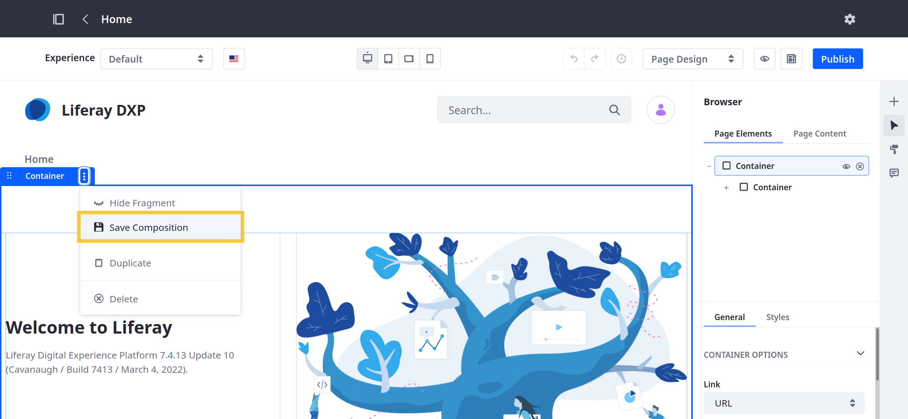
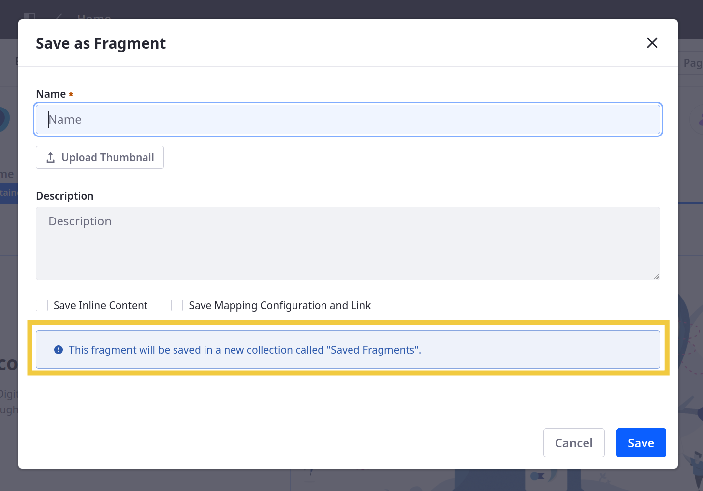
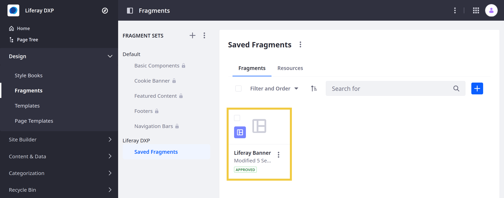
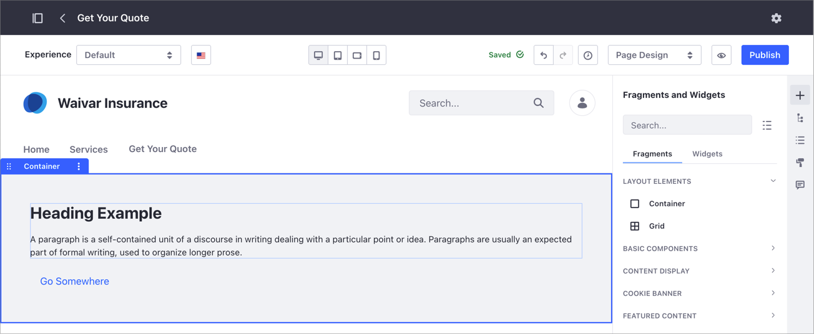
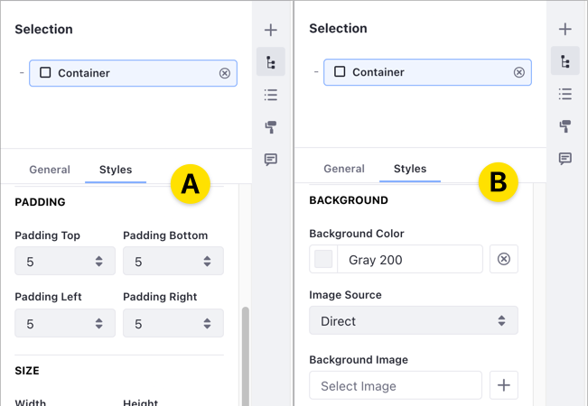
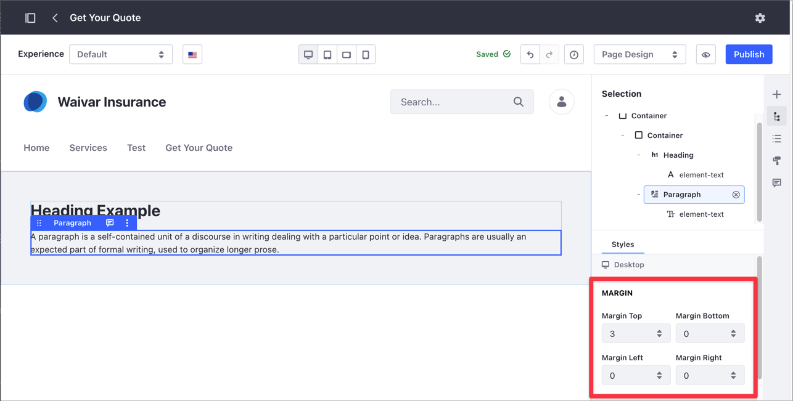
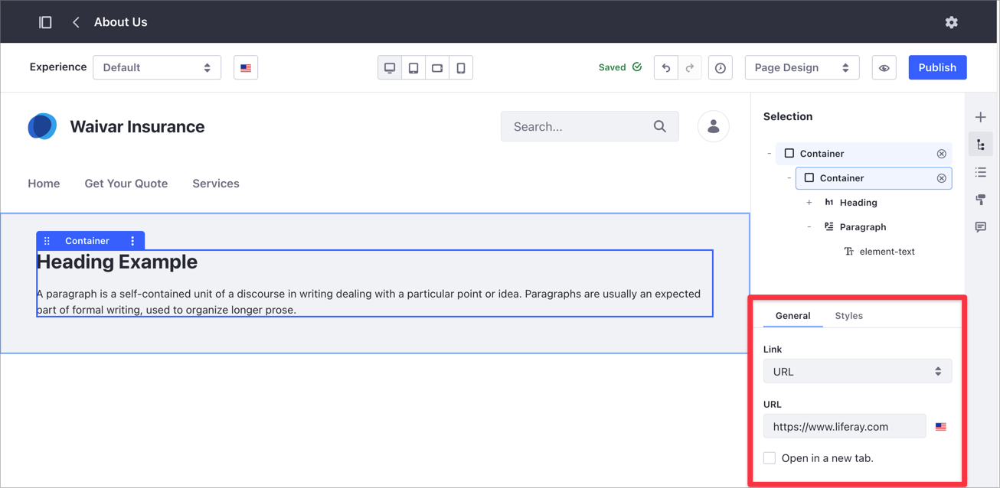
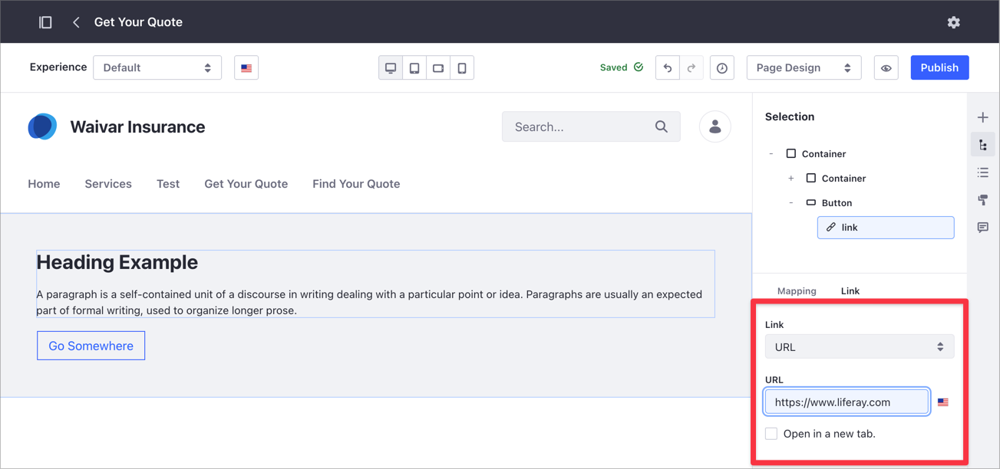
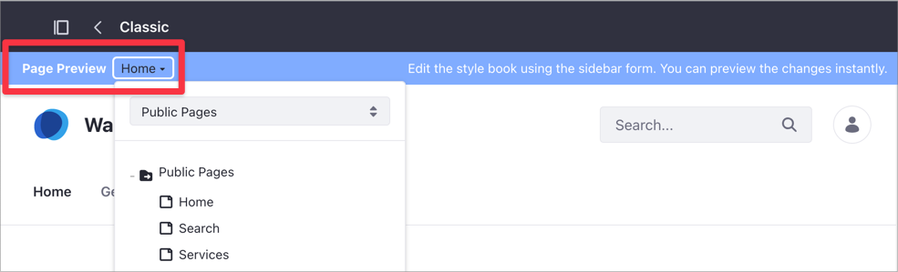
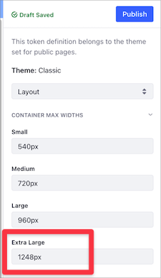

# Saving Fragment Compositions

Layout and composition are the foundation of your Page design. When you get this right, your Pages are easier to read and navigate, resulting in a richer and more consistent user experience. Using the Container and Grid layout elements, you can define drop zones, create a complex composition, and then save your composition as a new Fragment. It can then be reused in other Pages and Templates that support Fragments.

```{tip}
When designing compositions, start with the Container Fragment. Add other elements into this Container for maximum flexibility and layout control.
```

Follow these steps to save a Fragment composition:

1. Begin editing the Page or Template that includes the composition you want to save.

1. Click the desired *Container* or *Grid*.

   Alternatively, open the *Browser* panel () in the sidebar menu and select the desired *Container* or *Grid*.

1. Click the Fragment's *Options* button () and select *Save Composition*.

   

1. Enter a Name for the Fragment.

1. (Optional) Add a *thumbnail* and *description* for the new Fragment.

1. Determine whether to save the composition's *inline content* (e.g., links, text, images)

1. Determine whether to save the composition's [*mapping configuration*](./configuring-fragments/fragment-sub-elements-reference.md#mapping-settings).

1. Select the desired Fragment Set for the new Fragment.

   If no available Fragment Set exists, the composition is saved automatically to a new Set called Saved Fragments.

   

1. Click *Save*.

The saved Fragment composition is listed in the *Fragments and Widgets* panel () under the selected Fragment Set. You can add it to a Page or Template like other Fragments.

To view and manage saved compositions, open the *Site Menu* and go to *Design* &rarr; *Fragments*.

```{note}
In Liferay DXP 7.1 and 7.2, open the *Product Menu*, and go to *Site* → *Site Builder* → *Page Fragments*.
```

From here, you can rename saved compositions, change their thumbnail image, or export them as a `.zip` file, move them between Sets, or delete them. See [Managing Fragments](./managing-fragments.md) for more information.



```{note}
The latest version of the [Liferay Fragments Toolkit](../../../developer-guide/reference/fragments/fragments-toolkit-command-reference.md) supports creation, export/import, and preview of Fragment compositions.
```

## Example: Creating a Banner Composition

This step-by-step example shows you how to create a banner-style composition using nested Container Fragments. The example also illustrates how to save the composition and adjust its settings in the Style Book.



* [Step 1: Creating a New Content Page](#step-1-creating-a-new-content-page).
* [Step 2: Configuring the Container Fragment](#step-2-configuring-the-container-fragment).
* [Step 3: Saving the Fragment Composition](#step-3-saving-the-fragment-composition).
* [Step 4: Setting the Default Container Width in the Style Book](#step-3-setting-the-default-container-width-in-the-style-book).

### Step 1: Creating a New Content Page

1. Under the Site Menu, go to *Site Builder* &rarr; *Pages*.

1. Click *Add* () at the level where you want to add the new Page and select *Add Page*.

1. Select the *Blank* template or one of the existing templates.

1. In the *Add Page* dialog, type your Page's *Name*.

### Step 2: Configuring the Container Fragment

1. From the Content Page sidebar, select *Fragments and Widgets* () and drag and drop the *Container* Fragment over the default drop-zone.

    

1. Click the Container Fragment and in the *Selection* () panel, click *Styles*.

1. Under the Padding area, set the four Padding options to `5` (A).

1. Still in the Styles area, in the *Background Color* selector, select a gray color value of `200` (B).

    

1. Select *Fragments and Widgets* () and drop a new Container Fragment over the existing one. This creates a nested Container composition that appears when you click on the *Selection* () panel.

    

1. From the Fragments and Widgets () panel, under Basic Components, drag and drop a *Heading* Fragment inside the inner Container in the composition.

    

1. Drag and drop a *Paragraph* Fragment right below the Heading. Select the Paragraph in the composition and under the *Styles* section, choose a *Margin Top* of `3`.

    

1. From the Selection () panel, click the inner Container. Under the *General* tab, type the URL where you want to redirect users when they click on this area.

    

1. From the Fragments and Widgets () panel, under Basic Components, drag and drop a *Button* Fragment in the composition, right below the paragraph.

1. Select the _Button_ and under the Styles section, set a *Margin Top* of `3`. Under the *General* section, click the *Type* drop-down menu and choose _Link_.

    

1. In the Selection () panel, click the *link* for the Button Fragment. Under the Link section, type the URL you want to redirect users when they click the button.

    

```{note}
You don't need to Publish the Content Page. In-progress work on a Content Page is automatically saved as a draft.
```

### Step 3: Saving the Fragment Composition

Follow the above steps to save the composition as a new fragment.


### Step 4: Setting the Default Container Width in the Style Book

By default, the Container Fragment uses a *Fluid* width configuration. You can change the default setting to *Fixed Width*, and make this property available for other Content Pages based on the same Style Book. In this example with two nested Containers, you may want to configure the outer Container to adapt to the Page width while limiting the maximum width of Container with the text. To learn more about Style Books in Liferay DXP, read [Using a Style Book to Standardize Site Appearance](../../../site-appearance/style-books/using-a-style-book-to-standardize-site-appearance.md).


```{warning}
To avoid breaking your Site layout configuration, use a test environment when working with Style Books. Do not update a Style Book configuration for testing purposes on a production Site.
```

1. From the Selection () panel, click the inner Container Fragment.

1. Under the Styles area, set the *Container Width* property to *Fixed Width*.

    

1. Click the *Page Design Option* panel (A) and under the *Style Book* section (B), verify the active Style Book (C).

    

1. Under the Site Menu, go to *Design* &rarr; *Style Books*.

    

1. Click the *Actions* () menu for the Style Book corresponding to your Content Page and select *Edit*.

1. On the Style Book editor, select your Content Page from the *Page Preview* drop-down menu.

    

1. Select the *Layout* option on the right-hand side drop-down menu, and set a maximum width value (in pixels) for the fixed width elements in the *Extra Large* option.

    

1. Click *Publish* to update your Style Book with the new configuration.

## Creating Advanced Compositions with the Container Fragment

> Available: Liferay DXP/Portal 7.4+.

When you configure one or more Containers inside another Container Fragment, you can define advanced display options using a *Flex* display.

1. Under the Site Menu, go to *Site Builder* &rarr; *Pages*.

1. [Create a new Content Page](../../adding-pages/adding-a-page-to-a-site.md) or open an existing page with a Container-based composition. You can use [this example](#example-creating-a-banner-composition) to create a basic composition using the Container Fragment.

1. Click the *Selection* () panel.

1. Select the Container Fragment that groups the elements where you want to apply the advanced composition. For example, if you have a Container with Fragments in it, select the outer Container.

1. Under the Styles section, click the *Content Display* drop-down menu and select one of the available *Flex* options.

    

1. Set the *Align Items* and *Justify Content* settings to your preference.

    

## Additional Information

* [Using Fragments](../using-fragments.md)
* [Managing Fragments](./managing-fragments.md)
* [Content Page Editor UI Reference](../../using-content-pages/content-page-editor-ui-reference.md)
* [Building Responsive Layouts with the Grid Fragment](../../../optimizing-sites/building-a-responsive-site/building-responsive-layouts-with-the-grid-fragment.md)
