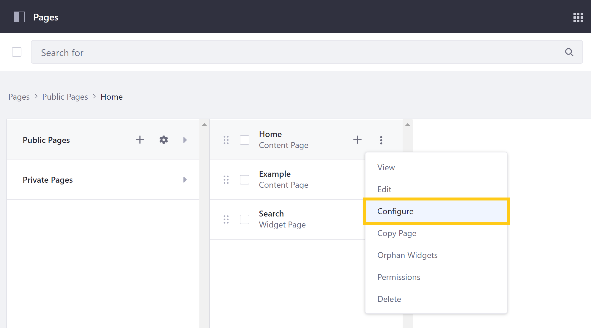
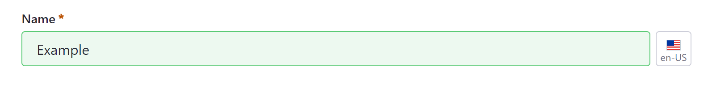
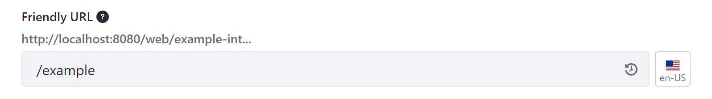
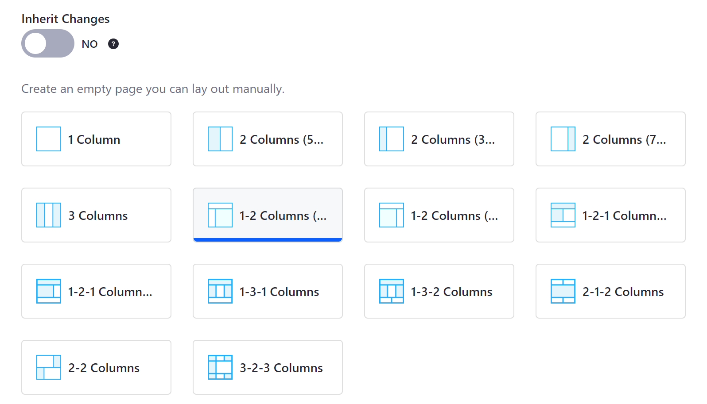
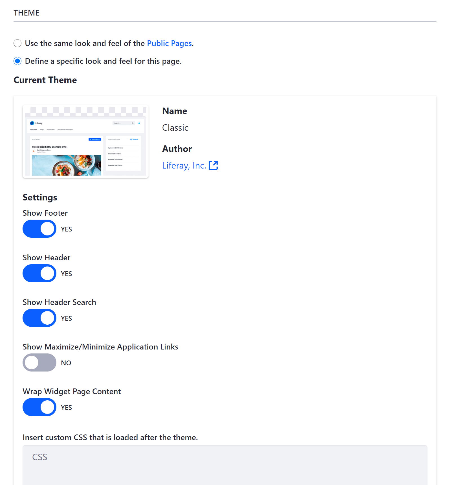
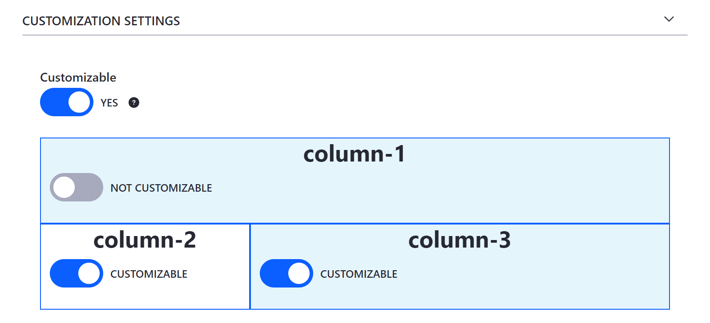
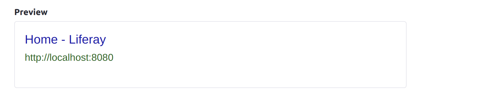
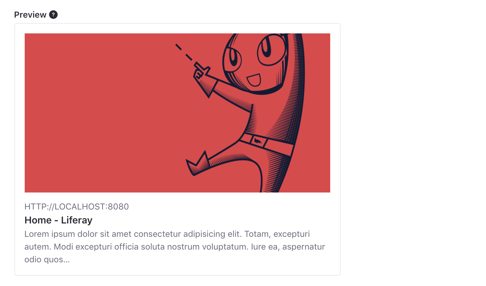
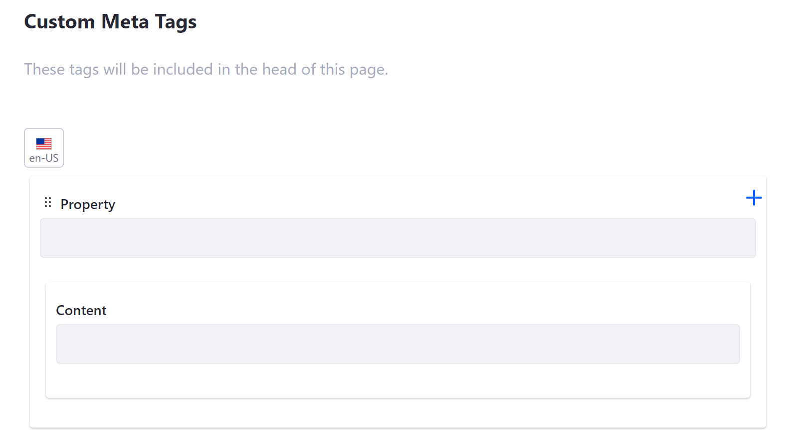

# Configuring Individual Pages

You can configure individual pages to meet your needs. All changes made in this way are scoped to the selected page.

To configure a page, open the *Site Menu* and go to *Site Builder* &rarr; *Pages*. Then click the *Actions* button () for the page you want to customize and select *Configure*.



Alternatively, you can access individual page settings by navigating to the page you want to customize and clicking the *Configure Page* button (  ) at the top right of the *Application Bar*.

These settings are organized into the following tabs:

* [General](#general)
* [SEO](#seo)
* [Open Graph](#open-graph)
* [Custom Meta Tags](#custom-meta-tags)

```note::
   Many of these settings can be localized to provide translations based on a User's locale. See `Introduction to Localization <../../../installation-and-upgrades/setting-up-liferay/initial-instance-localization.md>`_ and `Modifying Localizable Site Fields <../../site-settings/configuring-site-languages/modifying-localizable-site-fields.md>`_ for more information.
```

## General

Here you can configure the basic information and design of a page, including its name, friendly URL, layout, and more.

### Name and Friendly URL

Use the Name field to set a page's title used for Site navigation and displayed in a browser's title bar. Use the Friendly URL field to set a new URL for a page, or click the *Restore* icon (  ) to see and restore a previously used URL. See [Configuring Your Page's Friendly URL](./configuring-your-pages-friendly-url.md) for more information.




```tip::
   While a page's name and friendly URL are initially defined together at page creation, they are configured independently afterwards. It is best practice to update them together so that they match.
```

### Navigation Menu Widget

You can hide a page from Navigation Menu widgets that show the Public Pages Hierarchy. When enabled, a hidden page can still appear in other navigation menus if added to them. See [Configuring Site Navigation](./../../site-navigation/managing-site-navigation.md) for more information.

### Page Layout

For basic Widget Pages created using a global template (e.g., blog, wiki, search), determine whether the page *Inherits Changes* made to the global template. If the page does not inherit changes, select a custom layout to define row and column containers for its widgets.



### Categorization

Use *Topics* and *Tags* to categorize a page's content so users can more easily find it. For more information on using tags and categories, see [Organizing Content with Tags and Categories](../../../content-authoring-and-management/tags_and_categories.html).

### Look and Feel

Here you can use the page set's theme settings or define a unique look and feel for your page. When you choose to customize the page's theme, you can toggle various theme settings.

You can also access a CSS editor where you can add custom CSS code to the page. Any CSS code added to a page in this way is loaded after the theme.



```note::
   While Widget Pages include the *Look and Feel* tab here, Content Pages include these settings in the *Edit* sidebar menu.
```

### Advanced Settings

Access additional settings to customize a page's content and features, including query strings, [mobile device rules](../../optimizing-sites/building-a-responsive-site/creating-mobile-device-rules.md), custom fields, and embedded widgets.

```note::
   While Widget Pages include the Advanced tab here, Content Pages include these settings in the Edit sidebar menu under *Look and Feel*.
```

**Query String**: Use this to provide default parameters for a page when no others exist. Query strings are useful for web content templates.

**Target**: Use this field to determine page link behavior using specific target attributes, such as opening the link in a new window, tab, or frameset.

**Icon**: Choose an icon to display along with a page's name in the Site's navigation menus.

**JavaScript**: Add JavaScript code to a page. Any added code is executed at the bottom of the page. You can also access this editor in a Page Set's *Configuration* page.

```tip::
   If your Site's theme uses JavaScript, it’s best to add custom JavaScript code to the theme rather than an individual page or Page Set. This ensures your Site’s JavaScript code remains in one place. If your theme does not use JavaScript, place all of your Site's JavaScript code here.
```

**Mobile Device Rules**: Determine whether a page uses its Page Set's rules for mobile devices or is uniquely configured. These rules determine how a page's content renders for different types of mobile devices. 

**Customization Settings**: Determine whether a Widget Page's columns are *Customizable* for users. If customization is enabled, specify the columns users can customize. See [Personalizing Pages](../using-widget-pages/enabling-user-personalization-of-widget-pages.md) for more information.



**Custom Fields**: View and configure the *Custom Fields* you've defined for Site Pages. See [Custom Fields](../../../system-administration/configuring-liferay/adding-custom-fields.md) for more information.

**Embedded Widgets**: Access widgets you've embedded in a page using [Web Content Templates](./../../../content-authoring-and-management/web-content/web-content-templates/embedding-widgets-in-templates.md), [Page Fragments](../../developer-guide/developing-page-fragments/developing-fragments-intro.md), or Themes. <!--find appropriate link for Themes-->

```note::
   The *Custom Fields* and *Embedded Widget* sections only appear once you've created custom fields and embedded widgets in a page.
```

## SEO

Search engine optimization (SEO) refers to the methods used to improve your page's ranking in search engine results pages (SERP). The SEO tab provides easy access to settings you can use to optimize your page's content. See [Search Engine Optimization](../../optimizing-sites.html#search-engine-optimization) for more information about the following settings.

### HTML Title

Use the HTML Title field to define a page's `<title>` tag. This title is used by search engines to rank your page and serves as the page's heading in search engine results, though without replacing a page's [Name](#name-and-friendly-url). The recommended length for an HTML title is under 60 characters.

### Description

Use the Description field to define a page's `<description>` tag. This description is used by search engines to rank your page and also appears in search result previews of your page. The recommended length for a description is under 155 characters.

### Custom Canonical URL

Set a custom canonical URL for a page. Custom URLs set in this way take precedence over the global and instance level settings.

### Keywords

List words that people are likely to use when searching for your page's content. These keywords contribute to your page's ranking.

```tip::
   Use keywords often throughout your page's content, including titles, headings, descriptions, paragraphs, and image alt text.
```

### Preview SERP

Preview how a page is displayed in search engine results pages (SERP) based on your configuration of its HTML title, description, and custom URL.



### Robots

Configure `robots.txt` rules for a page. These rules provide instructions to search engines and other tools crawling and indexing your Site, either blocking or granting a crawler access to a specified path.

### Sitemap

Determine whether a page is included in the sitemap used by site crawlers. By excluding a page, you instruct site crawlers to skip it when crawling and indexing your Site.

### Page Priority

Set a page's priority from 0.0 to 1.0. This informs tools crawling and indexing your Site how a page should be prioritized relative to other pages in your Site.

### Change Frequency

Use the drop-down menu to inform tools crawling and indexing your Site how frequently a page is updated.

## Open Graph

[Open Graph](https://ogp.me/) is an Internet protocol that standardizes link summaries in application contexts that support this protocol, such as Facebook, Slack, and Twitter. In the *Open Graph* tab, you can use Open Graph `<meta property>` tags to define a page's metadata and create engaging representations of your content. See [Configuring Open Graph](../../site-settings/configuring-open-graph.md) for more information about the following settings.

```note::
   Open Graph properties defined here override values defined elsewhere in your DXP instance.
```

### Image

Use the Image field to define the following Open Graph `<meta>` properties for a page:

   ```html
      <meta property="og:image" content="http://example.com/ogp.jpg" />
      <meta property="og:image:secure_url" content="https://secure.example.com/ogp.jpg" />
      <meta property="og:image:type" content="image/jpeg" />
      <meta property="og:image:width" content="400" />
      <meta property="og:image:height" content="300" />
   ```

### Image Alt Description

Use the Image Alt Description field to define the `og:image:alt` property for a page. You can also localize an image's alt description via the *Language Flag* button.

### Custom Title and Description

Use the Title and Description fields to define the `og:title` and `og:description` properties. These properties create custom text used for rich previews in place of a page's HTML title and description. You can also localize these values via their *Language Flag* buttons.

### Preview Open Graph Page Representation

Preview your page's Open Graph configuration. This section displays how your page's content appears when its URL is shared in contexts supporting the protocol. Though an image's ratio may change depending on where the URL is posted.



## Custom Meta Tags

Here you can add custom `<meta>` tags to the `<head>` of a page. These tags are only visible in a page's HTML source code and are used to describe a page's data and determine how that data is displayed in different contexts, such as search engine results and social media posts. Each tag is defined using property and content attributes.



## Additional Information

* [Adding Pages to a Site](./../adding-pages/adding-a-page-to-a-site.md)
* [Content Pages Overview](../building-and-managing-content-pages/content-pages-overview.md)
* [Configuring Page Sets](./configuring-page-sets.md)
