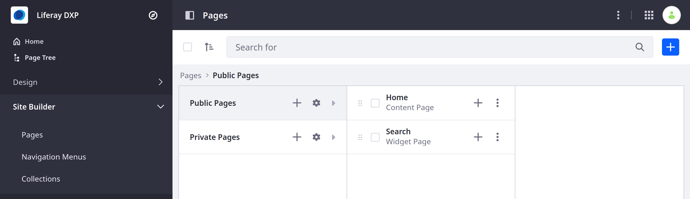
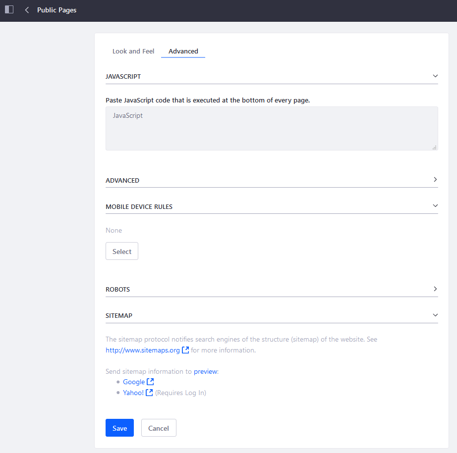
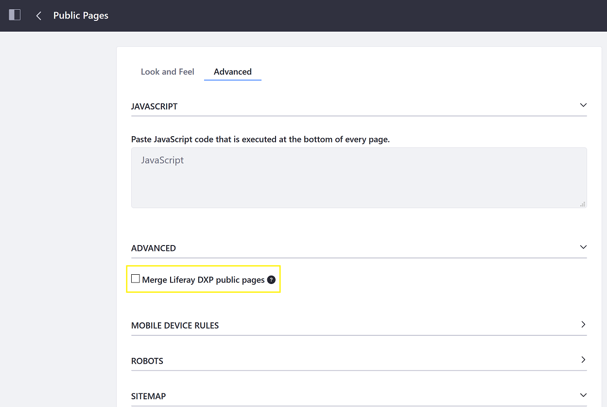
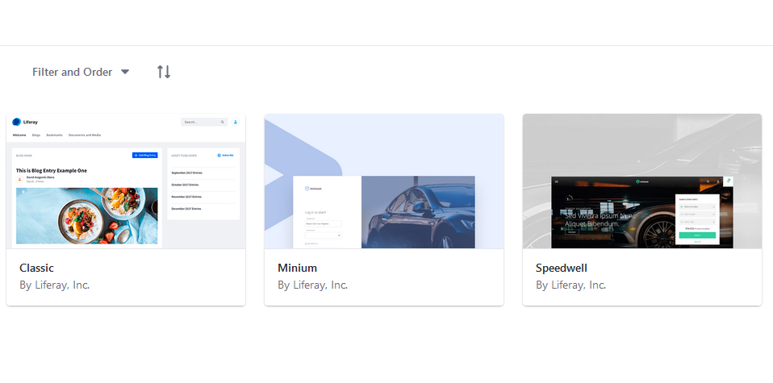
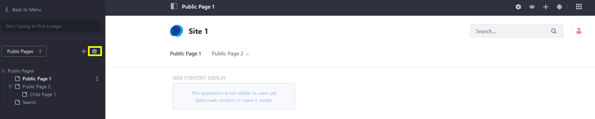
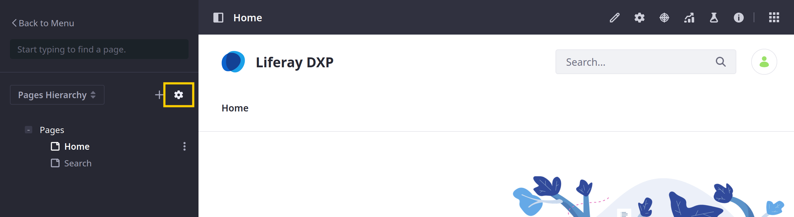

# Configuring Page Sets

```{important}
For Liferay 7.4 U22+ and GA22+, Private Pages are disabled for new installations. However, you can enable them if desired. See [Enabling Private Pages](../understanding-pages/understanding-pages.md#enabling-private-pages) for more information.
```

When Private Pages are enabled, Site Pages are divided into public and private [Page Sets](../understanding-pages/understanding-pages.md#page-sets). These sets group Pages so you can apply bulk configurations to each type of Page. Settings configured for a Page Set apply to all grouped pages and override configurations at the Site level. Page Set configurations are overridden by [customizations to individual pages](./configuring-individual-pages.md).

If Private Pages are disabled for your Liferay System, follow these steps to access bulk configuration Options for your Pages:

1. Open the _Site Menu_ (), expand _Site Builder_, and click _Pages_.

1. Click the _Actions_ button () in the Application Bar and select _Configuration_.


If Private Pages are enabled for your Liferay system, follow these steps to access Page Set configuration options:

1. Open the _Site Menu_ (), expand _Site Builder_, and click _Pages_.

1. Click the _Gear_ icon () for either _Public Pages_ or _Private Pages_.



## Configuring the Page Set's Look and Feel

In the _Look and Feel_ tab, you can customize the Page Set's theme and logo settings.

### Look and Feel

Themes create the overall feel for the Site and can transform the look entirely. The _Current Theme_ section displays the Theme currently applied to the Page Set, along with any configurable theme settings and color schemes that the Theme has. Many Themes include more than one color scheme, which keeps the existing look and feel while giving the Site a different flavor.



To change the current theme,

1. Click the _Change Current Theme_ button and select the Theme from the window that appears.

1. Select your desired theme.

    

1. Click _Save_ to apply the new Theme to the Page Set.

You can enter custom CSS in the _CSS_ section for modifying your theme. You can apply Themes to the entire Site (described here) or to individual pages (described in [Configuring Pages](./configuring-individual-pages.md#look-and-feel)).

### Logo

By default, the Liferay logo is used for your Site's pages. To use your own logo for a Site,

1. Expand the _Logo_ section.

1. Click the _Change_ button.

1. Browse to the location of your logo. Make sure your logo fits the space in the top left corner of the Theme you're using for your Site. If you don't, your other page elements are pushed aside to make way for the logo.

1. Choose whether to display the Site name on the Site. When _Show Site Name_ is enabled, the Site name appears next to the logo.

    ```{note}
    This option is enabled by default and can't be disabled if the *Allow Site Administrators to set their own logo* option is disabled in *Instance Settings*. Removing the Site name is not available for the default Liferay Site---you can configure this only for new Sites and User pages.
    ```

1. Click _Save_.

The Site's logo settings are now configured.

## Configuring the Page Set's Advanced Settings

The _Advanced_ tab contains several options that can impact the Site and overall performance. Administrators should proceed with caution.



### JavaScript

In the _JavaScript_ tab, you can paste JavaScript in the JavaScript editor. Code entered here is executed at the bottom of every page in the Site. Your Site's JavaScript is most likely (and should be) included with the Theme. However, this may be a good place to quickly test JavaScript code while not in production.

### Advanced Settings

If you have multiple Sites, one Site is marked as the _Default Site_ that visitors see when they visit your domain name. By default, only the default Site's Public Pages are displayed in the navigation.

You can display another Site's Public Pages in the default Site's navigation by enabling the _Merge public pages_ option for that Site.

```{warning}
Adding too many pages to the main navigation can make it become unwieldy very quickly.
```

1. Check the _Merge Liferay DXP public pages_ box.

    

1. Click _Save_ when finished.

### Mobile Device Rules

You can add _Mobile Device Rules_ to configure behaviors for specific mobile devices or types for the Page Set. Mobile device rules are inherited from your Public Pages, but you can define specific rules per page. You can edit the Look and Feel of specific pages for mobile devices, including the theme. See [Mobile Device Rules](../../optimizing-sites/building-a-responsive-site/creating-mobile-device-rules.md) for more information.

### Robots

Here you can configure search and indexing rules in the `robots.txt` rules for the domain's public and private pages. The `robots.txt` file provides instructions to search engines and other tools that are automatically crawling and indexing your Site. For example, you can specify not to index certain pages.

### Sitemap

This generates a sitemap you can send to some search engines so they can crawl your Site. It uses the industry standard sitemap protocol. Select a search engine link to send the sitemap to it (only required once per Site), or select the _preview_ link to see the generated XML that is sent to search engines.

## Using the Page Tree Menu

In Liferay DXP 7.3, you can access the same settings from the _Page Tree_ menu:

1. Open the _Site Menu_ () and click _Page Tree_ ().

1. Select _Public Pages_ or _Private Pages_ from the dropdown menu.

1. Click the Gear icon.

    

## Additional Information

* [Configuring Individual Pages](./configuring-individual-pages.md)
