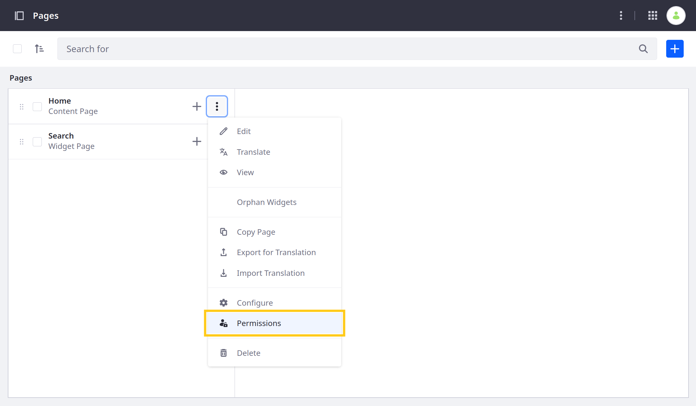
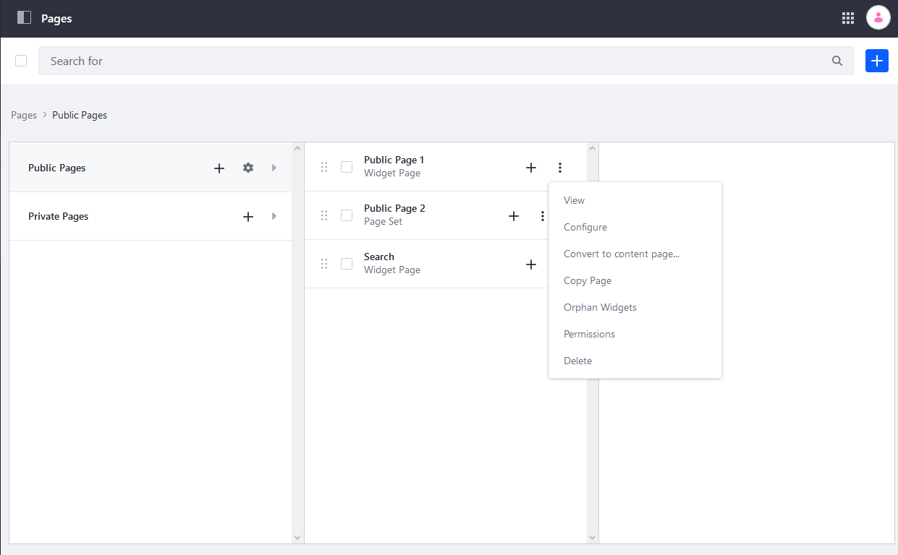

# Updating Page Permissions

By default, when Users join a Site, they can see all of its Pages. However, you can configure permissions for individual Pages to restrict access based on User [roles](../../../users-and-permissions/roles-and-permissions/understanding-roles-and-permissions.md).

```{note}
Individual Page's permission take priority over Site level configurations.
```

Follow these steps to update Page permissions:

1. Open the *Site Menu* (), expand *Site Builder*, and click *Pages*.

1. Click the *Actions* button () for the desired Page and select *Permissions*.

    

1. Update the permissions for each Role.

    

1. Click *Save* to apply the changes.

## Additional Information

* [Understanding Roles and Permissions](../../../users-and-permissions/roles-and-permissions/understanding-roles-and-permissions.md)
* [Assigning Users to Roles](../../../users-and-permissions/roles-and-permissions/assigning-users-to-roles.md)
* [Configuring Page Sets](./configuring-page-sets.md)
