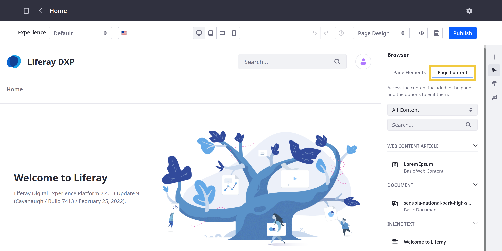

# Managing Content in Content Pages
<!-- Alt: Managing Content in Pages and Templates... If renamed, relocate to Displaying Content.-->
When editing or creating Content Pages and Templates, you can quickly view and edit any documents, Web Content articles, Collections, or inline text added to them. To do this, open the *Browser* panel () in the editing sidebar and click the *Page Content* tab.



The Page Content tab lists all content added using Fragments and supported widgets (i.e., Asset Publisher and Web Content Display). This includes content added to Fragments directly and those mapped to Fragment elements.

```{important}
Contents displayed in an Asset Publisher using Dynamic or Collection selection are not listed in the Page Content tab. Also, background images are not listed, except for Container background images.
```

From here, you can filter content by type (i.e., Web Content, Documents, Collection, or Inline Text) and perform the following content management actions.

* *Web Content Articles* and *Documents*: Click the *Actions* button () for the desired asset and select from the following options.

  * *Edit*: Edit the selected asset in its own application context (i.e., Web Content or Documents and Media).
  * *Edit Image* (for Documents): Crop or rotate the selected image.
  * *Permissions*: Edit permissions for the asset by user role.
  * *View Usages*: View all uses of the asset in Site Pages, Page Templates, and Display Page Templates.

* *Collections*: Click the *Actions* button () for the desired Collection and select an option. Available options depend on whether the Collection Display Fragment uses a manually defined Collection, or one defined dynamically by a Collection Provider. Manually defined Collections include all of the following actions. However, dynamically defined Collections only include the View Items option.

  * *Edit*: Edit the Collection in its native application context.
  * *View Items*: View all items included in the Collection. This opens a modal window where you can choose to edit each item or view it in its Display Page.
  * *Add Items*: Add items to the Collection.
  * *Permissions*: Edit permissions for the Collection by user role.

* Inline Text: Click the *Edit* button () for the desired text to begin editing it directly in the Page or template. This includes both simple and rich text elements from deployed Fragments. While editing rich text elements, you can highlight text to access additional formatting options.
  
   ```{note}
   Editing inline text requires the *Edit Inline Content* permission.
   ```

## For Liferay DXP/Portal 7.3

For Liferay DXP/Portal 7.3, you can review Web Content deployed using Fragments and widgets in the *Contents* panel ().

1. Edit or create a Content Page, Master Page Template, Page Template, or Display Page Template.

1. Open the *Contents* panel () in the sidebar.

    Content used on the page is listed here, along with how many pages it's used on. Hover over the content in the list to highlight the widget(s), mapped content fields, and Fragments that display the content on the page.

    ```{note}
    Web content that's displayed in an Asset Publisher with dynamic selection isn't listed in the Contents panel. You must manage this content directly from the Web Content admin app in the Control Panel.
    ```

1. Open the Actions () menu next to the listed content to manage it. These actions are available:

    * *Edit*: Edit the web content
    * *Permissions*: Update the web content's permissions
    * *View Usages*: See where the web content is used on the Site

## Additional Information

* [Using Content Pages](../using-content-pages.md)
* [Adding Elements to Content Pages](./adding-elements-to-content-pages.md)
* [Configuring Fragments](../page-fragments-and-widgets/using-fragments/configuring-fragments.md)
