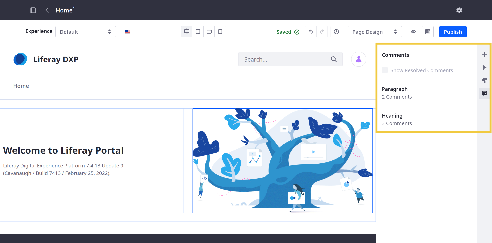
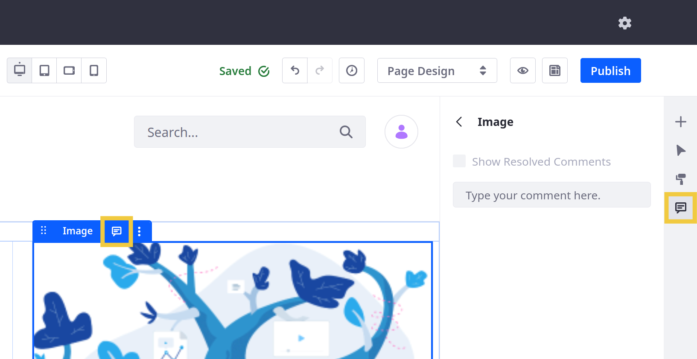
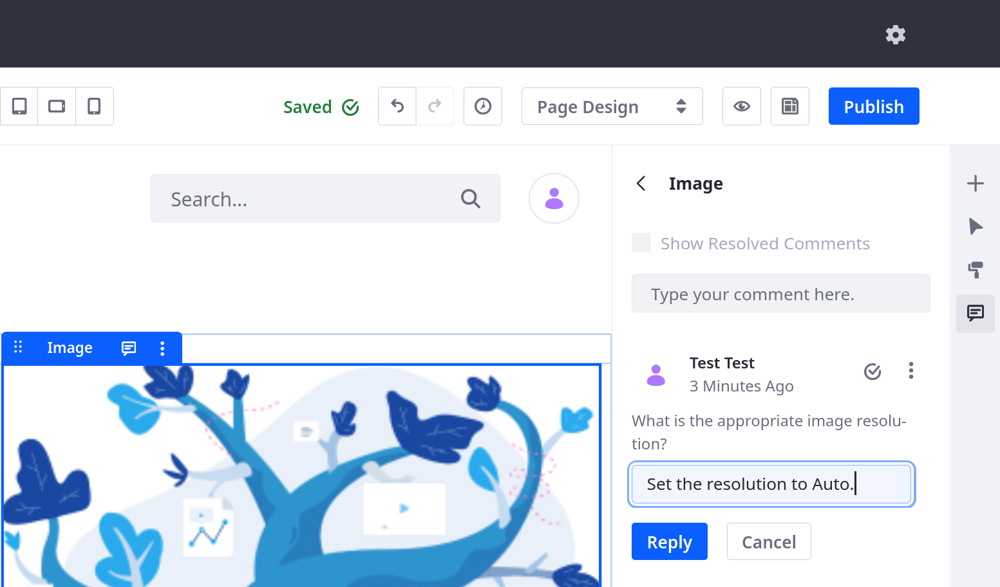
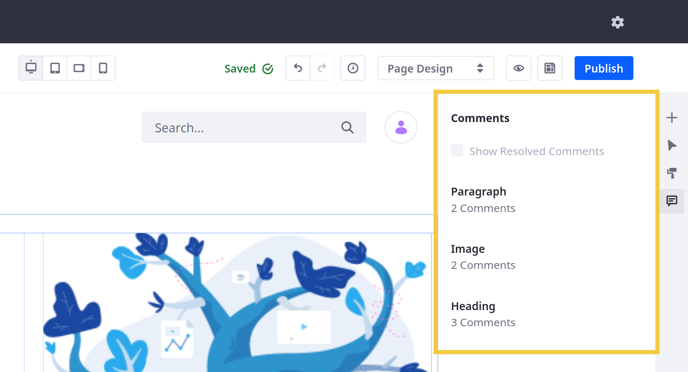
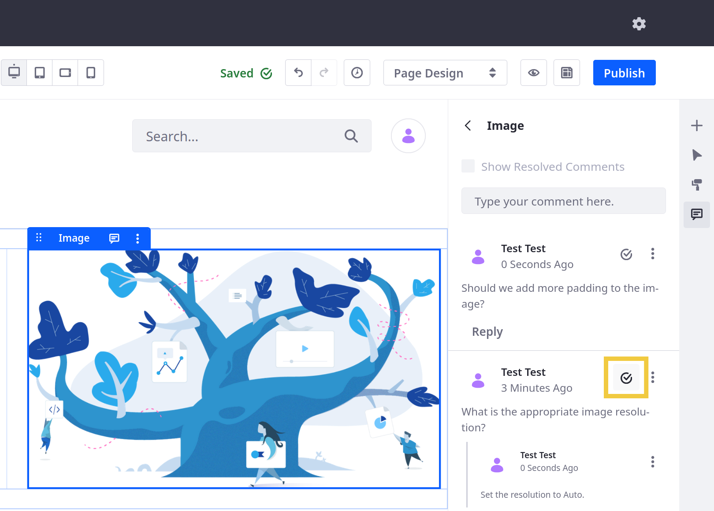
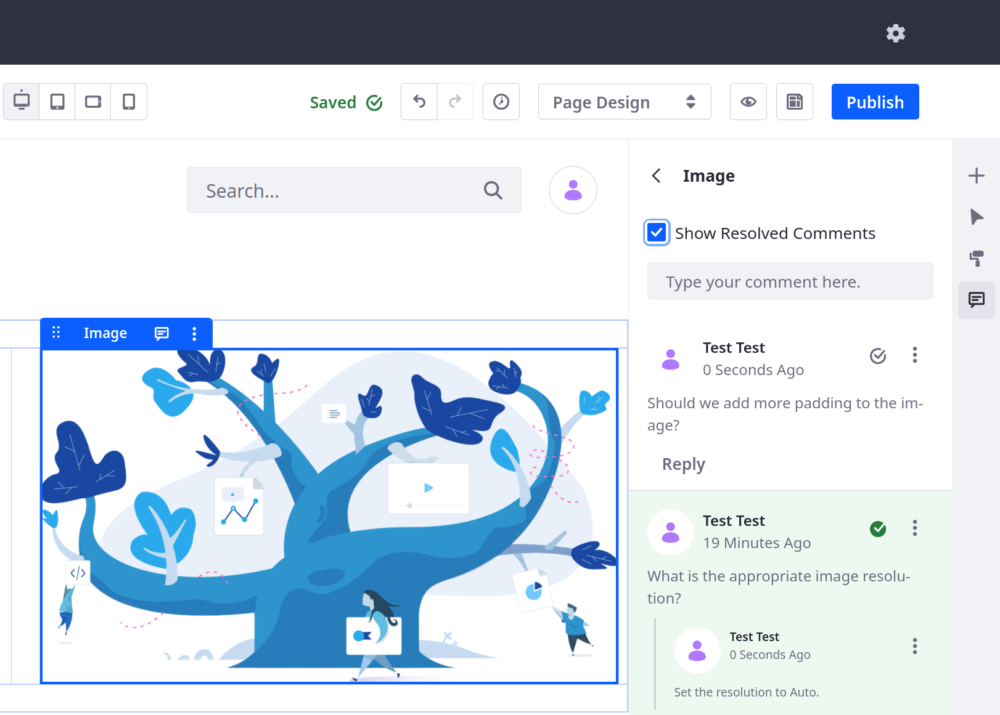

# Using Page Comments

When building Content Pages, you and your team can collaborate using  Liferay's Page Comments feature. While Comments are enabled out-of-the-box in Liferay DXP 7.3+, they are disabled by default in Liferay DXP 7.2. See [Enabling Comments](#enabling-comments) to learn more.



## Adding Page Comments

Follow these steps to add Page Comments:

1. Navigate to a Content Page that includes Page elements (i.e., Fragments or Widgets) and click the *Edit* button () to begin editing the Page.

1. Open the *Comments* panel () in the sidebar menu and select the desired Fragment or Widget.

   Alternatively, you can select the desired Page element and click its Comments icon. This opens the Comments panel.

   

   ```{note}
   Comments cannot be added to [Fragment sub-elements](../page-fragments-and-widgets/using-fragments/configuring-fragments/fragment-sub-elements-reference.md), Containers, or Grids. 
   ```

1. Enter your comment in the side panel and click *Comment*.

After a comment is added, you can *edit* or *delete* the comment via its *Actions* button (). Users can also add replies to it.



```{note}
Deleting a comment removes all replies to it.
```

## Reviewing Page Comments

Once comments are added to a Page Fragment or Widget, you can review them in the Comments side panel.



When collaborating, you can mark a comment as resolved by clicking on its *Resolve* button (). By default, resolved comments and their replies are hidden. However, you can view resolved comments by checking *Show Resolved Comments*.



While viewing resolved comments, you can reopen a comment by clicking its green *Resolve* button.



## Enabling Comments

To enable comments for Content Pages, follow these steps:

1. Go to the Control Panel and navigate to *Configuration* &rarr; *System Settings* &rarr; *Content and Data* &rarr; *Pages*.

1. Select *Content Page Editor* under the Virtual Instance Scope. Check the *Comments Enabled* checkbox and click the *Save* button.

   

   You should now be able to use Content Page Comments.

```{note}
This enables Content Page Comments for all instances. To control this on an instance-by-instance basis, navigate to the same setting in *Instance Settings* (instead of *System Settings*).
```

## Additional Information

* [Using Content Pages](../using-content-pages.md)
* [Adding Elements to Content Pages](./adding-elements-to-content-pages.md)
* [Content Page Editor UI Reference](./content-page-editor-ui-reference.md)
