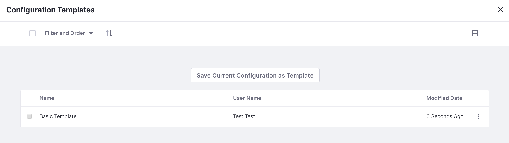

# Configuring Templates

Once you've configured a widget, *Configuration Templates* can save those settings in a reusable template.

```{note}
Configuration templates are only available for widgets placed on a page. Applications available from the Liferay DXP Menu do not provide configuration templates.
```

To create a configuration template, do as follows:

1. Click on *Options* () from the menu in the widget's title bar &rarr; select *Configuration Templates*. If the widget's current settings are the ones you want to save, click the *Save Current Configuration as Template* button. If not, change the settings until it's configured the way you want it, and then click the button.

    

1. There is only one field to fill out. Enter a name for your template and click *Save*. You should now see your configuration in the list. If you ever need to revert the app to these archived settings, you can click *Actions* () &rarr; *Apply* next to the configuration template you want to apply.

Unless otherwise noted, all widgets in Liferay DXP support this feature. This is particularly useful for widgets that have a lot of configuration options, such as the Message Boards application.
