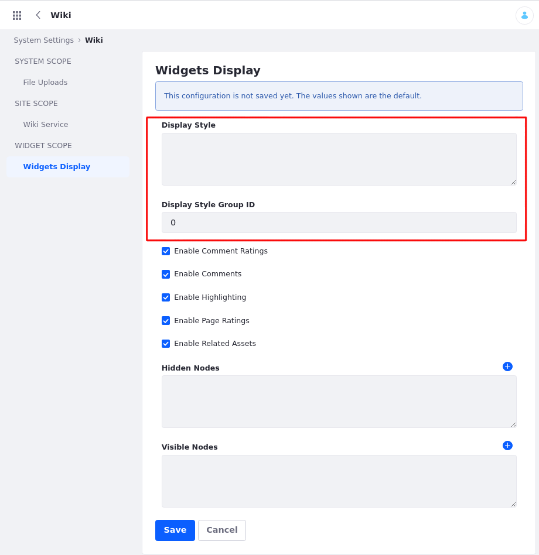

# Setting a Default Widget Template

You can change the widget template for an individual widget through its own configuration, but to configure the default widget template for all widgets of that type, you must go to *Control Panel* &rarr; *System Settings*. In System Settings you can find a configuration for every widget in Liferay DXP. Any widget that supports widget templates has a *Display Style Group ID* and a *Display Style* option.

  

- **Display Style Group ID:** The Site ID where the widget template is located. For Global templates use 0 for the ID.
- **Display Style:** The widget template's key.

```{note}
To enter a Display Style, you first need the *Template Key* for the template you want to use. To get the Template Key, go to the *Application Display Template* list for a given Site and retrieve it from the widget template listing. Then enter the display style as `ddmTemplate_[template-key]`.
```
## Default Widget Template Example

For example, configure the Language Selector widget templates like this:

1.  Open the *Home* &rarr; *Design* &rarr; *Widget Templates*.

1.  Click on the *Add icon* () and select the option *Language Selector Template*.

1.  Open *Details* and find the *Template Key* - `LANGUAGE-ICON-FTL`

  

Now that you have the ID, you can change the template from System Settings.

1.  Go to *Control Panel* &rarr; *Configuration* &rarr; *System Settings*.

1.  Find *Localization* under the *Platform* heading and select *Language Selector* from the options on the left.
 
1.  In the *Display Style* field, enter `ddmTemplate_LANGUAGE-ICON-FTL`.
 
Now any Language Selector widgets are added to a page use the new defaults.

```{warning}
This doesn't affect widgets already added to a page and configured.
```