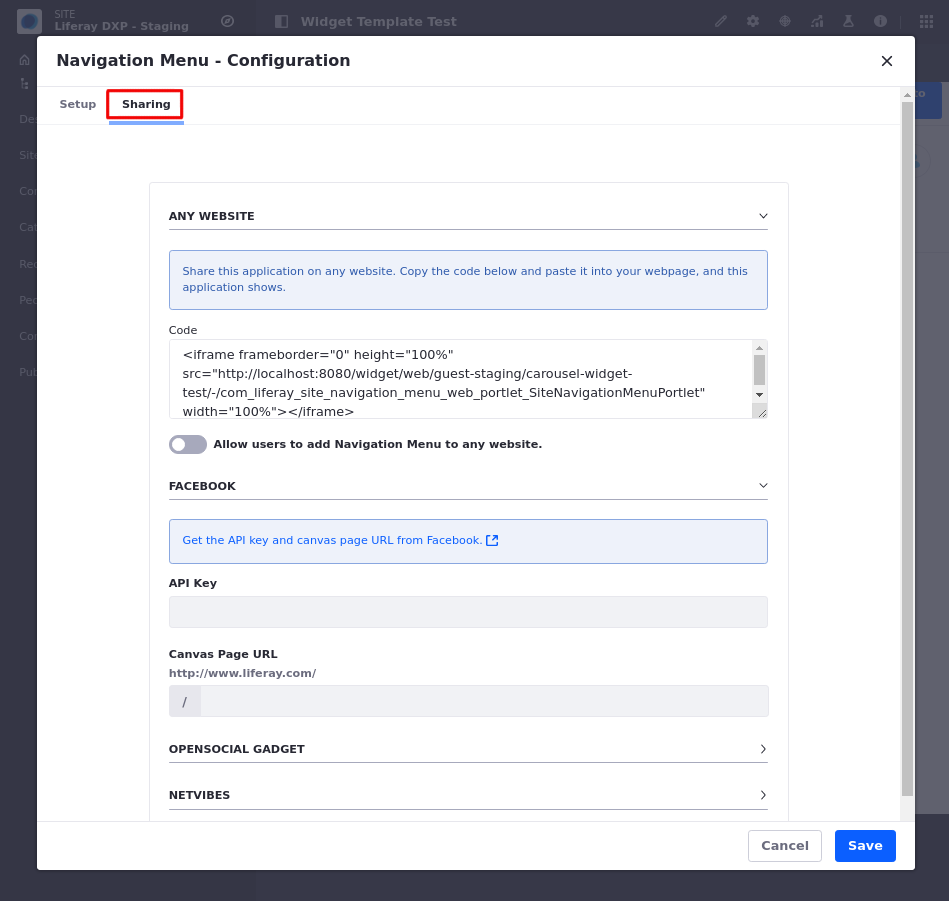
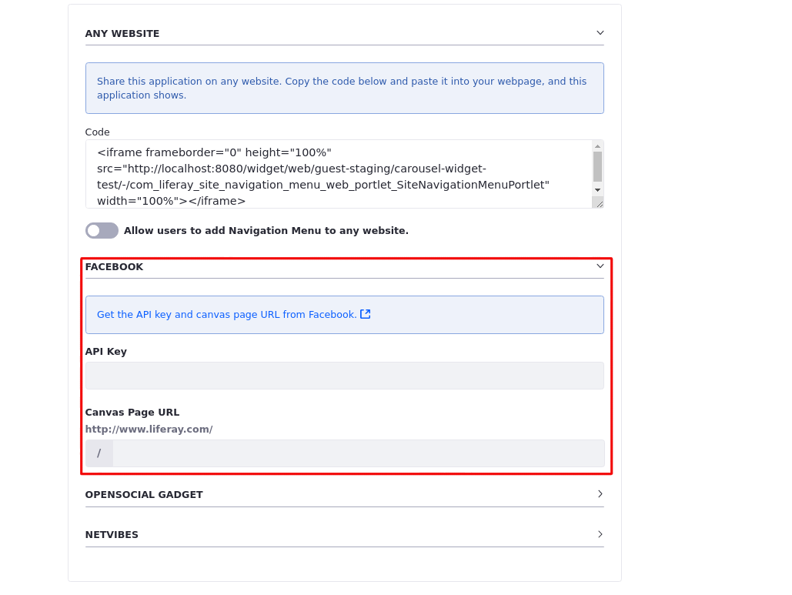

# Sharing Widgets with Other Sites

You can share widgets with other Sites by embedding an instance of a widget running on your Site into another website, such as Facebook, OpenSocial and Netvibes. This opens up a whole new avenue of exposure to your website that you would not have had otherwise.



1. Click on the widget's *Options* icon () &rarr; *Configuration* &rarr; *Sharing*.

1. There are three sub-tabs under sharing: Facebook, OpenSocial Gadget and Netvibes. Proceed according to the context you choose.

```{note}
With any website, switch the toggle to allow the navigation. Copy and paste the provided snippet of JavaScript code into the website where you want to add the widget. When a user loads the page on the other website, the code pulls the relevant widget from your Site and displays it.
```
## Facebook

You can add any widget as a Facebook app. To do this, you must first get a developer key.

1. Go to the Facebook tab on Sharing.

1. Retrieve the *API Key*<!--[ include link -]()--> and the *Canvas Page URL*<!--[ include link -]()--> from Facebook. Copy and paste them on the Sharing tab.

    
  
1. Click *Save* and go back to the Facebook tab in Liferay DXP. You're given the *Callback URL*, which you can copy and paste into Facebook. When opening your app in Facebook, the correct callback URL is used to render the application.

1. Optionally, enable the *Allow users to add [application-name] to Facebook*. Then you can navigate to your app's Options menu and select *Add to Facebook*.

## OpenSocial Gadget

OpenSocial comprises a container and a set of APIs for social networking and other web applications. Liferay DXP can serve up applications to be used as  OpenSocial Gadgets on any OpenSocial-compatible pages.

1. To serve a Liferay widget on an OpenSocial platform, copy and paste the provided gadget URL, add it to the appropriate configuration page of the OpenSocial platform you're using. Your Liferay instance serves that widget directly onto that platform's page.

    The URL provided is unique to the specific instance of the widget, so you could serve multiple instances of the same widget as different OpenSocial Gadgets.

1. Go to *OpenSocial Gadget* on the Sharing tab, and enable the selector *Allow users to add [application-name] to an OpenSocial platform*.

1. Click *Save* and revisit the *Options* button of your widget. A new button appears named *Add to an OpenSocial Platform*. When selecting this new button, the URL is provided for sharing the widget to an OpenSocial platform.
   
## Netvibes

Netvibes offers a similar environment where users can log in, create their own personal dashboard, and add customizable widgets to it.

Go to *Netvibes* on the Sharing tab, enable the *Allow users to add [application-name] to Netvibes pages* selector. You can then use the provided URL to create a custom Netvibes widget based on the instance of the Liferay widget that you're using.

## Additional Information

- [Setting Widget Permissions](./setting-widget-permissions.md)