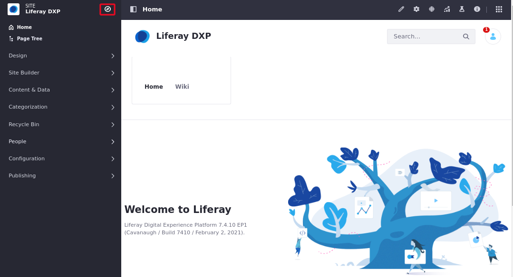
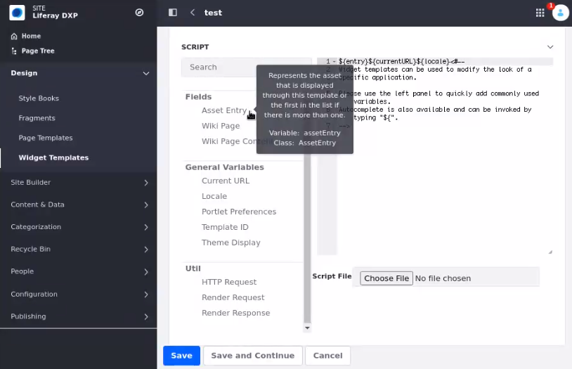

# Styling Apps, Assets and Widgets with Widget Templates

*Widget Template* define custom display templates used to render widgets. You can use to show blog entries horizontally instead of vertically, list your assets in different sizes, launch a template editor and create custom templates. Widget templates let you personalize your widget and give you ultimate control over its appearance and functionality. Here you learn how to create  and configure a Widget Template.

## Creating a Widget Template

To create a Widget Template follow these steps:

1.  From Site Administration, click the *Site Selector* button () to choose the Site where you want to create the widget template.

    
 
1.  Open *Design* &rarr; *Widget Templates*.

    
 
If you selected the Global context, this page shows a list of sample templates available for your apps. These sample templates differ from the default templates already configured in the apps. If you choose a Site to host your template, you must create a custom template for that Site's apps.

1.  Click the *Add* button (), and you're prompted to select the type of template to create.

- *Asset Publisher*
- *Blogs*
- *Breadcrumb*
- *Cart Summary*
- *Cart*
- *Categories Navigation*
- *Category Content*
- *Category Facet*
- *Commerce Addresses*
- *Commerce Categories*
- *Custom Facet*
- *Custom Filter*
- *Folder Facet* 
- *Language Selector*
- *Media Gallery*
- *Mini Cart*
- *Modified Facet*
- *Navigation Menu*
- *Open Carts*
- *Placed Orders*
- *Product Comparison Bar*
- *Product Comparison Table*
- *Product Details*
- *Product Downloads*
- *Product Publisher*
- *RSS Publisher*
- *Search Bar*
- *Search Results*
- *Similar Results*
- *Site Facet*
- *Site Map*
- *Sort*
- *Tag Cloud*
- *Tag Facet*
- *Type Facet*
- *User Facet*
- *Wiki*

1.  Enter the name

    **Optional** open *Details* to provide a description and a small image to use. You can select the language type for your template.
 
1.  Within *Details* select a scripting language to use. You can use FreeMarker or Velocity. FreeMarker is recommended.
 
1.  Use the *Script* section to create the widget template.

1.  Click *Save*.

### The Template Editor

On the left side of the template editor is a palette of common variables used for making templates. This is a great reference when creating your template. To place one of the variables into the template editor, position your text cursor where you want it placed, and click the variable name.

Each variable also has a tooltip which displays a detailed description. Because there are multiple kinds of widget templates, there are also different variables for each widget template. Thus, each template has a different set of variables only applicable for that specific template.

You can also use the autocomplete feature to add variables to your template. It can be invoked by typing *${* which opens a drop-down menu of available variables. By clicking one of the variables, the editor inserts the variable into the editor.

You can also embed same-type templates into other templates. For example, suppose you have an existing Wiki widget template and would like to create another similar Wiki widget template. Instead of starting from scratch, you can import the existing Wiki widget template into your new one and build off of it. In other words, you can utilize widget templates as generic templates which
allow for reusable code to be imported by Velocity or FreeMarker templates in the system.

## Configuring Widget Templates

After you've saved your widget template, you can manage it through its *Actions* button (). This provides
several options:

- *Edit*: lets you modify the widget template's setup properties.
- *Permissions*: lets you manage the permissions *Update*, *Permissions*,
  *Delete*, and *View* for the widget template.
- *Copy*: creates a copy of the widget template.
- *Delete*: deletes the widget template.

Additionally, your widget template generates a static URL and a WebDAV URL. These values access the XML source of your template. You can find these URLs by clicking the widget template from the menu and expanding the *Details* section. With the WebDAV URL, Site administrators can add, browse, edit, and delete widget templates on a remote server. If you want to learn more about what the WebDAV URL can do, visit the article on [WebDAV access](../../../../content-authoring-and-management/documents-and-media/publishing-and-sharing/accessing-documents-with-webdav.md).

| **Note:** Embedding widgets into widget templates, although possible, is not recommended because this could cause conflicts with other widgets or unexpected behavior (e.g., embedding a widget that aggregates data to the breadcrumb). If embedding a widget into a widget template is your only option, make sure it does not interfere with other widgets.

Next you must configure the widget to use the new widget template:

1.  Go to the *Configuration* page for the widget you want to modify and open its *Display Settings*.

1.  Under *Display Template*, select your widget template from the drop-down menu.

Also, you can manage Site-specific display templates for your app: do this by  clicking the *Manage Display Templates for [SPECIFIC_SITE]* link next to the *Display Template* drop-down menu. A window appears with a list of your configured templates only available for your Site with options to add new templates or edit existing templates.

## Additional Information 

- [Widget Template Example](./using-a-widget-template-example.md)