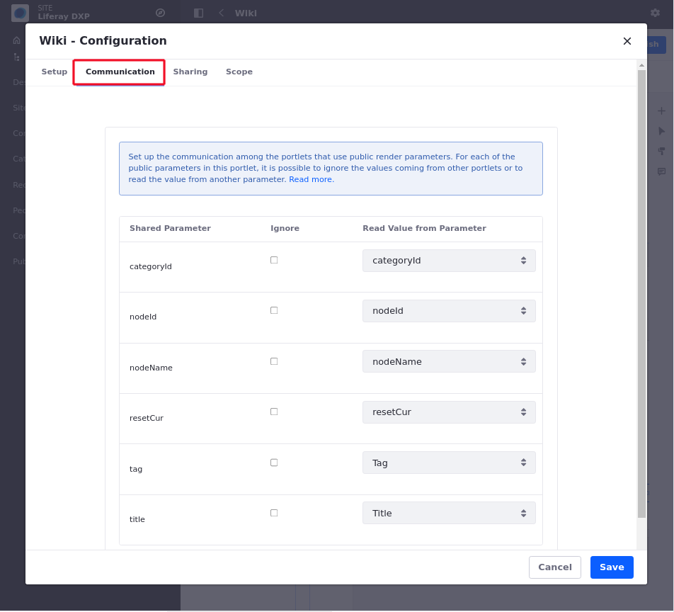

# Communication Between Portlet Widgets

Portlet widgets can communicate with each other using public render parameters and events. Some Liferay portlets provide a configuration UI to help you get the most out of this communication mechanism. To access your portlet's configuration window, follow these steps: 

1. Click on the *Options* icon () &rarr; *Configuration* &rarr; *Communication* tab.



The screenshot above is for the Wiki, which has six public render parameters: `categoryId`, `nodeId`, `nodeName`, `resetCur`, `tag`, and `title`. For each of these parameters, you can configure the portlet to ignore the values coming from other portlets or read the value from another parameter.

```{important}
If your widget isn't a portlet, this feature isn't available.
```
Why might it be useful to ignore the values for certain parameters that come from other portlets? Consider a common use case for the Wiki application. The  Wiki portlet is often used along with the Tags Navigation portlet so that when a  user clicks on a tag of the latter, the Wiki shows a list of pages with that  tag. An administrator may want the Wiki to show the front page always 
independently of any tag navigation done through other portlets. Ignoring the values of the parameter coming from other widgets let this happen.

Reading the value of a parameter from another portlet is an advanced but very powerful option that allows portlets to communicate with each other even if their developers didn't intend them to. For example, imagine that the Wiki is used to publish information about certain countries, and there's another portlet that allows browsing countries for administrative reasons. The second
portlet has a public render parameter called *country* with the name of the country. You'd like the Wiki to show the information from the country that's selected in the administration portlet. This can be achieved by setting the value of the title parameter of the Wiki portlet to be read from the country parameter of the administration portlet. Cool, isn't it?

## Additional Information 

- [Sharing Applications With Other Sites](./sharing-widgets-with-other-sites.md)
