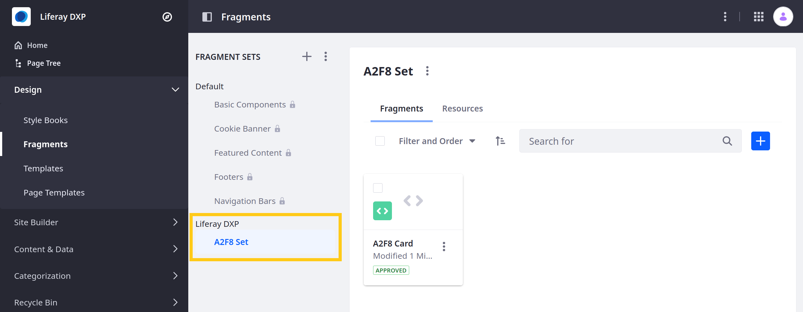
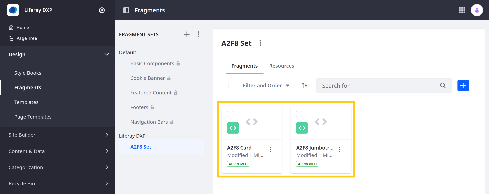

# Auto-Deploying Fragments

> Available: Liferay Portal 7.3 GA1+ and Liferay DXP 7.3+

If you're [developing Page Fragments with your own tooling](./using-the-fragments-toolkit.md#fragment-set-structure), you can deploy them by packaging them in ZIP files for importing via the Liferay UI. But you're not limited to using the UI. You can deploy Fragment ZIP files from the command line too. Here you'll learn how to work with Fragment projects and import the Fragments to the Sites you want from the command line using Liferay's auto-deployment mechanism.

```{note}
For Liferay DXP 7.4+, Fragment Collections are called Fragment Sets in the Liferay UI.
```

## Deploy an Auto-deployable Fragment Set

Start with auto-deploying an example Fragment Set.

1. Run the command below to start the Docker container:

    ```bash
    docker run -it -m 8g -p 8080:8080 [$LIFERAY_LEARN_PORTAL_DOCKER_IMAGE$]
    ```

1. Download and unzip the [example auto-deployable Fragment Set](https://learn.liferay.com/dxp/latest/en/site-building/developer-guide/developing-page-fragments/liferay-a2f8.zip):

    ```bash
    curl https://learn.liferay.com/dxp/latest/en/site-building/developer-guide/developing-page-fragments/liferay-a2f8.zip -O
    ```

    ```bash
    unzip liferay-a2f8.zip
    ```

1. Compress the Fragment project's Set and its deployment descriptor into a ZIP file:

    ```bash
    cd liferay-a2f8
    ```

    ```bash
    zip -r  a2f8-fragments.zip a2f8-set/ liferay-deploy-fragments.json
    ```

1. Import the Fragments Set to the descriptor-specified Site by copying the new `.zip` file to the auto-deploy folder in Liferay's Docker container:

    ```bash
    docker cp a2f8-fragments.zip $(docker ps -lq):/opt/liferay/deploy
    ```

1. Check the Docker console for this log message:

    ```bash
    INFO  [com.liferay.portal.kernel.deploy.auto.AutoDeployScanner][AutoDeployDir:263] Processing a2f8-fragments.zip
    ```

1. Verify the Fragment Set is available. Open the *Site Menu* () and go to *Design* &rarr; *Fragments*. The Set should appear in the list.

```{note}
If an imported Fragment has invalid rules, it is automatically saved as a draft.
```



## Fragment Project Structure

The auto-deployable Fragment project has this structure:

```bash
[project ZIP]
├── [fragment-set]
│   ├── collection.json
│   └── [fragment]
│       └── fragment files ...
└── liferay-deploy-fragments.json
```

The `liferay-deploy-fragments.json` file specifies the scope where you want to deploy the Fragments:

* System-wide (all instances)
* a virtual instance (Company)
* a Site (group).

The example's configuration below specifies deploying to a Site (group) called "Guest" within a virtual instance (liferay.com):

```json
{
    "companyWebId": "liferay.com",
    "groupKey": "Guest"
}
```

Both keys in this JSON file are optional. In your `liferay-deploy-fragments.json` file, you can make Fragments available system-wide (to all instances) by specifying an empty JSON element or by adding this configuration:

```json
{
    "companyWebId": "*"
}
```

```{note}
The Fragments Toolkit's [npm run compress command](./using-the-fragments-toolkit.md) facilitates creating Fragment ZIP files and their deployment descriptors.
```

## Modify the Fragment Set and Redeploy

Follow these steps to modify the Fragment Set and redeploy it:

1. Add a new Fragment to the example Set by moving the project's `a2f8-jumbotron` Fragment folder into the `a2f8-set/` folder.

1. Compress the Fragment Set into a ZIP file as you did above:

    ```bash
    zip -r  a2f8-fragments.zip a2f8-set/ liferay-deploy-fragments.json
    ```

1. Import the modified Fragment Set by copying the ZIP file to the Docker container as you did previously:

   ```bash
   docker cp a2f8-fragments.zip $(docker ps -lq):/opt/liferay/deploy
   ```

1. Check for the new Fragment. Open the *Site Menu* (), go to *Design* &rarr; *Fragments*, and click on *A2F8 Set*. It should include the A2F8 Jumbotron Fragment.

    

Great! Now you know how to work with a Fragment Set locally, specify a Site for it, and import it using auto-deployment.

## Additional Information

* [Including Default Resources with Fragments](./including-default-resources-with-fragments.md)
* [Adding Configuration Options to Fragments](./adding-configuration-options-to-fragments.md)
