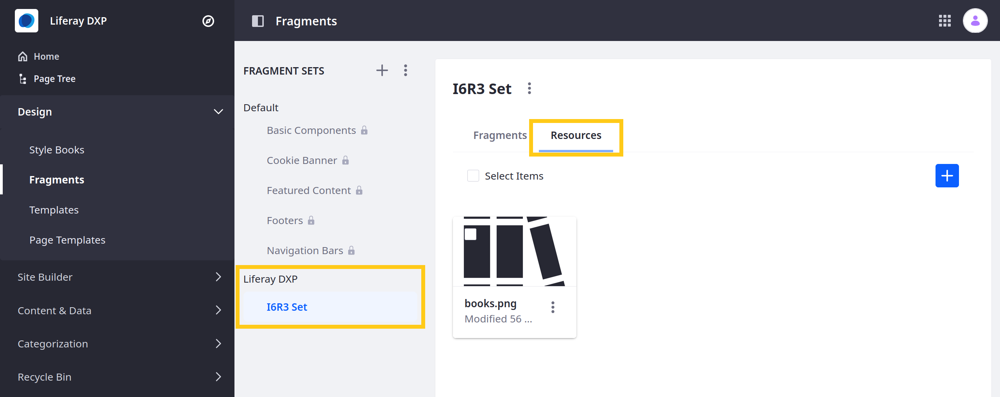
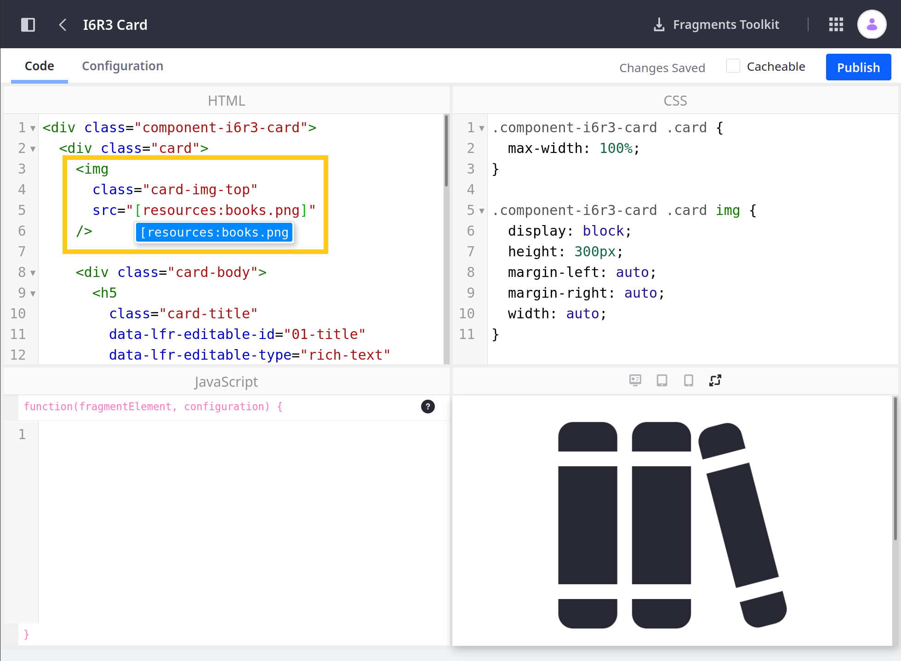
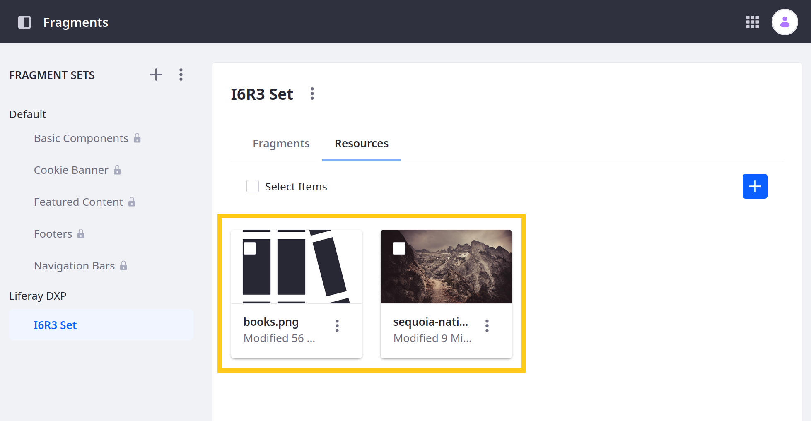
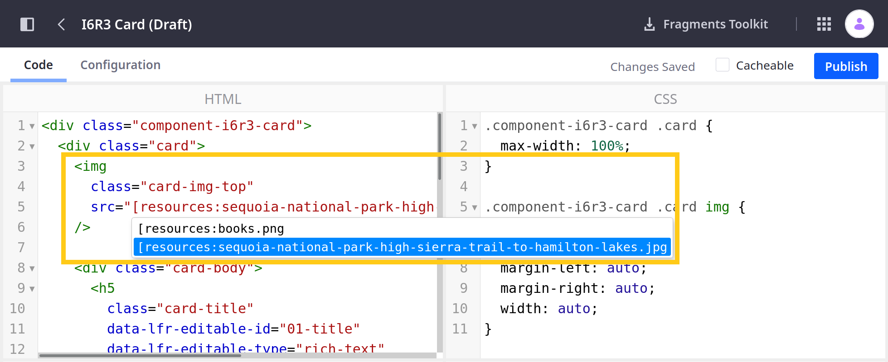

# Including Default Resources in Fragments

You can include images (e.g. `.gif`, `.jpg`, `.jpeg`, or `.png`) in your Fragment Collections for your Fragments to use. Keeping images with your Fragments, rather than in other applications, like [Documents and Media](../../../content-authoring-and-management/documents-and-media/sharing-documents-and-media.md), is a convenience. Here you'll learn how to include image resources in your Fragment Collections and use image resources in your Fragments.

## Import a Fragment Collection with Resources

First, import an example Fragment Collection to see how Fragment resources work:

1. Run the command below to start the Docker container:

    ```bash
    docker run -it -m 8g -p 8080:8080 [$LIFERAY_LEARN_DXP_DOCKER_IMAGE$]
    ```

1. Download and unzip the [example resources Fragment Collection](https://learn.liferay.com/dxp/latest/en/site-building/developer-guide/developing-page-fragments/liferay-i6r3.zip):

    ```bash
    curl https://learn.liferay.com/dxp/latest/en/site-building/developer-guide/developing-page-fragments/liferay-i6r3.zip -O
    ```

    ```bash
    unzip liferay-i6r3.zip
    ```

1. Setup up the Fragments Toolkit:

    ```bash
    cd liferay-i6r3
    ```

    ```bash
    ./setup-tutorial.sh
    ```

    Resolve all unmet requirements reported by the script and rerun the script until it reports that your environment is ready.

1. Import the Fragment Collection in the Docker container with the Fragments Toolkit using the `yarn run import` command below. 

    ```bash
    yarn run import

    ...
    ? Liferay host & port http://localhost:8080
    ? Username test@liferay.com
    ? Password [hidden]

    Checking connection...
    Connection successful

    ? Company ID liferay.com
    ? Group ID Liferay

    Importing project...

    Generating zip file

    build/liferay-fragments.zip file created
    Import them to your liferay-portal to start using them
    ✔ Fragment I6R3 Card imported
    ```

1. Verify that the Fragment Collection is available. Point your browser to `https://localhost:8080`, and under the Site Menu on the left side of the screen, go to *Design* &rarr; *Fragments*. The I6R3 Collection appears with the other Collections.

1. Click on the *I6R3 Collection*.

1. Click the *Resources* tab. The `books.png` image appears in the resource list.

    

## Resource Format Overview

The image resource is included in the Collection's `resources` folder. Here's the Fragment Collection file structure:

* `collection.json`: a text file which describes your Collection with the format `{"name":"Collection name","description":"Collection description"}`.
* `[fragment-name]/`: contains all of a Fragment's files.
* `resources/`: contains files available to all the Collection's Fragments.

```tip::
  Alternatively, you can upload the image through the *Resources* tab in the `Fragments Editor <./using-the-fragments-editor.md>`_.
```

Image files are referenced in a Fragment's HTML with the syntax `[resources:image-name.extension]`. The example Fragment HTML has this `img` element:

```html

```

```note::
  The resource name is case-sensitive and must match the name and case exactly in the reference.
```

```tip::
  You can style the image resource in your CSS with the syntax ``img[src="[resources:image-name.extension]"]``.
```

## Include a New Resource

Now that you know how to include a resource and reference it in a Fragment, you can use a new resource in the example Fragment Collection.

1. Copy an image, such as an image from <https://www.freeimages.com/>, to the `liferay-i6r3.zip/src/i6r3-collection/resources/` folder.

1. Import the Fragment Collection in the Docker container again as you did above:

    ```bash
    yarn run import
    ```

1. Verify that the Fragment Collection includes the resource. In the *Fragments* page in the UI, select the *I6R3 Collection* and click the *Resources* tab. The new image appears in the resource listing.

    

1. Open the *I6R3 Card* Fragment by selecting the Collection's *Fragments* tab and clicking the *I6R3 Card* Fragment. The Fragment source appears in the Fragments Editor.

1. Update the Fragment to use the new image resource. Delete `books.png` from the `img` element's `src="[resources:books.png]"` attribute and start typing the new image file's name after `src="[resources:`. An attribute value with the image file name appears under the cursor. Select that attribute value.

    

1. Verify that the Fragment renders the new image.



```note::
   Any Fragment in a Fragment Collection has access to the Collection's resources.
```

Great! Now you know how to use image resources Fragment Collections.

## Related Information

* [Adding Configuration Options to Fragments](./adding-configuration-options-to-fragments.md)
* [Auto-deploying Fragments](./auto-deploying-fragments.md)
* [Using the Fragments Editor](./using-the-fragments-editor.md)
