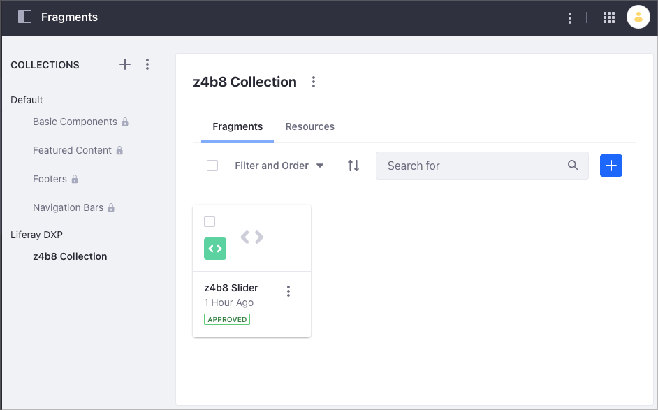
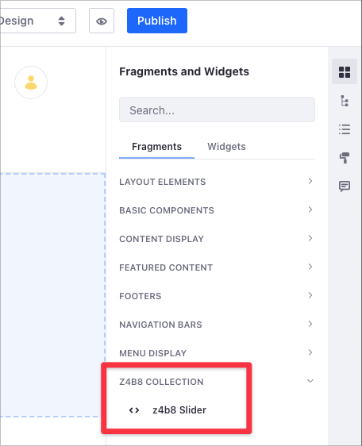
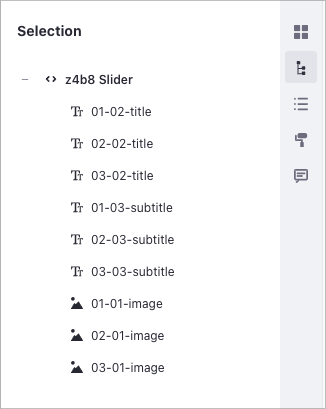

# Setting the Order of Elements in a Fragment

> Available in Liferay DXP 7.4+.

You typically use the [Slider](../../creating-pages/building-and-managing-content-pages/using-fragments.md#slider) or [Tab](../../creating-pages/building-and-managing-content-pages/using-fragments.md#tabs) Fragment to show areas of information. In the case of a Slider, you present this information using slides in a carrousel fashion. In a Tab Fragment, you usually configure multiple tabs, each one containing a particular information.

When you edit your Slider or Tab Fragment in the [Content Page Editor](../../creating-pages/building-and-managing-content-pages/editing-content-pages.md), the sidebar *Selection* () button shows the list of elements in your Fragment. Before Liferay DXP 7.4, these elements were not presented orderly. This made it difficult to identify how the Slider or Tab elements were grouped, especially when for Fragments with a large number of elements.


Starting Liferay DXP 7.4, the Slider and Tab Fragments show their elements orderly. In addition to this, Liferay DXP 7.4 includes the new `data-lfr-priority` HTML attribute to better organize the Fragment's elements. Elements with a lower `data-lfr-priority` value have precedence in the Selection list, independently of their order in the HTML code. For example, in this code excerpt, the elements follow this order: `First Slide Title`, `First Slide Subtitle`, and `First Responsive Image`:

```html
    <div class="carousel-inner text-break" id="${fragmentEntryLinkNamespace}-carouselInner" role="group">
        <div class="carousel-item active">
            

            <div class="carousel-caption d-none d-md-block">
                <h2
                    data-lfr-editable-id="01-02-title"
                    data-lfr-editable-type="rich-text"
                    data-lfr-priority="1"
                >
                    First Slide Title
                </h2>

                <p
                    data-lfr-editable-id="01-03-subtitle"
                    data-lfr-editable-type="rich-text"
                    data-lfr-priority="2"
                >
                    First Slide Subtitle
                </p>
            </div>
        </div>
```

This is the result in the Content Page Editor Selection:


```note::
   You use the `data-lfr-priority` HTML attribute in the Editable or Drop Zone area of your HTML code.
```

## Setting the Order of Elements in Your Fragment

To understand how you can modify the order of elements in your Slider or Tab Fragment, this tutorial takes a sample Slider Fragment from Liferay DXP 7.3, imports the Fragment into Liferay DXP 7.4, and guides you to update the Fragment HTML code.

- [Deploy the sample Liferay DXP 7.3 Slider Fragment in Liferay DXP 7.4](#deploy-the-sample-liferay-dxp-7.3-slider-fragment-in-liferay-dxp-7.4).
- [Customize the Order of Elements in the Slider Fragment](#customize-the-order-of-elements-in-the-slider-fragment).
- [Verify the New Order of Elements in the Content Page Editor](#verify-the-new-order-of-elements-in-the-content-page-editor).

## Deploy the Sample Liferay DXP 7.3 Slider Fragment in Liferay DXP 7.4

1. Run the following command to start a Liferay DXP 7.4 Docker container:

    ```bash
    docker run -it -p 8080:8080 liferay/dxp:7.4.10-ep1-nightly
    ```

1. Download and unzip the Liferay DXP 7.3 sample Fragment *z4b8 Collection*:

    ```bash
    curl https://learn.liferay.com/dxp/7.x/en/site-building/developer-guide/developing-page-fragments/setting-the-order-of-elements-in-a-fragment/resources/liferay-z4b8.zip -O
    ```

    ```bash
    unzip liferay-z4b8.zip
    ```

1. Change directory to the uncompressed folder and set up the Fragments Toolkit (for more information, read [Using the Fragments Toolkit](./using-the-fragments-toolkit.md)).

    ```bash
    cd liferay-z4b8
    ```

    ```bash
    ./setup_tutorial.sh
    ```

1. Import the sample Fragment *z4b8 Collection* to the Liferay DXP 7.4 Docker container using the Fragment Toolkit. Alternatively, you can [import the Fragment manually](../../displaying-content/using-fragments/managing-page-fragments.md).

    ```bash
    yarn run import
    ```

1. Enter the the information required by the `yarn run import` process. When required, use the up and down arrow keys in your keyboard to choose between different options.

    ```bash
    ❯ yo liferay-fragments:import
    ? Liferay host & port http://localhost:8080
    ? Username test@liferay.com
    ? Password [hidden]
    Checking connection...
    Connection successful

    ? Company ID liferay.com
    ? Group ID Liferay DXP
    Building project...
    Importing project...
    Project imported
    ```

1. Open your browser and go to `https://localhost:8080`, and under the Site Menu on the left side of the screen, go to *Design* &rarr; *Fragments*. The sample *z4b8 Collection* appears in the Collection list.

    

    ```note::
       The Collection Slider DXP 7.3 contains only one Slider Fragment named *z4b8 Slider*.
    ```

## Customize the Order of Elements in the Slider Fragment

1. Go to *Site Administration* &rarr; *Design* &rarr; *Fragments*.
1. Under the *Collections* area, click the sample *z4b8 Collection* you [deployed before](#deploy-the-sample-liferay-dxp-7.3-slider-fragment-in-liferay-dxp-7.4).
1. Click on the Fragment's *Actions* () button and select *Edit* to open the [Fragments Editor](./using-the-fragments-editor.md).

    

1. In the HTML code area, you can Edit the Slider Fragment code. Our Slider Fragment code defines three slides in three different `<div class="carrousel-item">` HTML tags. Each slide contains three elements:

    - Image (`data-lfr-editable-type="image"`)
    - Title (`data-lfr-editable-type"="rich-text"`)
    - Subtitle (`data-lfr-editable-type"="rich-text"`).

    The following code shows these three elements for the first slide in the carrousel:

    ```html
        <div
            class="carousel-inner text-break"
            id="${fragmentEntryLinkNamespace}-carouselInner"
            role="group"
        >
            <div class="carousel-item active">
                

                <div class="carousel-caption d-none d-md-block">
                    <h2
                        data-lfr-editable-id="01-02-title"
                        data-lfr-editable-type="rich-text"
                    >
                        First Slide Title
                    </h2>

                    <p
                        data-lfr-editable-id="01-03-subtitle"
                        data-lfr-editable-type="rich-text"
                    >
                        First Slide Subtitle
                    </p>
                </div>
            </div>
        </div>
    ```

1. Add the `data-lfr-priority` attribute to the Editable or Drop Zone area. In this example we modify the order of elements to list all the slider titles first, then all the slider subtitles, and then all the slider images:

    ```html
        <div class="component-z4b8-slider pb-4">
            <div class="carousel">
                <ol class="carousel-navigation">
                    <li>
                        <button aria-controls="${fragmentEntryLinkNamespace}-carouselInner" class="active" type="button">
                            <span class="sr-only">
                                Focus first slide
                            </span>
                        </button>
                    </li>
                    <li>
                        <button aria-controls="${fragmentEntryLinkNamespace}-carouselInner" type="button">
                            <span class="sr-only">
                                Focus second slide
                            </span>
                        </button>
                    </li>
                    <li>
                        <button aria-controls="${fragmentEntryLinkNamespace}-carouselInner" type="button">
                            <span class="sr-only">
                                Focus third slide
                            </span>
                        </button>
                    </li>
                </ol>

                <div class="carousel-inner text-break" id="${fragmentEntryLinkNamespace}-carouselInner" role="group">
                    <div class="carousel-item active">
                        

                        <div class="carousel-caption d-none d-md-block">
                            <h2
                                data-lfr-editable-id="01-02-title"
                                data-lfr-editable-type="rich-text"
                                data-lfr-priority="1"
                            >
                                First Slide Title
                            </h2>

                            <p
                                data-lfr-editable-id="01-03-subtitle"
                                data-lfr-editable-type="rich-text"
                                data-lfr-priority="4"
                            >
                                First Slide Subtitle
                            </p>
                        </div>
                    </div>

                    <div class="carousel-item">
                        

                        <div class="carousel-caption d-none d-md-block">
                            <h2
                                data-lfr-editable-id="02-02-title"
                                data-lfr-editable-type="rich-text"
                                data-lfr-priority="2"
                            >
                                Second Slide Title
                            </h2>

                            <p
                                data-lfr-editable-id="02-03-subtitle"
                                data-lfr-editable-type="rich-text"
                                data-lfr-priority="5"
                            >
                                Second Slide Subtitle
                            </p>
                        </div>
                    </div>

                    <div class="carousel-item">
                        

                        <div class="carousel-caption d-none d-md-block">
                            <h2
                                data-lfr-editable-id="03-02-title"
                                data-lfr-editable-type="rich-text"
                                data-lfr-priority="3"
                            >
                                Third Slide Title
                            </h2>

                            <p
                                data-lfr-editable-id="03-03-subtitle"
                                data-lfr-editable-type="rich-text"
                                data-lfr-priority="6"
                            >
                                Third Slide Subtitle
                            </p>
                        </div>
                    </div>
                </div>

                <button
                    aria-controls="${fragmentEntryLinkNamespace}-carouselInner"
                    aria-label="Previous Slide"
                    class="carousel-control-prev"
                    type="button"
                >
                    <span class="carousel-control-prev-icon" aria-hidden="true"></span>
                    <span class="sr-only">Previous</span>
                </button>

                <button
                    aria-controls="${fragmentEntryLinkNamespace}-carouselInner"
                    aria-label="Next Slide"
                    class="carousel-control-next"
                    type="button"
                >
                    <span class="carousel-control-next-icon" aria-hidden="true"></span>
                    <span class="sr-only">Next</span>
                </button>
            </div>
        </div>
    ```

    ```note::
       You don't need to edit other parts of the Fragment's code, like JavaScript, CSS, or Configuration.
    ```

## Verify the New Order of Elements in the Content Page Editor

1. Go to *Site Administration* &rarr; *Site Builder* &rarr; *Pages*.
1. Edit the Content Page where you want to add the Slider Fragment sample (or [add a new Page](../../creating-pages/adding-pages/adding-a-page-to-a-site.md)).
1. From the Content Page sidebar, click *Fragments and Widgets* ().
1. Under the *Fragments* column, find the *Z4B8 Collection* you [deployed before](#deploy-the-sample-liferay-dxp-7.3-slider-fragment-in-liferay-dxp-7.4).

    

1. Drag and drop the *z4b8 Slider* onto the editing area.
1. In the Content Page Sidebar, click the Selection () button to show the list of elements in your Fragment. Here is the result from our custom HTML code:

    

    ```note::
        Slider or Tab Fragments that you import from a version previous to Liferay DXP 7.4 appear orderly in the Content Page Editor sidbar but don't include the `data-lfr-priority` HTML attribute. You need to edit the HTML Fragment code to include this attribute.
    ```

## Related Information

- [Using the Fragments Toolkit](./using-the-fragments-toolkit)
- [Using the Fragments Editor](./using-the-fragments-editor)
- [Developing Fragments](./developing-fragments)
