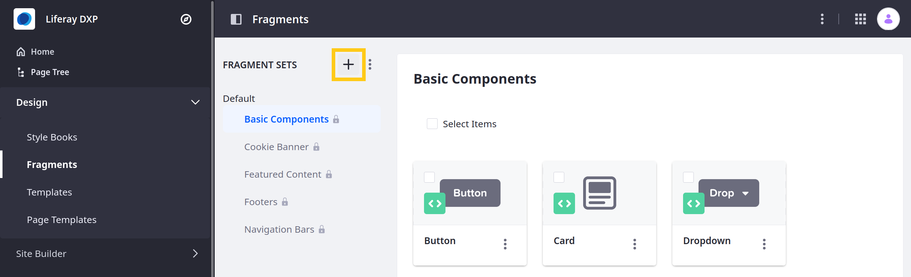
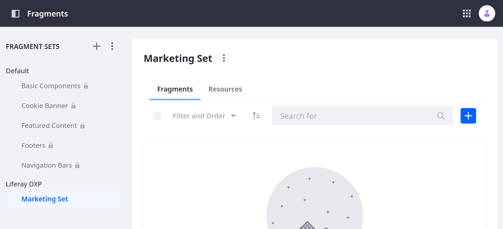
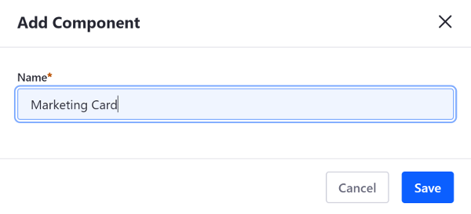
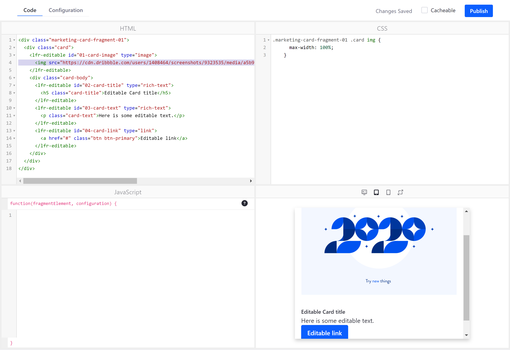
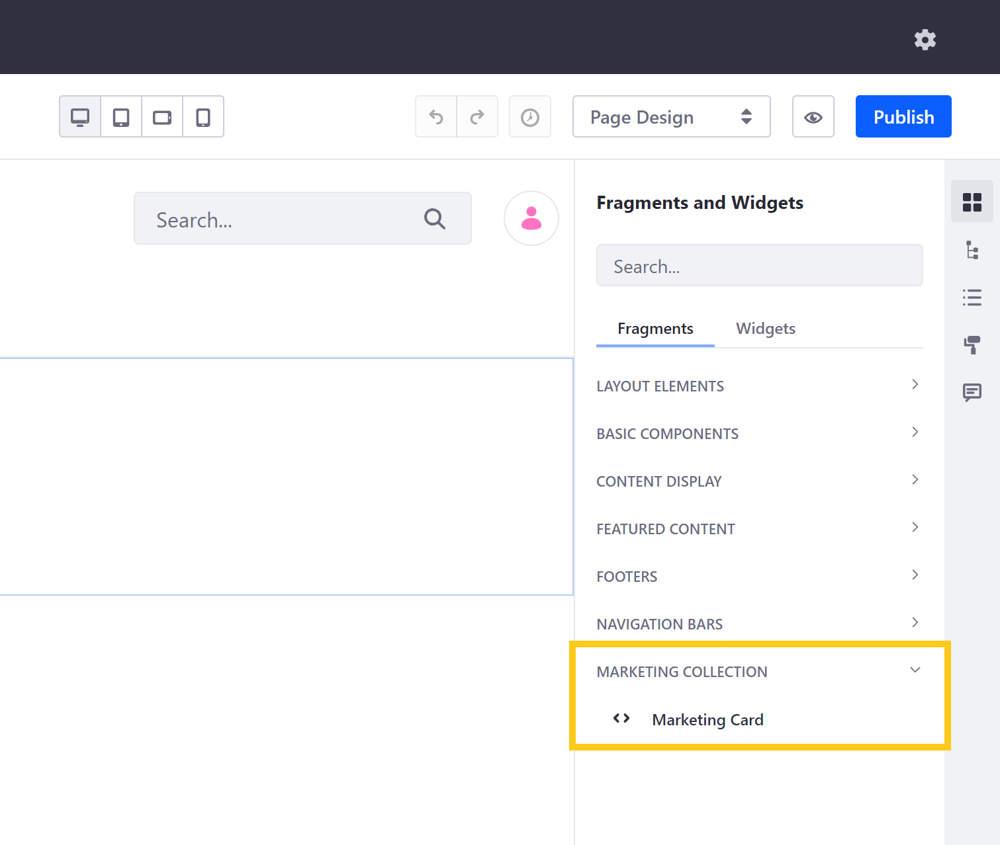
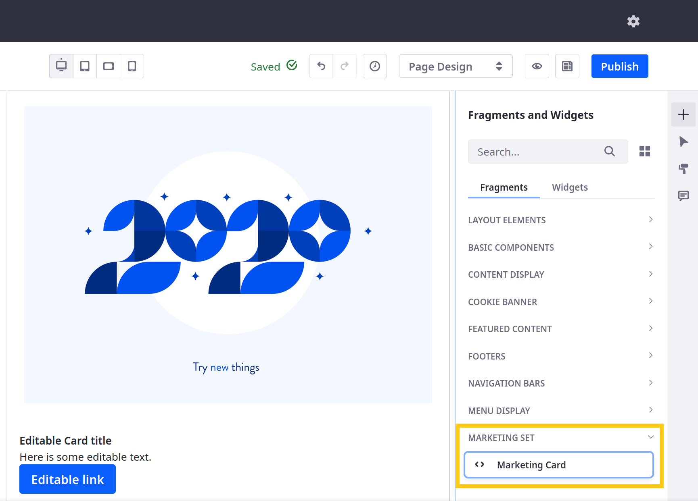

# Using the Fragments Editor

Liferay DXP includes a built-in [editor](../reference/fragments/page-fragment-editor-interface-reference.md) for developing Content Page Fragments. To access the editor, open the *Site Menu* () and go to *Design* &rarr; *Fragments*. From here, you can view, manage, and create Fragments and  Fragment Sets.

* [Creating a Fragment Set](#creating-a-fragment-set)
* [Creating a New Fragment](#creating-a-new-fragment)

```{note}
For Liferay DXP 7.4+, Fragment Collections are called Fragment Sets in the Liferay UI.
```

## Creating a Fragment Set

Before creating new Fragments, you must first create a new Fragment Set to put them in:

1. Open the *Site Menu*, and go to *Design* &rarr; *Fragments*

    ```{note}
    In Liferay DXP 7.1 and 7.2, open the *Product Menu*, and go to *Site* → *Site Builder* → *Page Fragments*.
    ```

1. Click the *Plus* button () next to Fragment Sets.

   

1. Enter a *name* and *description* for the new Set.

    ```{tip}
    Create Sets that group Fragments by functionality or by teams and departments.
    ```

1. Click *Save*.

Once saved, you can add Fragments to the Set.

## Creating a New Fragment

Follow these steps to create a Fragment:

1. Go to the desired Fragment Set and click the *Add* button () to create a new Fragment.

   

   ```{note}
   Prior to Liferay DXP 7.3, a Fragment could either be a Section or a Component. In Liferay DXP 7.3+, all Page Fragments are Components.
   ```

1. Enter a *name* for the Fragment and click *Save*.

    

1. In the Code tab, use the CSS, HTML, and JavaScript fields to add your Fragment's resources. Here, you can also see a live preview of your Fragment's appearance in different device contexts.

    Here are some HTML editing shortcuts:

    * Enter an open angle bracket (`<`) to access standard HTML tags and Liferay's Fragment-specific tags.

    * Start an element attribute with `data` to access Liferay's [editable Fragment attributes](../reference/fragments/fragment-specific-tags-reference.md) .

    

    The example below adds a Card component with editable text:

    ```html
    <div class="marketing-card-fragment-01">
      <div class="card">
        <lfr-editable id="01-card-image" type="image">
          
        </lfr-editable>
        <div class="card-body">
          <lfr-editable id="02-card-title" type="rich-text">
            <h5 class="card-title">Editable Card title</h5>
          </lfr-editable>
          <lfr-editable id="03-card-text" type="rich-text">
            <p class="card-text">Here is some editable text.</p>
          </lfr-editable>
          <lfr-editable id="04-card-link" type="link">
            <a href="#" class="btn btn-primary">Editable link</a>
          </lfr-editable>
        </div>
      </div>
    </div>
    ```

    ```css
    .marketing-card-fragment-01 .card img {
      max-width: 100%;
    }
    ```

    

1. In the Configuration tab, use the `JSON` field to add [configuration options](./adding-configuration-options-to-fragments.md)) to a Page Fragment.

   

1. Click *Publish* to save your Fragment and make it available for use in [Content Pages](../../creating-pages/understanding-pages/understanding-pages.md#content-pages).

    

While developing a Fragment, changes are automatically saved as a draft until your Fragment is published. Once added to a Set, you can copy, export, edit, and remove a Fragment at any time in the Fragments editor. See [Managing Fragments](../../creating-pages/page-fragments-and-widgets/using-fragments/managing-fragments.md) for more information on available actions for Page Fragments.

```{note}
Since Liferay DXP 7.2 SP1+ and Liferay Portal 7.2 GA2+, you can create Page Fragments on the *Global* Site to make them available for all Sites. To expose this feature in the initial releases of these versions, you must create a `.config` file named `com.liferay.fragment.web.internal.configuration.FragmentGlobalPanelAppConfiguration.config` and add the `enabled=B"true"` property. Then copy it to your Liferay DXP instance's `osgi/configs` folder. Global Page Fragments are inherited by child Sites and can only be edited from the Global Site. Any resources the Global Page Fragment references from the Global Site are copied to a Site that leverages the Page Fragment.
```

## Additional Information

* [Using the Fragments Toolkit](./using-the-fragments-toolkit.md)
* [Adding Configuration Options to Fragments](./adding-configuration-options-to-fragments.md)
