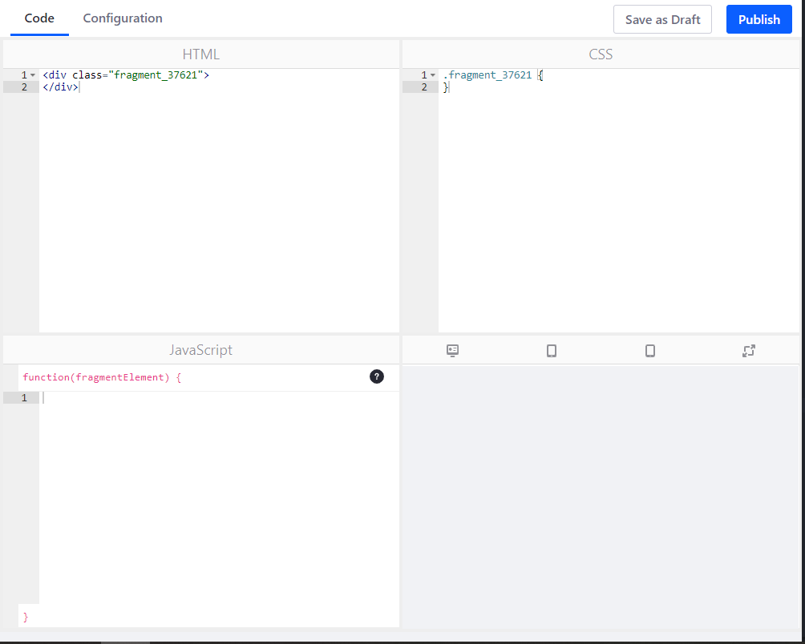
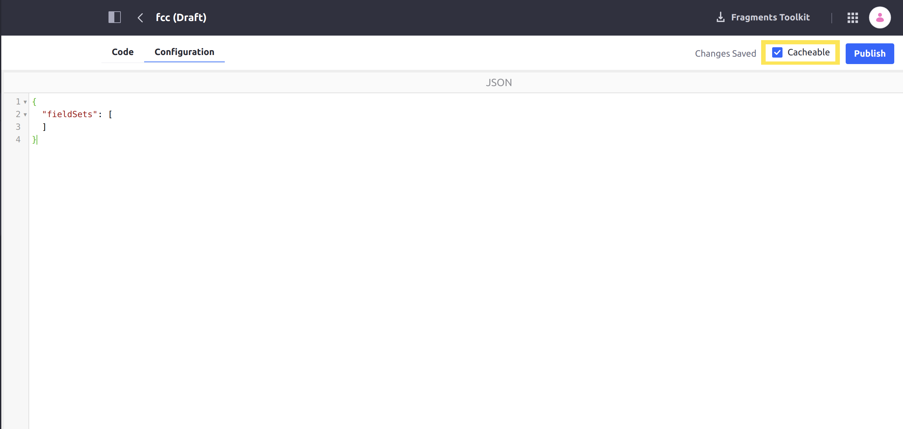

# Page Fragment Editor Interface Reference

The Page Fragment editor's interface is organized into two tabs:

- [Code Editor](#code-editor)
- [Configuration](#configuration)

The sections below cover how to use these portions of the interface. See [Developing Page Fragments](../../developing-page-fragments/developing-fragments-intro.md) to learn how to develop Page Fragments.

## Code Editor

The code editor is split into four panes:

**HTML:** Supports standard HTML, along with Liferay Portal specific tags and FreeMarker (using the [alternative (square bracket) syntax](https://freemarker.apache.org/docs/dgui_misc_alternativesyntax.html)) that can be used to add dynamic behavior.

```tip::
   Type ``$(`` to begin using auto-completion to find variable names. Type ``[@`` to use auto-completion to find taglib names.
```

**CSS:** Supports standard CSS.

**JavaScript:** Supports standard JavaScript and JQuery. You can also access configuration values in the FreeMarker context in the JavaScript pane.

**Preview:** provides a live preview of the component that updates as you write code. You can switch between desktop, mobile, tablet, and expanded views.



## Configuration

```note::
  Defining configurations for Page Fragments is available in Liferay DXP 7.2 SP1+ and Liferay Portal GA2+.
```

The Configuration tab provides input for adding configuration options to the Page Fragment's Configuration Menu. This is equivalent to the `configuration.json` file that the [Fragments Toolkit](../../developing-page-fragments/using-the-fragments-toolkit.md) produces. For example, you can add a selector to your Page Fragment's configuration options that lets users choose a color for the Page Fragment's heading. Defining configuration options for a Page Fragment gives it more flexibility, reducing the number of Page Fragments you must maintain.

```note::
  Changes made to the configuration are automatically made available to the code editor. If your configuration is invalid, you can't publish your Page Fragment. Be sure to always have a valid JSON configuration before previewing or publishing Page Fragments.
```

Configuration values are made available to the Page Fragment through the FreeMarker context in the HTML pane. You can combine configuration options with conditional values in the HTML to create dynamic experiences for the user. You can also access these values via JavaScript. See [Making Page Fragments Configurable](../../developing-page-fragments/adding-configuration-options-to-fragments.md) for more information.

In DXP 7.3+, you can also select a checkbox near the top of the page to make your fragment cacheable. If this option is enabled, then the fragment is added to the cache when it is added to a page, improving the performance of pages with these fragments.



## Additional Information

- [Developing Fragments](../../developing-page-fragments/developing-fragments-intro.md)
- [Adding Configuration Options to Fragments](../../developing-page-fragments/adding-configuration-options-to-fragments.md)
- [Fragment Configuration Type Reference](./fragment-configuration-types-reference.md)
