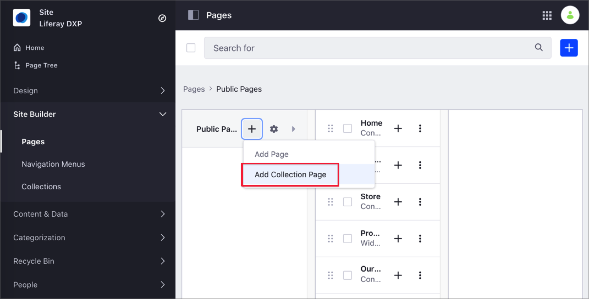
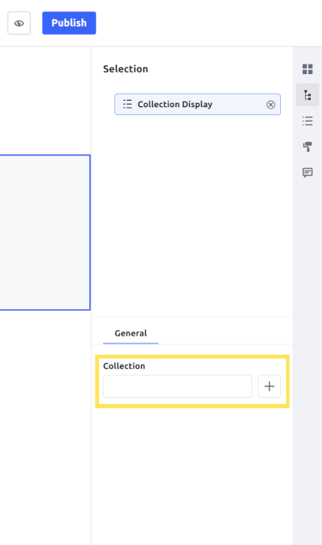
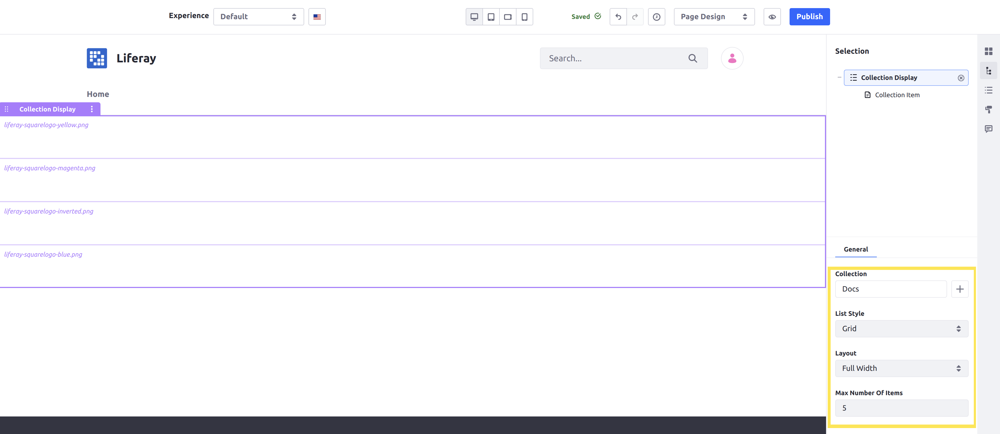
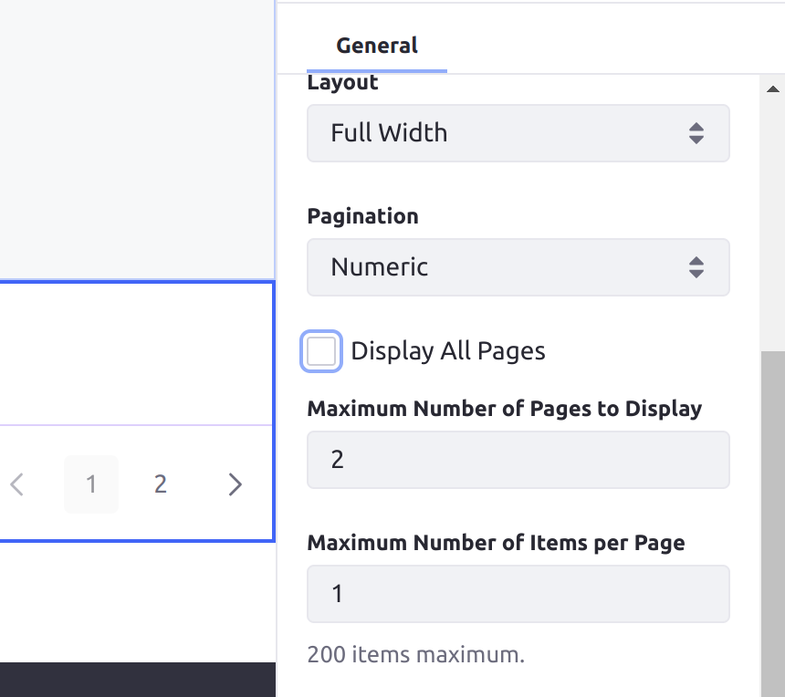
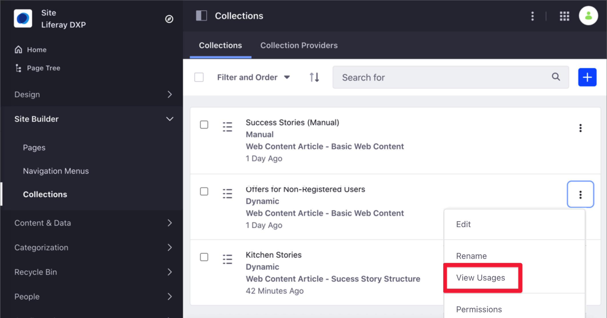
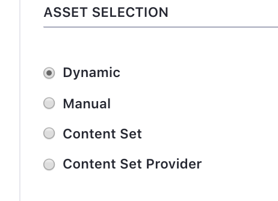
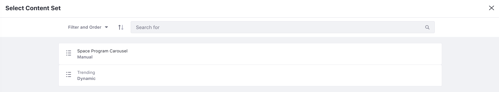
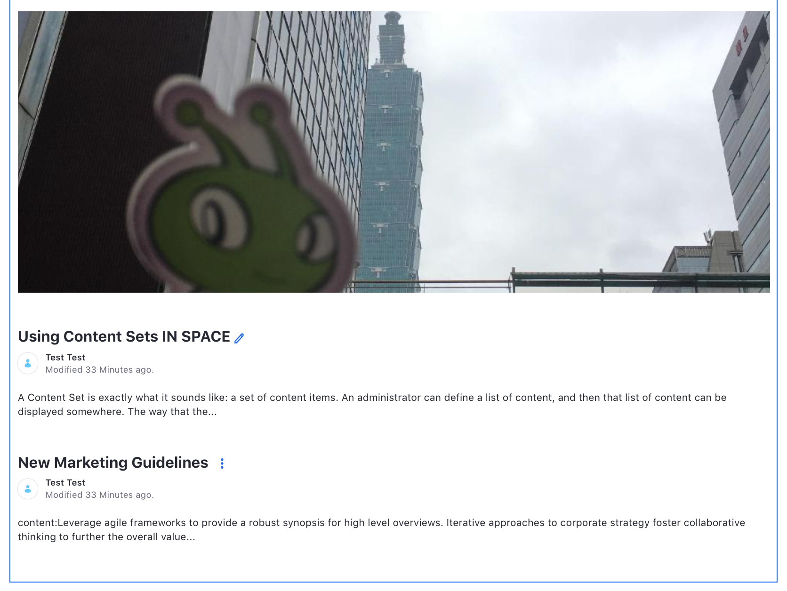
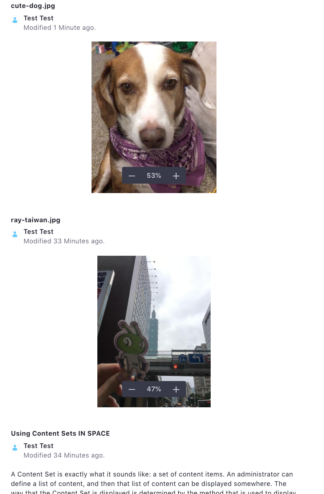

# Displaying Collections

> Availability: Liferay Portal 7.3 GA6, DXP 7.3 GA1+

You can display a Collection by adding a Collection Page, or a Collection Display Fragment. For more information about these display options, see [About Collections and Collection Pages](../../../content-authoring-and-management/collections-and-collection-pages/about-collections-and-collection-pages.md#displaying-collections).

By default, any User can see a Collection's content. However, you can create *Personalized Variations* of these items using Segments. For more information, see [Customizing Collections Using Segments](../../../content-authoring-and-management/collections-and-collection-pages/about-collections-and-collection-pages.md#customizing-collections).

```{note}
Before displaying a Collection, you must create one. For more information, see [Creating Collections](../../../content-authoring-and-management/collections-and-collection-pages/creating-collections.md).
```

## Displaying Collections on a Page

The two easiest ways to display a Collection are to add a Collection Page, or to add a Collection Display Fragment to an existing page.

### Displaying Collections on a Collection Page

A Collection Page links a page to a Collection. Collection Pages include Collection Display Fragments as part of the page. See [this section](#adding-a-collection-display-fragment-to-a-page) to add a Collection Display Fragment to an existing page instead.

Follow these steps to add a Collection Page:

1. Go to *Site Administration* &rarr; *Site Builder* &rarr; *Pages*.

1. Click the *New Page* button () at the level where you want to add the new page, and select *Add Collection Page*.

   

1. From the *Collections* tab, select one of your Collections.

1. Select the *Master Page* you want to use.

1. Enter the *Name* of your Collection Page and click *Add*.

1. To show the Collection, map its content to page elements. See the [Mapping Components](#mapping-components-to-display-a-collection-s-assets) section for more information.

```{important}
You cannot create a child page under a Collection Page.
```

You now have a Collection Page displaying your chosen Collection, within a Collection Display Fragment.

### Adding a Collection Display Fragment to a Page

A Collection Display fragment shows a Collection in a Content Page. It can be configured to display a chosen Collection in any desired style or layout.


To add an existing Collection to a Collection Display Fragment: 

1. Click the Edit icon () on a Content Page.

1. Click the icon () to open the Fragments and Widgets panel.

1. Under the *Content Display* category in the Fragments menu, drag the *Collection Display* fragment to a place on the page.

1. Click on the Collection Display fragment to show the configuration in the *Selection* panel.

1. Click the button to select a Collection for the fragment to display in the *General* section of the panel:

   

The Collection Display fragment is now on the page and displaying the selected Collection.

## Configuring a Collection Display Fragment

Whether you added a Collection Display Fragment manually or via a Collection Page, you can configure it by editing the page and selecting the fragment.

Selecting a Collection Display Fragment divides it into sections for each asset in the Collection. New options appear under the fragment's General configuration after you've selected a Collection:

* **List style**: the style used to format the assets in the list (e.g., Grid or Bulleted List styles)
* **Layout**: the number of columns the assets appear in
* **List item style**: the style used to format each individual asset. This option may not appear depending on the chosen List style.
* **Max number of items**: the maximum number of assets the fragment can display at a time



Publish the page when you're ready for the assets in the Collection to be displayed as configured.

<!-- Add reference to developer tutorials to add more options for the List styles/List item styles when available -->

### Mapping Components to Display a Collection's Assets

You can also configure the item style (how each asset is individually displayed) in the fragment by mapping display components to them.

Map these elements to the assets in the Collection Display Fragment by dragging them into the cells of the fragment.

```{note}
Depending on the option you have chosen for a Collection Display Fragment's List style, you may not be able to drag components into the fragment. If you cannot drag components into the fragment, you can choose a different List style or select a different option under `List item style`. 
```

1. In the Page Editor, click the *Collection Display* representing your Collection.

1. In the tools sidebar, click the *Fragments and Widgets* () button.

1. From the *Fragments and Widgets* sidebar panel, drag and drop the components you want to use to show the Collection items.

    

    ```{note}
    If the Collection Display contains more than one item, you can drag the Fragment or Widget to any of them. The rest of the items in your Collection automatically use the same layout settings.
    ```

1. Click the Fragment or Widget on the Collection Display.

1. Click again to access the mapping options.

1. In the *Mapping* column, select the *Field* that you want to map to your Collection.

    

1. Add more Fragments or Widgets as necessary and map the content to the content Fields.

   

1. Click *Publish*.

## Paginating Display Items

> Available: Liferay DXP/Portal 7.4+

Starting with Liferay DXP 7.4, you can paginate the Collection items using the Pagination configuration. This option provides two important advantages:

* It is easier to show Collections with a large number of items. Instead of showing all the items in the Collection, you can decide how many items to show at once, while allowing users to move back and forward through the list of items in the Collection.
* Breaking the visible list of items into smaller groups reduces the server overhead, improving the server response time and user experience.

```{note}
In Liferay DXP 7.4 versions earlier than U18 or GA18, fewer pagination options are available. In these versions, you can still enable pagination and choose the maximum number of items to display at once, but you cannot change the number of pages shown in the pagination menu.
```

To paginate the display items in the Collection Display,

1. Click the Edit icon () on the Content Page with the Collection Display.

1. Click the Browser icon () to open the Fragments and Widgets panel.

1. Under Page Elements, select the Collection Display Fragment you want to paginate. (The chosen Fragment must be configured to display an existing Collection.)

1. In the General Settings, choose the pagination options:

    * **Pagination**: None (no pagination), Numeric, or Simple (Previous/Next controls).
    * **Display All Pages**: Whether to display the numbers or controls for every page in the pagination menu. If no pagination type is selected, then this option becomes *Display All Collection Items* instead.
    * **Maximum Number of Pages to Display**: The maximum number of pages shown in the pagination menu. This option only appears if the Display All Pages checkbox is not selected.
    * **Maximum Number of Items per Page**: The maximum number of items from the Collection to display per page, if pagination is enabled. If no pagination type is selected, then this option becomes *Maximum Number of Items to Display* instead.

    

If you enable pagination, then the total number of pages available depends on both the total number of items in the Collection and the setting for Maximum Number of Items per Page.

```{tip}
By default, the Collection Display Fragment only displays up to 20 items at a time in Edit mode to prevent a negative performance impact. You can change this limit by navigating to Control Panel &rarr; Instance Settings &rarr; Pages &rarr; Page Editor, and changing the number in the *Maximum Number of Items in Edit mode* field. This setting does not affect what Users see on the page in View mode.
```

## Viewing Collections Usage Throughout the Site

You can find usage statistics for the Collections on your site.

1. Go to *Site Administration* &rarr; *Site Builder* &rarr; *Collections*.
1. Under the *Collections* tab, click on the Actions () menu next to the Collection you want to review and select *View Usages*.

  

## Liferay DXP 7.2

### Displaying Content Sets

Content Sets are primarily displayed through the Asset Publisher. It is currently the only method to display them out of the box, but you can develop your own external applications or widgets to utilize Content Sets. In [Creating Content Sets](../../../content-authoring-and-management/collections-and-collection-pages/creating-collections.md#creating-content-sets) you created two Content Sets. Now display them on a page.

#### Configuring the Asset Publisher for Content Sets

To display the Content Sets, start with a blank page, and then add the necessary Asset Publishers and configure them to display the Content Sets.

1. Create a new *Home* page for your site as a Widget Page with a 1 column layout. If you're using a fresh Liferay DXP bundle, you can just remove the *Hello World* widget from the sample *Home* page.
1. Open the *Add* menu and add two *Content Management* &rarr; *Asset Publishers* to the page stacked vertically.
1. Click  &rarr; *Configuration* for the top Asset Publisher.
1. Under *Asset Selection* choose *Content Set*.

    

1. Open *Select Content Set* and click *Select*.
1. Click on the *Space Program Images* Content Set.
1. Click *Save*.

Now the images will appear at the top of the page. You can manage the way the content is displayed---like what metadata appears---or even create a *Widget Template* to style the content, but the items which display and the order in which they appear are determined by the Content Set.

Now configure the bottom Asset Publisher with the other Content Set.

1. Click  &rarr; *Configuration* for the bottom Asset Publisher.
1. Under *Asset Selection* choose *Content Set*.
1. Open *Select Content Set* and click *Select*.
1. Click on the *Trending* Content Set.

    

1. Click *Save*.

Again, you can manage various display settings, but the items which appear and their order are determined by the Content Set criteria.



#### Adding Items to an existing Content Set

To demonstrate both the management of both static and dynamic Content Sets, upload a new image, tag it, and add it to the static set manually.

1. Upload a new image, and under *Categorization* tag it as *trending*.
1. Without lifting another finger, the image is added to the top of the *Trending* Content List.

    

1. To add it to the manual set, go back to *Site Administration* &rarr; *Content & Data* &rarr; *Site Builder*.
1. Click on *Space Program Images* or select  &rarr; *Edit* next to *Space Program Images*.
1. Next to *Asset Entries* click *Select* &rarr; *Basic Document*.
1. Select the new image and click *Add*.
1. Navigate back to the *Home* page to see your image added to the list.

Content Sets are a powerful feature which provide one place to easily define content and other assets to be displayed all over your site. Their reusability also means less repeated work involved in getting great content delivered to your users.

## Related Information

* [Creating Collections](../../../content-authoring-and-management/collections-and-collection-pages/creating-collections.md)
* [About Collections and Collection Pages](../../../content-authoring-and-management/collections-and-collection-pages/about-collections-and-collection-pages.md)
* [Personalizing Collections](../../personalizing-site-experience/experience-personalization/personalizing-collections.md)
