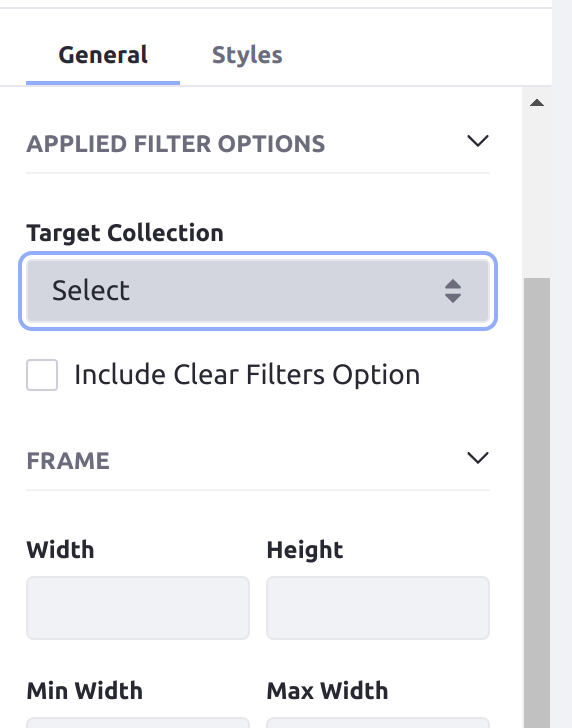
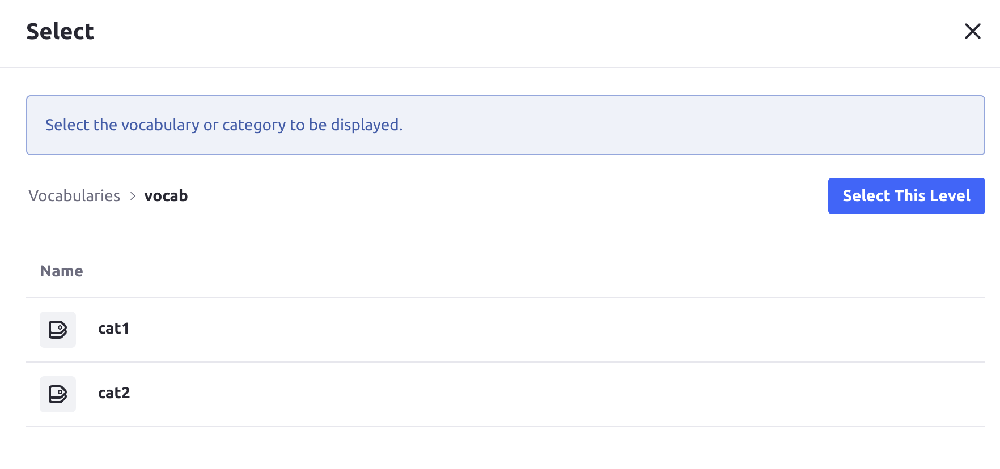
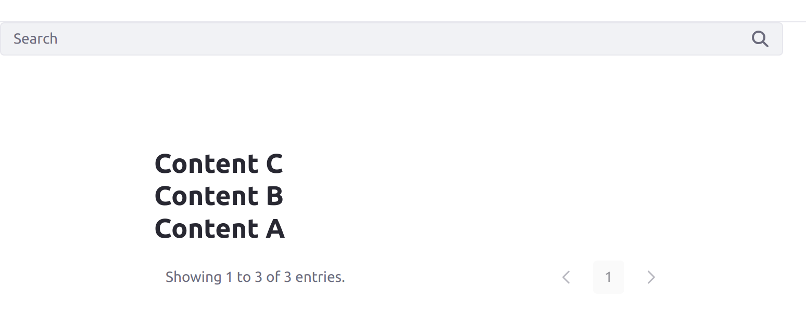
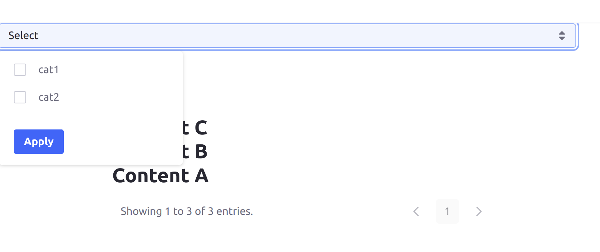
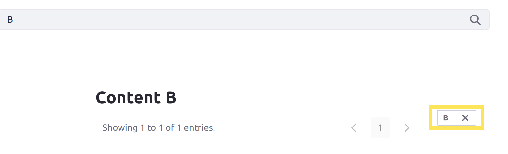

# Filtering Collections on a Page

In order to improve the experience for Users viewing Collections on your Site, you may want them to be able to filter the content, with a keyword for example. There are two Page Fragments you can add to your pages to help Users filter content in displayed Collections: the [Collection Filter Fragment](#using-the-collection-filter-fragment) and the [Applied Filters Fragment](#using-the-applied-filters-fragment).

## Using the Collection Filter Fragment

The Collection Filter Fragment allows Users to filter the content displayed in a chosen Collection on the page. Users can 

Follow these steps to add and configure a Collection Filter Fragment to a page (that is already displaying a Collection in a [Collection Display Fragment](./displaying-collections.md#configuring-a-collection-display-fragment)):

1. While editing the page, add a Collection Filter Fragment anywhere on the page.

1. In the Fragment's *General* configuration, select the desired Collection. The Collection must be displayed in Collection Display Fragments on the page for it to have an effect.
    
    

    The *Filter* drop-down menu appears when you have selected a compatible Collection.

1. Choose a type of filter for the Fragment, *Keywords* or *Category*.

    If you choose the Keywords filter type, then Users can search for any keyword to filter the Collection by. If you choose the Category filter type, then the *Source* input field appears, and Users can select a category from the configured source to filter the Collection by.

1. If you chose the Category filter type, then click on the Source input field, and use the popup menu to choose the source of categories for Users to choose from.

    

1. Click *Select This Level* when you have selected the vocabulary or parent category *containing the desired categories to choose from*.

1. Publish the page.

The Collection Filter Fragment's behavior changes depending on whether you configured the Keywords or Category filter type.

If you chose the Keywords type, then the Collection Filter Fragment appears as a search bar. Users can enter keywords to filter Collections displayed on the page to content containing those keywords.

If you chose the Category type, then the Fragment appears as a menu listing all of the categories that can be chosen. Users can select any number of these categories and apply them to filter Collections to content with those categories.

## Using the Applied Filters Fragment

The Applied Filters Fragment allows Users to see a list of filters applied with the [Collection Filter Fragment](#using-the-collection-filter-fragment).

Follow these steps to add an Applied Filters Fragment to a page (that already has a configured Collection Filter Fragment):

1. While editing the page, add an Applied Filter Fragment anywhere on the page.

1. In the Applied Filter Fragment's *General* configuration, select the desired Collection. The same Collection must be both displayed on the page and configured with a [Collection Filter Fragment](#using-the-collection-filter-fragment).

1. Publish the page.

Now when the User filters content with the Collection Filter Fragment, the Applied Filters Fragment shows a list of the filters currently applying to the configured Collection. Users can also click the *X* button on each filter listed to remove the filter.

## Additional Information

* [Displaying Collections](./displaying-collections.md)
