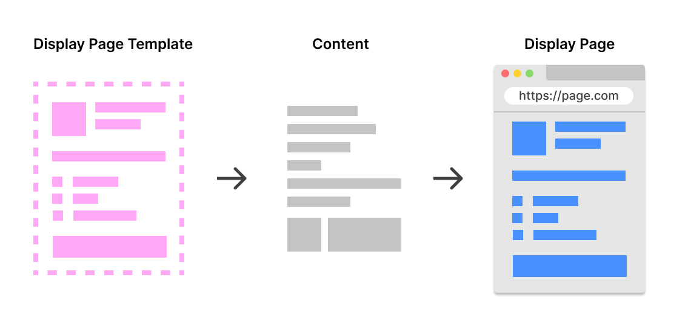
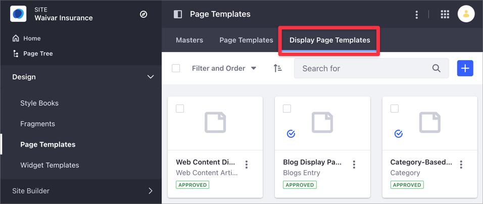
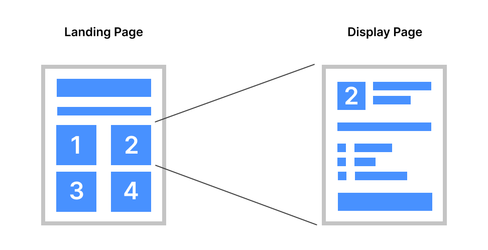
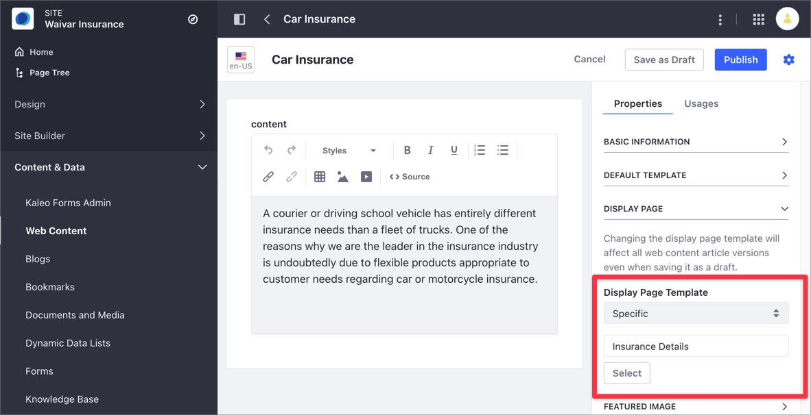

# About Display Page Templates and Display Pages

Display Pages provide a way to organize and dynamically display your content on a Page. Similarly to [Content Pages](../../creating-pages/building-and-managing-content-pages/content-pages-overview.md), you organize the Display Page content in [Fragments](../using-fragments/using-page-fragments.md) and [Widgets](../../creating-pages/building-and-managing-content-pages/using-widgets-on-a-content-page.md) but using a Display Page Template to outline and map your content. Using a single Display Page Template, you can apply the same layout multiple times to different content of the same type.

```tip::
   Using Content Pages, you can create the Page layout and composition of your choice, but you cannot save and reuse this Content Page as a template.
```

For instance, you can create a Display Page Template for different Web Content Articles and display the content in different Display Pages, each using the same layout but with a unique friendly URL. This way, users have a consistent experience when browsing your Site. Additionally, you can define Display Page Template [SEO settings](./configuring-seo-and-open-graph.md), improving your Display Pages discoverability. Display Pages are ideal when you need to show a catalog of elements in a consistent way, like business case studies, different product or service options, or flat or job listings.

```note::
   For more information about the different ways of displaying content in Liferay DXP, see `Displaying Content <../displaying-content-intro.md>`_.
```

## Understanding Display Page Templates and Display Pages

The Display Page Template determines how to display and map your content on the Display Page. The way you create a Display Page Template is very similar to the way you [add elements to Content Pages](../../creating-pages/building-and-managing-content-pages/adding-elements-to-content-pages.md). However, Display Pages are always associated to a certain type of content, while Content Pages are not.

To create a Display Page, create a Display Page Template first and then display the content using the Display Page unique URL.



When you create a Display Page Template, you choose among the following types of content to associate:

- [Web Content Articles](../../../content-authoring-and-management/web-content/web-content-articles/adding-a-basic-web-content-article.md)
- [Documents](../../../content-authoring-and-management/documents-and-media/publishing-and-sharing/publishing-documents.md)
- [Categories](../../../content-authoring-and-management/tags-and-categories/defining-categories-and-vocabularies-for-content.md) (starting with Liferay DXP 7.4+.)
- [Blog Entries](../../../content-authoring-and-management/blogs/getting-started-with-blogs.md)

Consider the following when creating and managing Display Page Templates:

- You can create different Display Page Templates for the same content type, but you can set only one default template for the same content type.
- You can associate the content to the default Display Page Template or you can use a specific Display Page Template (see [Publishing Content With Display Pages](./publishing-content-with-display-pages.md) for more information.)
- The Display Page renders your content using a unique [friendly URL](../../site-settings/managing-site-urls/configuring-your-sites-friendly-url.md).
- To update your Display Page layout and mappings, update the Display Page Template under Site Administration &rarr; *Design* &rarr; *Page Templates*.

    

## Using Display Page Templates and Display Pages Example

Consider the following example to better understand how you can implement Display Page Templates and Display Pages on your Site.

On your insurance business website, you want to showcase the different insurances options to prospective customers. You have different Web Content Articles in Liferay DXP describing each one of these insurances. You start with a landing page where visitors can see all the insurances at a glance, and click on each option (1 to 4, in this example) to access a new page with the corresponding insurance details.



```tip::
   `Content Pages <../../creating-pages/building-and-managing-content-pages/content-pages-overview.md>`_ give you the tools to create stunning landing pages.
```

You want to use the same layout for each one of the four detail pages describing the different insurances, and you want to dynamically map each field on these pages to the insurance information in your Web Content Articles.

To achieve this goal, you create a single Display Page Template named *Insurance Details* where you map the different fields in your Web Content Articles to Fragments in your template composition. Then, you define this new Display Page Template in the Web Content using the Web Content Article properties. When you display this Web Content using its friendly URL, the Display Page uses the layout and mappings in the Display Page Template.



## Related Information

- [Creating and Managing Display Page Templates](./creating-and-managing-display-page-templates.md)
- [Publishing Content With Display Pages](./publishing-content-with-display-pages.md)
- [Displaying Content](../displaying-content-intro.md)
