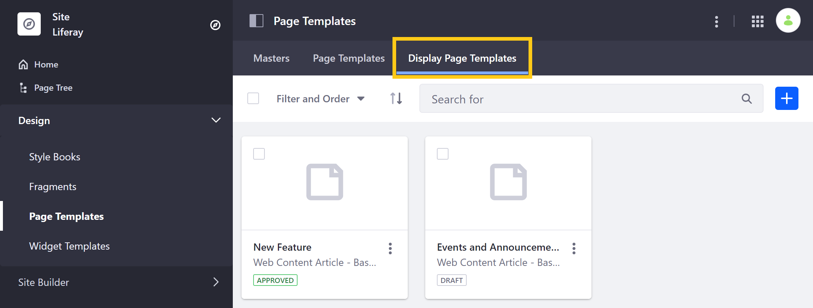
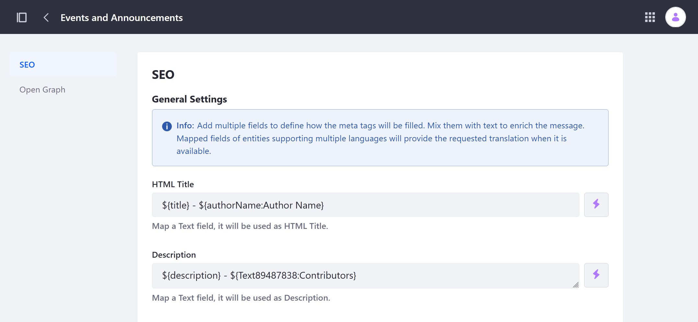
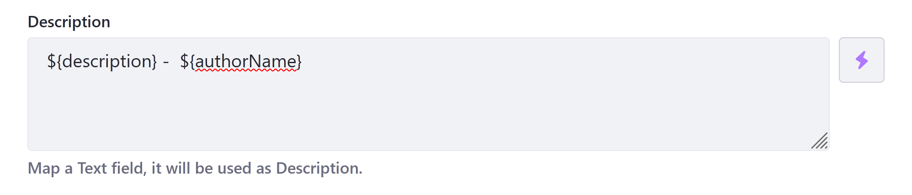
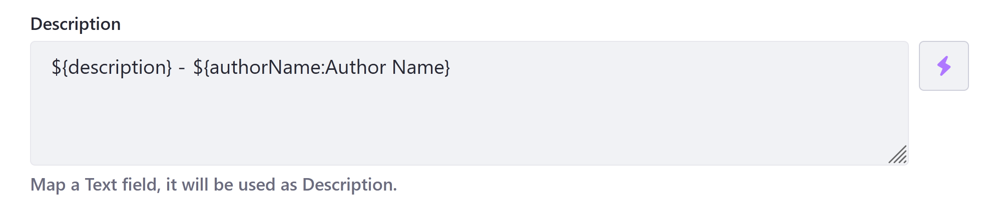
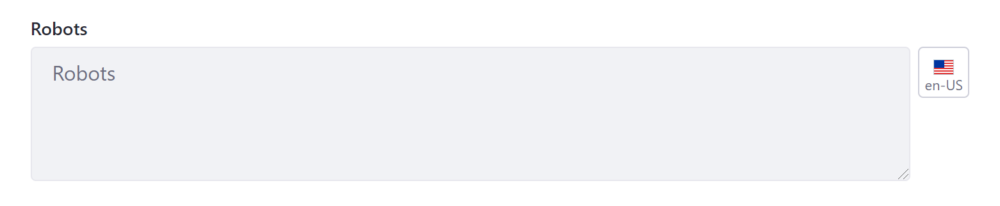
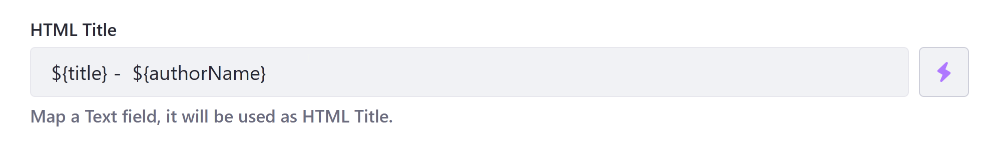
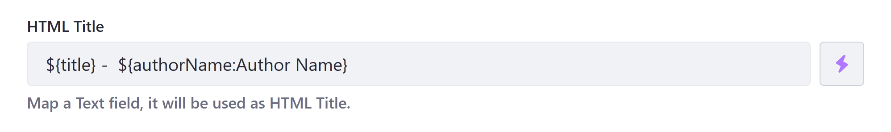
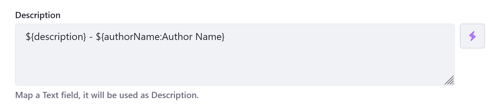
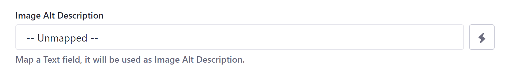

# Configuring SEO and Open Graph

> Available DXP/Portal 7.3+

Display Page Templates are custom layouts used to display individual content items at a dedicated URL. These layouts are built using both Fragments and Widgets and can be created for Web Content Articles, Documents, Blog Entries, and more. Each template has its own SEO and Open Graph settings that can be filled both manually and dynamically.

Follow these steps to configure SEO and Open Graph settings for a Display Page Template:

1. Open the *Site Menu* (), go to *Design* &rarr; *Page Templates*, and click on the *Display Page Templates* tab.

   

1. Click the *Actions* button () for the desired template and select *Configure*.

   Alternatively, you can access these settings when editing a template by clicking the *Configuration* button ().

1. Go to the [SEO](#seo-settings-reference) or [Open Graph](#open-graph-settings-reference) tab and enter the desired configuration.

   

1. Click *Save*.

   ```{important}
   Unsaved changes are lost when navigating between the SEO and Open Graph tabs.
   ```

When configuring SEO and Open Graph settings, you can enter values directly and use field mapping to add values dynamically. Available mapping options depend on the template's content type and subtype. To map a field, simply click on the *field selector* button () and select from available fields. As of Liferay DXP 7.4 U1 and Portal 7.4 GA5, fields added in this way are represented as `${}` placeholders with two parts: a field reference ID and field label (`${fieldReferenceID:Field Label}`).

```{note}
For earlier versions, mapping placeholders only include the field reference ID (e.g., `${title}`, `${authorName}`, `${Text84981642}`).
```

Liferay provides the field label value for clarity on the administrative side, since field reference IDs in custom Web Content and Document structures are not human-readable (e.g., `${Text84981642:Contributors}`). The label is not displayed to end users and does not affect mapping, so users can edit it as desired. Mapping only depends on the placeholder's field reference ID.

```{note}
Liferay provides translations for mapped fields when possible. However, text provided outside of mapped fields is not translated.
```

## SEO Settings Reference

Search engine optimization (SEO) refers to the methods used to improve your Page's ranking in a search engine results page (SERP). With Display Page Templates, you can configure your content's Display Pages for SEO.

### HTML Title

The *HTML Title* field defines a Display Page's `<title>` tag. This title is used by search engines to rank your Page and serves as the Page's heading in search engine results. By default, Display Page templates map this field to `${title}`. If desired, you can edit this value directly and use the field selector to include additional mappings (e.g., `${title} - ${authorName:Author Name}`).

The recommended length for an *HTML title* is under 60 characters.

```{tip}
It is best practice to update the SEO and Open Graph titles together.
```



### Description

The *Description* field defines a Display Page's description `<meta>` tag. This description is used by search engines to rank your Page and appears in search engine results as a preview of your Page. By default, Display Page templates map this field to `${description}`. If desired, you can edit this value directly and use the field selector to include additional mappings (e.g., `${description} - ${authorName:Author Name}`).

The recommended length for a Page's description is under 155 characters.

```{tip}
It is best practice to update the SEO and Open Graph descriptions together.
```



### Robots

The *Robots* field configures `robots.txt` rules for a Display Page. These rules provide instructions to search engines and other tools crawling and indexing your Site, defining what paths should or should not be crawled. Note that web crawlers may or may not obey instructions in `robots.txt`.

You can also localize this field using the *Language Flag*.



### Sitemap

Determine whether to include a Display Page in your `sitemap.xml` file, as well as set its *Priority* and *Change Frequency*. These fields inform search engines whether to crawl and index the Display Page, how it should be prioritized relative to other Site Pages, and how frequently it is updated.



## Open Graph Settings Reference

> Available: Liferay DXP/Portal 7.3+.

[Open Graph](https://ogp.me/) is an Internet protocol that standardizes previews of Site content when shared in application contexts that support it, such as Facebook, Slack, and Twitter. It does this by embedding structured data in page headers as `<meta>` tags, similar to [RDFa](https://en.wikipedia.org/wiki/RDFa).

With Liferay DXP, you can create Display Page templates that dynamically configure a Page's Open Graph `<meta>` tags. Values defined here override default values defined at the [Site](../../site-settings/configuring-open-graph.md) level.

```{note}
Open Graph `<meta>` tags are only included in page headers to unauthenticated users. They are not included when the user is logged in.
```

### Title

The *Title* field defines a Display Page's `og:title` property, which defines the title displayed for your content in rich previews. By default, this field is mapped to `${title}`. If desired, you can edit this value directly and use the field selector to include additional mappings (e.g., `${title} - ${authorName:Author Name}`).

```{tip}
It is best practice to update the SEO and Open Graph titles together.
```



### Description

The *Description* field defines a Display Page's `og:description` property which determines the description displayed for your content in rich previews. By default, this field is mapped to `${description}`. If desired, you can edit this value and use the field selector to include additional mappings (e.g., `${description} - ${authorName:Author Name}`).

```{tip}
It is best practice to update the SEO and Open Graph descriptions together.
```



### Image

The *Image* field defines a Display Page's `og:image` properties, which configures the image displayed for your content in rich previews. In addition to the basic image tag, DXP automatically adds a number of structured properties that determine how your selected image is displayed. The Image field defines the following `<meta>` tags.

```html
<meta property="og:image" content="http://example.com/ogp.jpg" />
<meta property="og:image:secure_url" content="https://secure.example.com/ogp.jpg" />
<meta property="og:image:type" content="image/jpeg" />
<meta property="og:image:width" content="400" />
<meta property="og:image:height" content="300" />
```

By default, this field is unmapped in Display Page templates. This means the template defaults to the image set at Site level, unless you select a different Image field.



### Image Alt Description

The *Image Alt Description* field defines a Display Page's `og:image:alt` property, which determines the alt text read by screen readers for your displayed content's `og:image` property.

```html
<meta property="og:image:alt" content="This is an example." />
```

By default, this field is unmapped in Display Page templates. This means the template defaults to the alt text set at the Site level, unless you select a different Text field.


## Additional Information

- [Configuring Your Page's Friendly URL](../../creating-pages/page-settings/configuring-your-pages-friendly-url.md)
- [Configuring Open Graph](./../../site-settings/configuring-open-graph.md)
