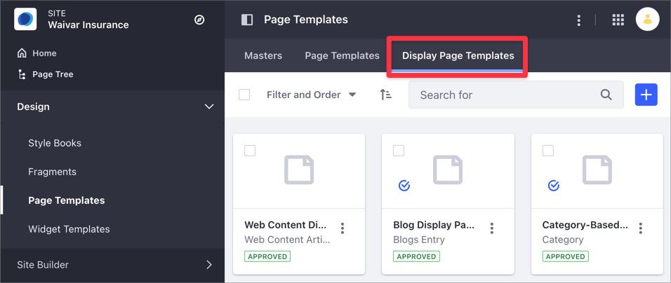

# Displaying Content with Display Page Templates

Display Pages provide a way to organize and display your content on a Page. Similarly to [Content Pages](../../creating-pages/building-and-managing-content-pages/content-pages-overview.md), you organize the Display Page content in [Fragments](../using-fragments/using-page-fragments.md) and [Widgets](../../creating-pages/building-and-managing-content-pages/using-widgets-on-a-content-page.md) but using a Display Page Template. Using the same template, you can apply the same layout multiple times to different content. For instance, you can create a Display Page Template for Web Content Articles and apply it to different Web Content, so that the user has a consistent experience when browsing the Site. Using Content Pages, you can create the Page layout and composition of your choice, but you cannot save and reuse this Content Page as a template.

```note::
   For more information about the different ways of displaying content in Liferay DXP, see `Displaying Content <../displaying-content-intro.md>`_.
```

## Understanding Display Page Templates and Display Pages

The Display Page Template determines how to organize and display the content on the Display Page. The way you create a Display Page Template is very similar to the way you [add elements to Content Pages](../../creating-pages/building-and-managing-content-pages/adding-elements-to-content-pages.md). However, Display Pages are always associated to a certain type of content, while Content Pages are not.

To create a Display Page, create a Display Page Template first and then display the content using the Display Page unique URL.


When you create a Display Page Template, you choose among the following types of content to link:

- [Web Content Articles](../../../content-authoring-and-management/web-content/web-content-articles/adding-a-basic-web-content-article.md)
- [Documents](../../../content-authoring-and-management/documents-and-media/publishing-and-sharing/publishing-documents.md)
- [Categories](../../../content-authoring-and-management/tags-and-categories/defining-categories-and-vocabularies-for-content.md) (starting with Liferay DXP 7.4+.)
- [Blog Entries](../../../content-authoring-and-management/blogs/getting-started-with-blogs.md)

Consider the following when creating and managing Display Page Templates:

- You can create different Display Page Templates for the same type of content, but only one template can be the default one for the same content type.
- The Display Page renders your content using a unique [friendly URL](../../site-settings/managing-site-urls/configuring-your-sites-friendly-url.md).
- You update your Display Page configuration through the Display Page Template options under Site Administration &rarr; *Design* &rarr; *Page Templates*.

    

## Related Information

- [Creating and Managing Display Page Templates](./creating-and-managing-display-page-templates.md)
- [Publishing Content With Display Pages](./publishing-content-with-display-pages.md)
- [Displaying Content](../displaying-content-intro.md)
