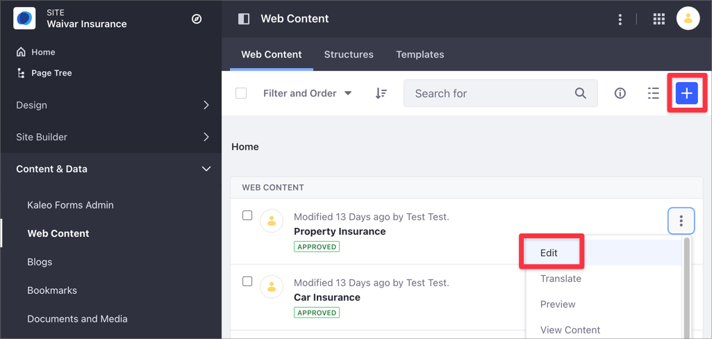
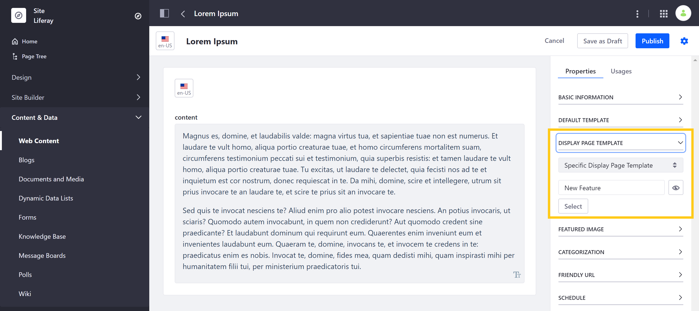
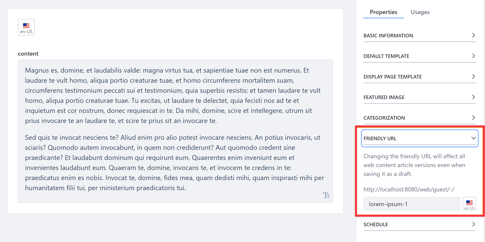
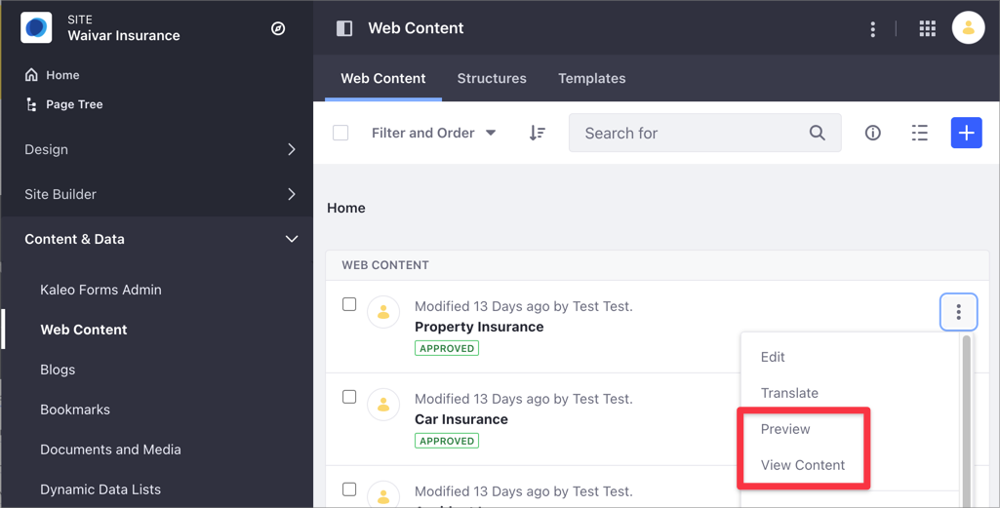
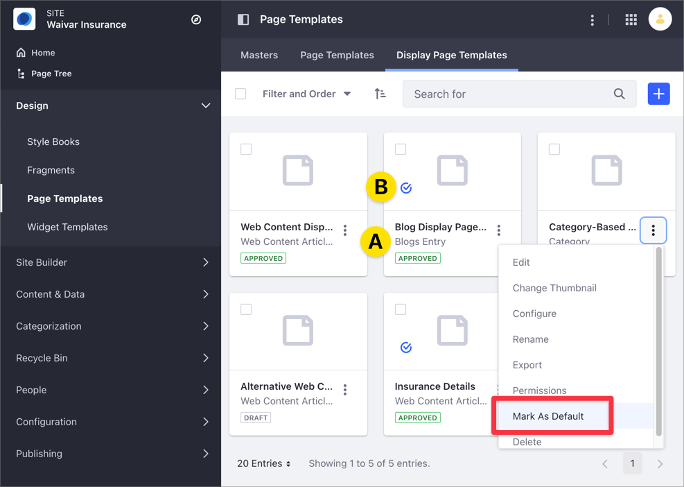

# Publishing Content With Display Pages

You publish your content on a Display Page using the layout and content mapping options you define in the Display Page Template. Display Pages are always associated with a certain type of content. To learn more, read [About Display Page Templates and Display Pages](./about-display-page-templates-and-display-pages.md).

To publish your content using a Display Page,

1. From the Site Administration panel, click the panel category for the type of content you want to display:

    - For *Web Content*, *Blogs*, or *Documents and Media*, click *Content & Data*.
    - For *Categories*, click *Categorization*.

    ```{note}
    Publishing Categories using a Display Page Template is available starting with Liferay DXP 7.4.
    ```

1. From the *Actions* () menu of an existing content, choose *Edit*. Alternatively, click the *Add* () button to create a new piece of content.

    

1. Expand the *Display Page Template* section in the Properties area, open the drop-down selector and choose *Specific Display Page Template*.

    

    ```{note}
    If you don't choose a specific Display Page Template, your content is published using the [default one](#configuring-a-default-display-page-template) for the content type.
   ```

1. Click *Select*, click the Display Page Template of your choice, and click *Done*.

    ```{tip}
    You can preview what the display page looks like with the *Preview* button located next to the selected Display Page Template.
    ```

1. Scroll down to the *Friendly URL* panel, expand it, and modify the friendly URL if you want. This is the URL the Display Page uses to show your content.

    

1. Click *Publish*.
1. To preview your content in the context of the Display Page Template, click the content's *Actions* () menu and choose *Preview*. To view your Display Page, including the friendly URL, choose *View Content*.

    

## Configuring the Default Display Page Template

Consider these items when configuring a default Display Page Template:

- You can publish the content using the default or a specific Display Page Template. 
- You can create more than one Display Page Template for the same content type, but you can set only one by default.
- If you don't choose a specific Display Page Template, your content is published using the default one for the content type.

To configure the default Display Page Template,

1. Under *Site Administration*, click *Design* &rarr; *Page Templates* and choose the *Display Page Templates* column.
1. Under the Display Page Template's name you can see the type of content the Display Page Template is associated to (A). The blue check (B) indicates the default Display Page Template for the type of content.
1. Click the *Actions* () menu for the Display Page Template you want to configure as default and choose *Mark As Default*.

    

## Additional Information

- [About Display Page Templates and Display Pages](./about-display-page-templates-and-display-pages.md)
- [Creating and Managing Display Page Templates](./creating-and-managing-display-page-templates.md)
