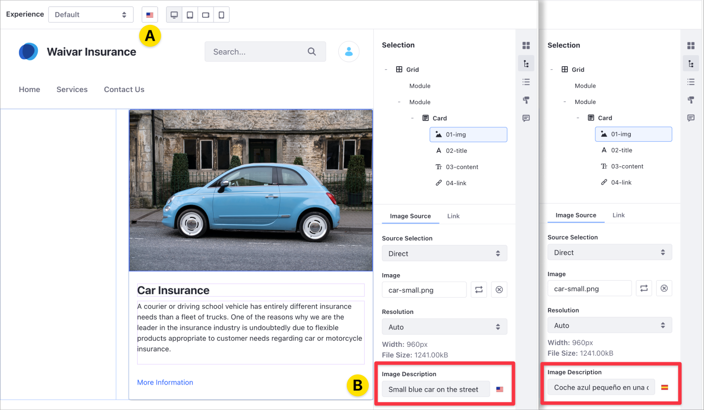
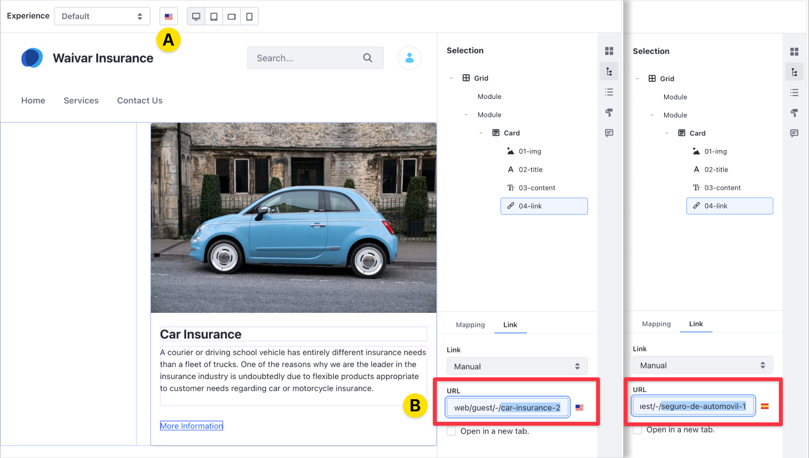

# Localizing the Fragment Configuration

> Available: Liferay DXP 7.4+

You can localize the following Fragment settings for the target audience's language:

- [Image Description (*alt text*)](#localizing-alternative-text-for-images)
- [Editable URLs](#localizing-editable-urls)

Additionally, you can change the Fragment configuration fields depending on the Page's target language using the `localizable` attribute. For more information, read the [Fragment Specific Tags and Attributes Reference](../../developer-guide/reference/fragments/fragment-specific-tags-reference.md).

## Localizing Alternative Text for Images

You can add localization in different languages for the image description (also known as *alternative text* or *alt text*) in built-in and custom Fragments. When you change the target language for your Content Page using the language selector in the editor toolbar (A), you can edit the Image Description, adapting the text for the target language (B).



```tip::
    Localizable fields show a flag icon next to their Image Descriptions. 
```

If the Image Description doesn't have a translation, the description shows the default Content Page language.

## Localizing Editable URLs

When you localize a URL or link in your Content Page, you can redirect to different URLs and content, based on the target language. When you change the target language for your Content Page using the language selector in the editor toolbar (A), you can update the URL to the link of your choice (B).



You can localize links you enter manually and links from a content field. If the link doesn't have a translation, the active URL is the one for the default Content Page language.

## Additional Information

- [Content Pages Overview](../../creating-pages/building-and-managing-content-pages/content-pages-overview.md)
- [Content Page Editor User Interface Reference](../../creating-pages/building-and-managing-content-pages/content-page-editor-user-interface-reference.md)
- [Using Page Fragments](../../displaying-content/using-fragments/using-page-fragments.md)
