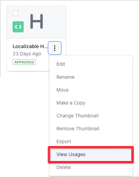
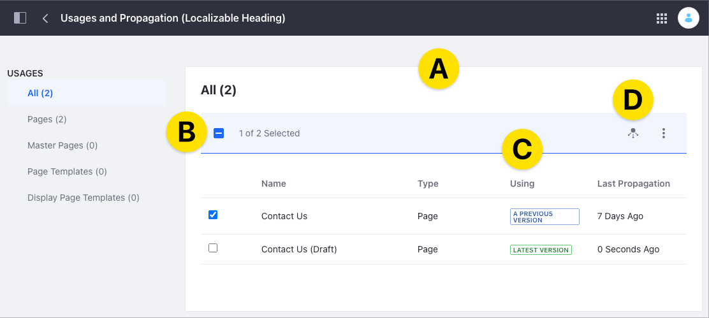
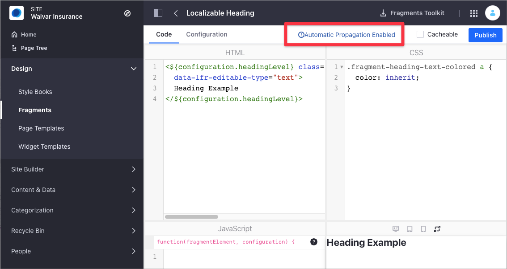

# Propagating Fragment Changes

By default, [changes to the Fragment's configuration](../../developer-guide/developing-page-fragments/using-the-fragments-editor.md) do not propagate automatically to the [Content Pages](./content-pages-overview.md) using the Fragment. For example, if you use a [Button Fragment](./using-fragments.md#button) of *Primary* type and then change the configuration to use the *Secondary* type, a Content Page using the Fragment does not reflect the change by default.

Using *Fragment Propagation*, you can modify this behavior and propagate your Fragment changes to the elements where the Fragment exists. Propagation includes changes in the Fragment configuration and code (HTML, CSS, and JavaScript). In addition to Content Pages, Propagation affects other elements where you use the Fragment, like Master Pages, Page Templates, and Display Page Templates.

```note::
   Changes to existing Fragment ``editable`` fields don't propagate to avoid overwriting content in Content Pages. To force the propagation in an ``editable`` field, you must change the field ID. The content on that field does not longer appears in the Content Page when the changes are propagated, but you can retrieve the content from the database using the old field ID. To learn more, read `Fragment Specific Tags and Attributes Reference <../../developer-guide/reference/fragments/fragment-specific-tags-reference.md>`_ in the developer documentation.
```

You can propagate the Fragment changes in two different ways:

- [Manually for a single Fragment](#propagating-changes-manually-for-a-single-fragment)
- [Automatically for all Fragments](#propagating-changes-automatically-for-all-the-fragments)

## Propagating Changes Manually for a Single Fragment

You can update all elements where you use a Fragment with the most recent Fragment configuration. Use this procedure after [updating the Fragment](../../developer-guide/developing-page-fragments/using-the-fragments-editor.md) with the desired changes.

1. Go to *Site Administration* &rarr; *Site Builder* &rarr; *Fragments*.

1. Under *Collections*, click the Collection containing your Fragment.

1. On the Fragment, click the *Actions* () menu and select *View Usages*.

    

    ```tip::
       If the *View Usages* option is unavailable, the Fragment is not in use.
    ```

1. The Usages and Propagation list shows the elements containing the Fragment (A). Check the element or elements you want to update with the latest configuration. If you want to select all the elements, click *All* under *Usages* and check the box in the list header (B). The *Using* column (C) provides information about the Fragment configuration in use:

**Latest Version:** The element uses already the latest Fragment changes. You don't need to propagate changes to these elements.

**A Previous Version:** The element uses a previous Fragment configuration.

1. Click the *Propagate* () button (D) to update the elements selected with the latest Fragment changes.

    

## Propagating Changes Automatically for All the Fragments

Using this option, any [Fragment change](../../developer-guide/developing-page-fragments/using-the-fragments-editor.md) propagates automatically to all elements where the Fragment exists. You need access to the Liferay DXP [System Settings](../../../system-administration/configuring-liferay/system-settings.md) to configure this option.

```warning::
   Automatic propagation can lead to unintended consequences in the production environment, such as typos or inaccurate content being published. Use Automatic propagation only for testing or development purposes.
```

1. Click on the *Global Menu* ().
1. Go to *Control Panel* &rarr; *Configuration* &rarr; *System Settings*.
1. Under the *Content and Data* section, click *Page Fragments*.
1. Check the *Propagate Fragment Changes Automatically* to enable Fragment Propagation for all your Fragments.
1. Click *Save*.

When you enable the *Propagate Fragment Changes Automatically*, the [Fragments Editor](../../developer-guide/developing-page-fragments/using-the-fragments-editor.md) shows the *Automatic Propagation Enabled* message.



## Additional Information

- [Using Page Fragments](./using-page-fragments.md)
- [Configuring Fragment Styles](./configuring-fragment-styles.md)
- [Content Pages Overview](../../creating-pages/building-and-managing-content-pages/content-pages-overview.md)
