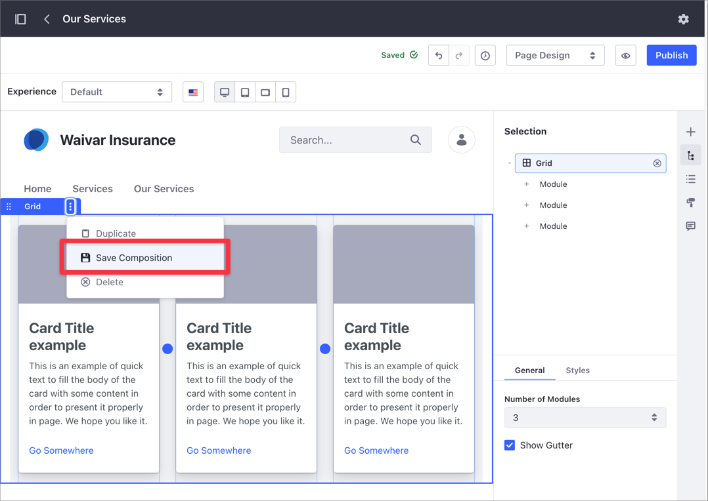
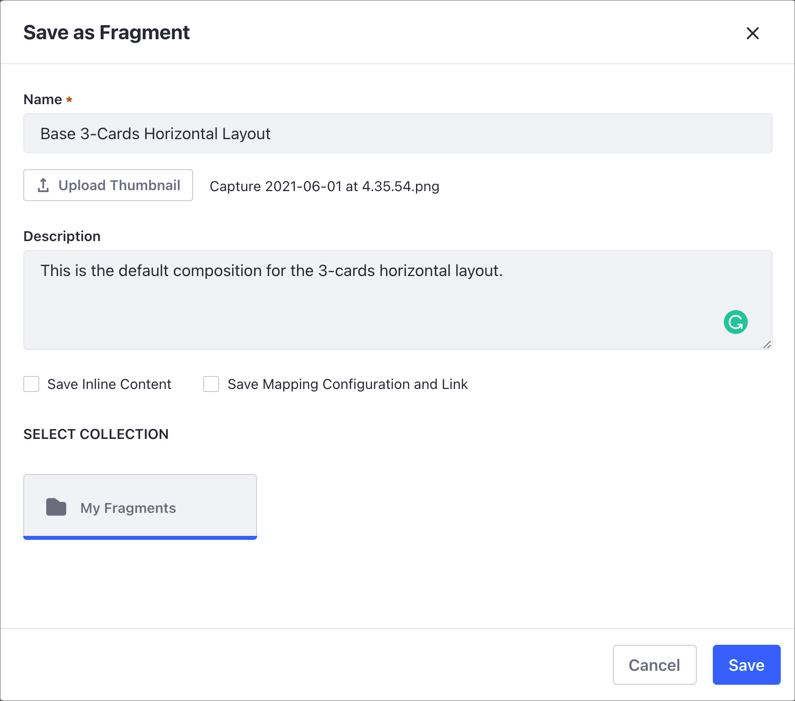
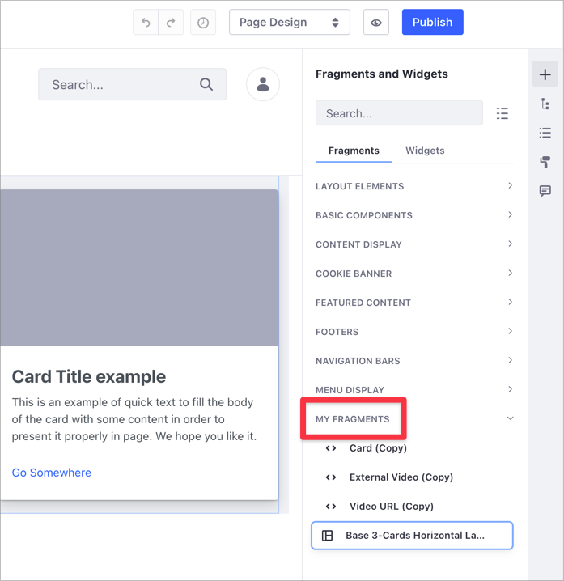
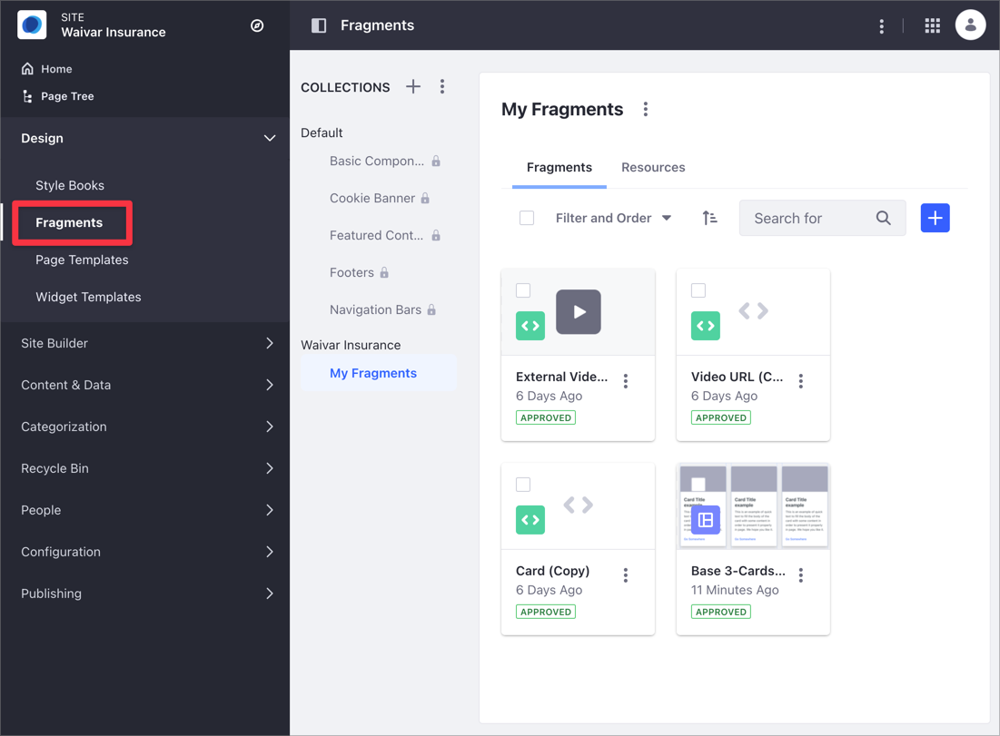

# Saving a Fragment Composition

You can save customized Fragment compositions (Section or Row layout Fragments) as new Fragments, so you can reuse them in your other Fragment-based pages. For example, you may want to save a [Grid Fragment](../../creating-pages/building-and-managing-content-pages/configuring-elements-on-content-pages.md#configuring-the-grid-fragment) composition with a different number of modules per row or a custom grid padding options.

To save the Fragment composition,

1. Open the [Content Page](../../creating-pages/building-and-managing-content-pages/content-pages-overview.md) with the Fragment configuration you want to save.

1. On the Content Page editor, click *Selection* () to open the [Selection panel](../../creating-pages/building-and-managing-content-pages/content-page-editor-user-interface-reference.md#selection).

1. Select the Fragment composition you want to save.

1. Click the *Options* menu () for the selection and choose *Save Composition*.

      

1. In the Save as Fragment dialog, provide a *Name* and other optional information:

    - Fragment *Description* and *Thumbnail*.
    - *Save Inline Content* option, for including inline content such as fragment entries (links, images, text, etc.)
    - *Save Mapping Configuration* option, for including [mapped content](../../creating-pages/building-and-managing-content-pages/configuring-elements-on-content-pages.md#mapping-content).
    - *Collection* where you want to save the Fragment composition.

      

    ```note::
    If no Site-specific Fragment Collection exists, the saved Fragment composition is saved automatically to a new Fragment Collection called Saved Fragments.
    ```

## Using Saved Fragment Compositions

Your can use a saved Fragment composition from the Content Page editor:
  
1. Open the Content Page where you want to use the composition.

1. Click *Edit* () at the top right.

1. Click the *Fragments and Widgets* icon ().

1. Under the *Fragments* section, find your Fragment composition at the bottom of the Fragments list.

1. Add the Fragment composition to your page.

    

## Managing Saved Fragment Compositions

Your Fragment compositions are saved in the Fragments page, under the *Site Menu* &rarr; *Design* &rarr; *Fragments*. From here, you can manage your composition in the same way you manage other Fragments. For more information, read [Managing Page Fragments](./managing-page-fragments.md). Compositions can be exported or imported between Sites just as any other Fragment.

```note::
    In Liferay DXP 7.1 and 7.2, open the *Product Menu*, and go to *Site* → *Site Builder* → *Page Fragments*.
```



```note::
  The latest version of the `Liferay Fragments Toolkit <../../developer-guide/developing-page-fragments/using-the-fragments-editor.md>`_ supports creation, export/import, and preview of Fragment compositions.
```

## Related Information

- [Managing Page Fragments](./managing-page-fragments.md)
- [Content Page Editor User Interface Reference](../../creating-pages/building-and-managing-content-pages/content-page-editor-user-interface-reference.md)
- [Content Pages Overview](../../creating-pages/building-and-managing-content-pages/content-pages-overview.md)
- [Building Responsive Layouts with the Grid Fragment](../../optimizing-sites/building-a-responsive-site/building-responsive-layouts-with-the-grid-fragment.md)
