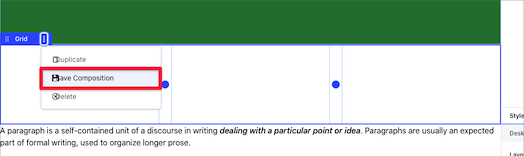
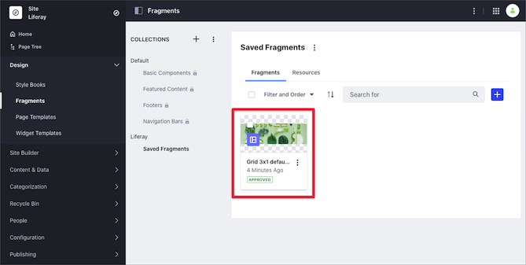

# Saving a Fragment Composition

You can save customized Fragment compositions (Section or Row layout Fragments) as new Fragments, so you can reuse them in your other Fragment-based pages:

1. Click the Row or Section composition you want to save.
1. Click the Options Menu () for the container and select *Save Composition*.

      

1. In the Save as Fragment dialog that appears, provide a name and other optional information:

    - Fragment *Description* and *Thumbnail*.
    - *Save Inline Content* option, for including inline content such as fragment entries (links, images, text, etc.)
    - *Save Mapping Configuration* option, for including [mapped content](#mapping-content).
    - *Collection* to save the Fragment.

      

```note::
   If no Site-specific Fragment Collection exists, the saved Fragment composition is saved automatically to a new Fragment Collection called Saved Fragments.
```

You can use the saved Fragment composition immediately using the Fragments sidebar or through the Page Fragments administrative application.



Compositions can be exported or imported between Sites just as any other Fragment.

```note::
  The latest version of the `Liferay Fragments Toolkit <../../developer-guide/developing-page-fragments/using-the-fragments-editor.md>`_ supports creation, export/import, and preview of Fragment compositions.
```

## Related Information

- [Adding Elements to Content Pages](./adding-elements-to-content-pages.md)
- [Content Pages Overview](./content-pages-overview.md)
- [Content Pages User Interface Reference](./content-page-editor-user-interface-reference.md)
