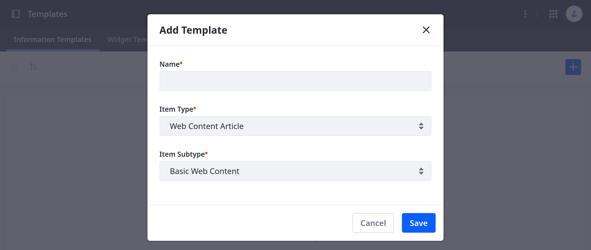
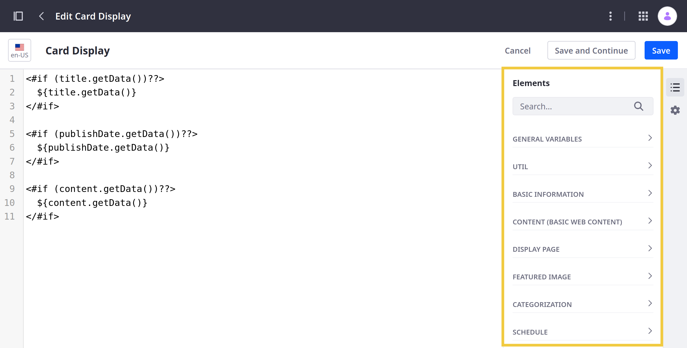
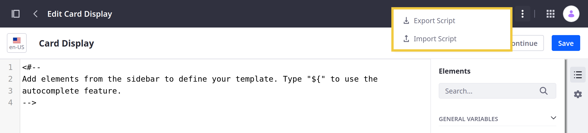
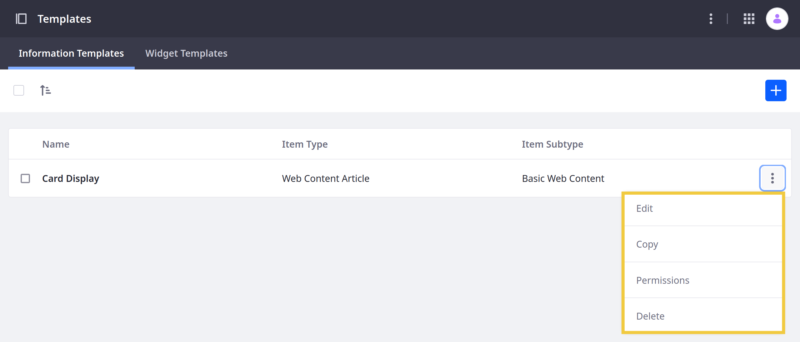
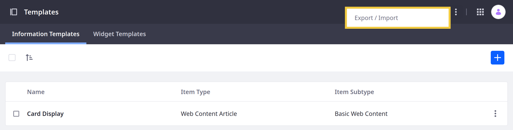

# Using Information Templates

{bdg-secondary}`Available 7.4+`

With Information Templates, you can create [FreeMarker](https://freemarker.apache.org/) templates for any item type that implements the [Info Framework](../../building-applications/data-frameworks/info-framework.md). Supported item types include Web Contents, Documents, Assets, Blogs, Categories, and Objects. Once created, you can map fragment fields to your template to determine how an item is rendered in Content Pages and Display Pages. This can help you implement a consistent style for your Site.

```{important}
Information templates are only available in fragments and are not available in widgets. If you want to design FreeMarker templates for Web Content that's displayed in widgets, use [Web Content Templates](../../content-authoring-and-management/web-content/web-content-templates/creating-web-content-templates.md).
```

## Creating Information Templates

Follow these steps to create an Info Template:

1. Open the *Site Menu* () and go to *Design* &rarr; *Templates* &rarr; *Information Templates*.

1. Click the *Add* button ()

1. Enter a *name*, select an *Item Type*, and (if applicable) select an *Item Subtype*.

   

1. Click *Save*. This redirects you to the template design page.

1. (Optional) [Import](#importing-and-exporting-scripts) an existing FreeMarker script from an `.ftl` file.

1. Design your template using FreeMarker.

   You can type `${` in the editor to use the autocomplete feature.

   In the *Elements* side panel (), you can quickly access available fields from the selected item type's structure.

   

   ```{note}
   The Elements side panel does not include fields based on templates (e.g., Journal Article Templates, Info Templates). This is to prevent infinite loops.
   ```

1. (Optional) Add a *description* or *image* to the template in the Properties side panel ().

1. Click *Save* when finished.

Once created, Info Templates can be used in Content Display fragments and any other fragment with [sub-elements](../creating-pages/page-fragments-and-widgets/using-fragments/configuring-fragments/fragment-sub-elements-reference.md) that can be mapped, such as text and rich text. When selected, they determine how an item is rendered in Content Pages and Display Page Templates.

## Importing and Exporting Scripts

When editing an Info Template, you can import and export FreeMarker scripts to reuse in other contexts:

1. Open the *Site Menu* () and go to *Design* &rarr; *Templates* &rarr; *Information Templates*.

1. Select the desired Info Template.

1. Click the *Actions* button  in the Application Bar and select *Export Script* or *Import Script*.

   

When exporting, the current FreeMarker script is saved as a `script.ftl` file.

When importing, the selected file replaces the template's current FreeMarker script.

## Managing Info Templates

In the Templates application, you can view and manage all existing Info Templates. Each existing template is listed with its type (e.g., Web Content Article) and sub-type (e.g., Basic Web Content). You can click the *Actions* button () for a template to access the following options:

| Action | Description |
| :--- | :--- |
| Edit | Edit the template. |
| Copy | Create a new template with the selected template's content. |
| Permissions | Manage basic permissions for the template. |
| Delete | Delete the template. |



Here you can also [export](#exporting-templates) and [import](#importing-templates) Info Templates as LAR files to share them between Sites and environments. To do this, click the *Actions* button in the Application Bar and and select *Export/Import*.



```{note}
By default, Info Template exports include Widget Templates. However, you can configure which templates are included in the LAR file.
```

## Additional Information

* [Creating a Widget Template](../creating-pages/using-widget-pages/styling-widgets/creating-a-widget-template.md)
* [Creating Web Content Templates](../../content-authoring-and-management/web-content/web-content-templates/creating-web-content-templates.md)
* [Mapping Web Content Templates to Fragments](../../content-authoring-and-management/web-content/web-content-templates/mapping-web-content-templates-to-fragments.md)
