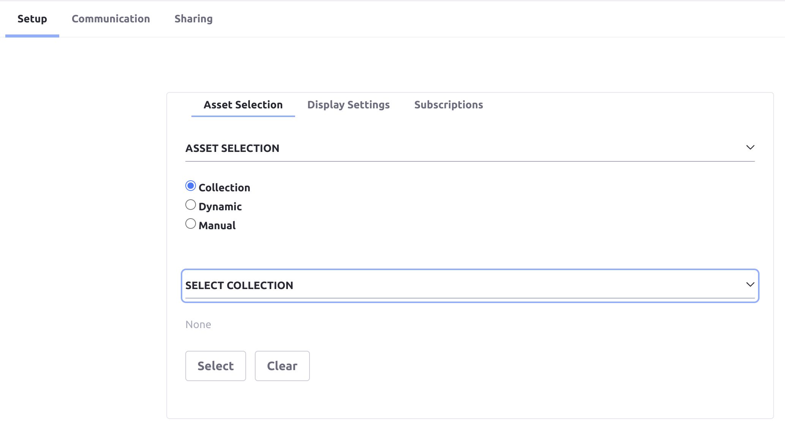

# Displaying Assets Using the Asset Publisher Widget

As you create web content, remember that pieces of [content](../../../content_authoring_and_management.md) are assets, just like message board entries and blog posts. The most common type of asset is [Web Content](../../../content-authoring-and-management/web-content/web-content-articles/adding-a-basic-web-content-article.md).
The Asset Publisher Widget supports these asset types by default:

* Blogs Entry
* Bookmarks Entry
* Bookmarks Folder
* Calendar Event
* Basic Document
* Google Drive Shortcut
* Documents Folder
* Dynamic Data Lists Record
* Knowledge Base Article
* Message Boards Message
* Basic Web Content
* Web Content Folder
* Wiki Page

```note::
    Starting with Liferay DXP 7.2, developers can use the `Info Framework <https://help.liferay.com/hc/en-us/articles/360029067251-Introduction-to-The-Info-Framework>`_ to display Assets from `Information Lists <https://help.liferay.com/hc/en-us/articles/360029067271-Creating-an-Information-List-Provider>`_.
```

Manual selection gives you control over what assets are displayed, but maintaining the list can be tedious if you find yourself updating the list on a regular basis. In this case, it's more convenient to use the Asset Publisher Widget to select content dynamically.

## Display Options

The Asset Publisher Widget displays assets. It has many configuration options. By default, the Asset Publisher displays abstracts (previews) of recently published assets with links to their full views. You can configure the Asset Publisher to display a table of assets, a list of asset titles, or the full content of assets. You can also configure it to display specific assets, and choose how many items to display in a list. You might use Asset Publisher to display chosen content types, recent content, or content by tags and categories.

## Publishing Mixed Content

Since the Asset Publisher Widget publishes assets, it excels at publishing mixed content types like images, documents, blogs, and of course, web content. This helps create a more dynamic website. you can place user-created wiki entries, blog posts, or message board messages in context with your web content.



## Additional Information

* [Selecting Assets in the Asset Publisher Widget](./selecting-assets-in-the-asset-publisher-widget.md)
* [Configuring the Asset Publisher Display Settings](./configuring-asset-publisher-display-settings.md)
* [Configuring Asset Publisher Subscriptions](./configuring-asset-publisher-subscriptions.md)
