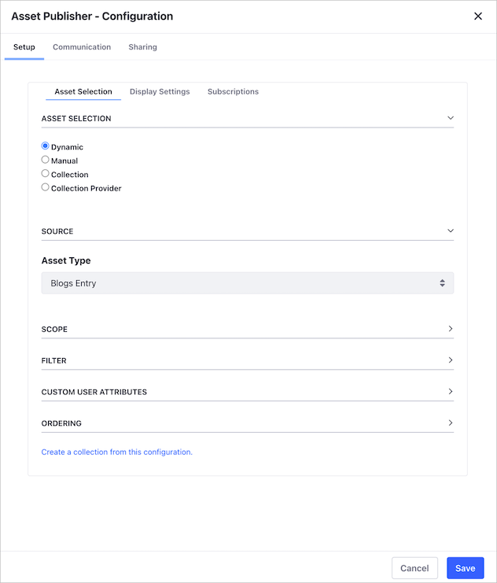

# Selecting Assets for the Asset Publisher

You can configure the Asset Publisher Widget to select assets dynamically based on specific criteria, or you can select assets manually, specifying exactly what assets to display. You can also display assets from [Collections](../../../content-authoring-and-management/collections-and-collection-pages/about-collections-and-collection-pages.md).

```note::
   For users on Liferay 7.2 and below, Collections are referred to as `Content Sets <../../../content-authoring-and-management/collections-and-collection-pages/about-collections-and-collection-pages.md#liferay-dxp-7-2>`_.
```

To select assets to publish in the *Asset Publisher* widget,

1. Click the *Actions* menu () at the top-right corner of the Asset Publisher Widget.

    

1. Select *Configuration* to display the Configuration dialog.

    Under the  the *Asset Selection* section, select how you want to filter through your assets. For a description of these options, see [Asset Collection Options](#asset-selection-options).

    

1. Optionally click on the *Create a collection from this configuration* link to save the configuration as a new [Collection]((../../../content-authoring-and-management/collections-and-collection-pages/about-collections-and-collection-pages.md)). This option is available for the [Dynamic](#dynamic) and [Manual](#manual) [Asset selection options](#asset-selection-options).

1. Once you've selected your assets and configured the widget, click *Save*.

## Asset Selection Options

You can use different options to select the Assets in the Asset Publisher dialog and *Asset Selection* section:

- [Dynamic](#dynamic)
- [Manual](#manual)
- [Collection](#collection)
- [Collection Provider](#collection-provider)

### Dynamic

Using the Dynamic asset selection, you can include Assets in the Asset Publisher Widget automatically, based on different criteria.

  1. In the *Source* section, use the *Asset Type* drop-down menu to select your Assets. Select a specific Asset Type or *Select More Than One* to choose from different types.
  1. In the *Scope* section, choose to display assets from an individual Site or other Sites.
  1. In the *Filter* section, define the *Rules* for the Assets in your Asset Publisher Widget. You can define rules based on [Categories](../../../content-authoring-and-management/tags-and-categories/defining-categories-and-vocabularies-for-content.md), [Tags](../../../content-authoring-and-management/tags-and-categories/tagging-content-and-managing-tags), or Keywords.
  1. Include a *Custom User Attribute* if you have defined one.
  1. In the *Ordering* section, choose the presentation order of Assets in the Asset Publisher Widget.

 

### Manual

Here you can set parameters and manually filter specific assets:

 1. In the *Scope* section, choose to display assets from an individual Site or other Sites.
 1. In the *Asset Entries* section, use the *Select* button to filter for specific types of assets.
 1. For the type of asset you select, check the assets you want to include.
 1. Click *Add*.

 

 ```note::
    A new Collection is created based on your selection.
 ```

### Collection

Select this option to choose from your previously saved Collections. To learn more about Collections, read [About Collections and Collection Pages](../../../content-authoring-and-management/collections-and-collection-pages/about-collections-and-collection-pages.md).

 1. Under the *Select Collection* section, click *Select*.
 1. Choose one of your exiting Collections.
 1. Click *Save*.

 

### Collection Provider

This is a new feature in Liferay 7.3 that allows developers to create specific collections with more advanced criteria.

## Related Information

- [About Collections and Collection Pages](../../../content-authoring-and-management/collections-and-collection-pages/about-collections-and-collection-pages.md)
