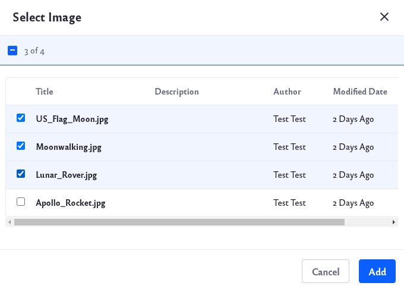

# Selecting Assets for the Asset Publisher

You can configure the Asset Publisher to select assets dynamically based on specific criteria, or you can select assets manually, specifying exactly what assets to display. You can also display assets from [Collections](../../../content-authoring-and-management/collections-and-collection-pages/about-collections-and-collection-pages.md).

```note::
   For users on Liferay 7.2 and below, Collections are referred to as `Content Sets <../../../content-authoring-and-management/collections-and-collection-pages/about-collections-and-collection-pages.md#liferay-dxp-7-2>`_.
```

To select assets to publish in the *Asset Publisher* widget,

1. Click the *Options* button () at the top-right corner of the widget.

1. Select *Configuration* to display the Configuration window.

    

    Under the Setup tab, there are a few sub-tabs with different options to configure. Under the Asset Selection section, you can select how you want to filter through your assets:

    **Dynamic:** Here you can set parameters that automatically include specific assets. In the Source section, use the Asset Type drop-down list to select one or more types of assets to be included. Choose across your different Sites in the Scope section. In the Filter section, you can also filter your assets by things such as category, keywords, or tags. As new assets are added, the widget updates itself.

    **Manual:** Here you can set parameters and manually filter specific assets. Choose across your different Sites in the Scope section. Under Asset Entries, click the *Select* button to filter for specific types of assets. For example, if you wanted to filter for images, you could select *Images* and add a check to each image you want included.

    

    Once you are finished making your selection, click the *Add* button. A new collection is created based on your selection.

    **Collection:** Select this option to choose from your previously saved collections. Under Select Collection, click on the *Select* button and choose a collection.

    

    To learn more, go to the [About Collections](../../../content-authoring-and-management/collections-and-collection-pages/about-collections-and-collection-pages.md) page.

    **Collection Provider:** This is a new feature in Liferay 7.3 that allows developers to create specific collections with more advanced criteria. 

1. Choosing Dynamic for Asset Selection gives additional settings to configure.

    * **Source:** Choose to display all asset types or just a few selected asset types
    * **Scope:** Choose to display assets from an individual Site or other Sites
    * **Filter:** Filter which assets to show by categories, keywords, or tags
    * **Custom User Attributes:**  Filter assets based on custom user profile attributes
    * **Ordering:** Choose how your assets will be ordered

1. Once you've selected your assets and configured the widget, click the *Save* button. You can also click on the *Create a collection from this configuration* link to save the configuration as a new collection.
