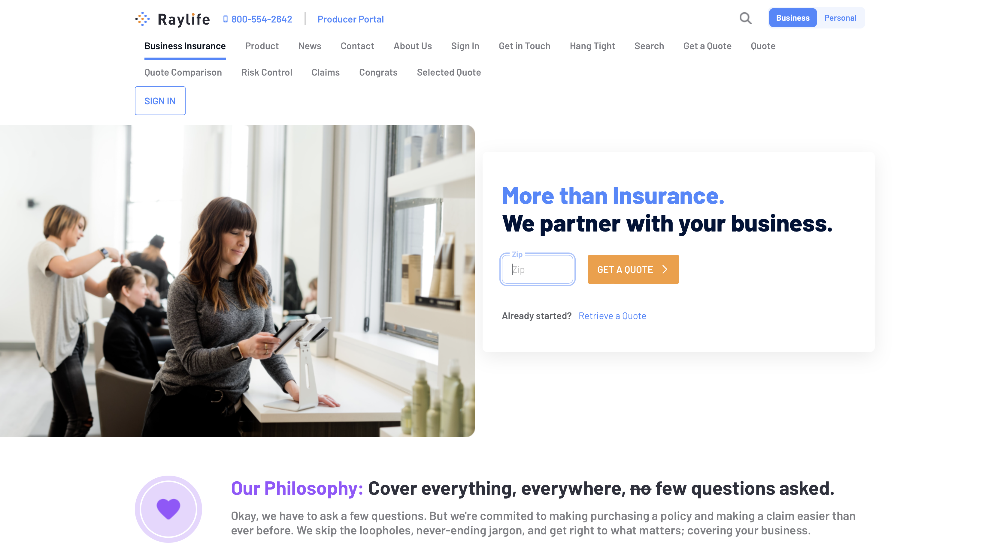

# Introduction to Site Building

Sites are a fundamental component of Liferay DXP. Essentially, a Site is a collection of pages that contains content applications that provide additional functionality. Many applications are available for use out-of-the-box.

When you first start and configure your Liferay DXP instance, a default Site is included. By default the instance name is *Liferay*, but this value can be changed through the configuration of the Setup Wizard or through the [Instance Configuration](../system-administration/configuring-liferay/virtual-instances/instance-configuration.md) in the Control Panel.

## Creating Sites

Liferay DXP includes all the tools you need to [build your Site](./building-sites/adding-a-site.md) and [create pages](./creating-pages/adding-pages/adding-a-page-to-a-site.md). You can create a Site from an existing [Site Template](./building-sites/building-sites-with-site-templates.md), which includes a predefined set of pages with applications, or you can create a blank Site and build it from the ground up.

Pages are just as flexible. There are multiple page types. Create a page from an existing [page type](./creating-pages/understanding-pages/understanding-pages.md) or create one from one of the default [page templates](./creating-pages/adding-pages/creating-a-page-template.md), or a page template you've created yourself. 

Sites and pages can be organized hierarchically. You can add as many nested pages (child pages) and [nested sites](./building-sites/site-hierarchies.md) (child sites) as you like for the parent Site or page. It is possible to have multiple sites across your Liferay DXP instance for various Organizations, employees, etc. You can also share content and pages between sites with the [import and export options](./building-sites/importing-exporting-pages-and-content.md).

Configuring Pages and Site [Navigation](./site-navigation/using-the-navigation-menus-application.md) behavior is intuitive and flexible. Pages can be automatically added to a navigation menu when they're created. You can hide pages if you prefer, or configure Page permissions restrict user access.

Liferay DXP also provides tools to enable you to make changes to your site without disrupting user experience. Liferay Sites can be staged, allowing changes to be made and tested on a site before being published to users. Liferay DXP's [Publications](./publishing-tools/publications.md) feature handles this for you. You can use Publications to develop, track, and update your Site in a safe environment, without affecting the live site that your users see.

## Displaying Content

Liferay DXP's Content Management System (CMS) offers a variety of tools to create, manage and display content of many types (e.g. blogs, images, web content articles). You can use the [Web Content Display widget](./displaying-content/additional-content-display-options/using-the-web-content-display-widget.md) to display web content articles of your choosing. 

If you want to publish a mix of content types you can use the [Asset Publisher](./displaying-content/using-the-asset-publisher-widget/displaying-assets-using-the-asset-publisher-widget.md) or [Displaying Collections](../site-building/displaying-content/additional-content-display-options/displaying-collections.md). You can manually select the content the Asset Publisher displays, or you can have it display assets dynamically based on specific criteria, giving you a great deal of control over the experience your users have. You can also embed content from other websites with the [Iframe widget](./displaying-content/additional-content-display-options/using-the-iframe-widget.md) or by creating an [Embedded Page](./creating-pages/understanding-pages/other-page-types.md#embedded).

You can create and edit content inline with [Fragments](./creating-pages/page-fragments-and-widgets/using-fragments.md). Fragments are individual pieces of code (CSS, HTML, and JavaScript) that you can arrange and combine to build a page. Several Fragments are included out-of-the-box that you can modify to create your content. If you require a more custom solution, you can [create your own](./developer-guide/developing-page-fragments/developing-fragments-intro.md).

Each piece of content has a default page that appears when you view it, but you can provide a customized landing page by creating a [Display Page Template](./displaying-content/using-display-page-templates/about-display-page-templates-and-display-pages.md). A Display Page Template maps portions of the Web Content (title, main body, image, etc.) to Fragments, so you can create the look you desire.

## Personalizing User Experiences

Liferay DXP's [Personalization and Segmentation](./personalizing-site-experience/personalizing-site-experience.md) framework lets you build site experiences that respond to and meet your users interests and needs. You can [create user Segments](./personalizing-site-experience/segmentation/creating-and-managing-user-segments.md) based on specific criteria, such as the Organizations they belong to or their Role in the Site, and then use it to display [personalized page layouts and content](./personalizing-site-experience/experience-personalization/content-page-personalization.md) for the user demographic, or you can [integrate with Analytics Cloud](https://learn.liferay.com/analytics-cloud/latest/en/connecting-data-sources/connecting-liferay-dxp-to-analytics-cloud.html) to analyze the behavior of the users within the Segment to see how they interact with your Site. You can even [recommend content based on a user's behavior](./personalizing-site-experience/experience-personalization/understanding-content-recommendations.md).

<!-- Screenshot -->

## Customizing and Configuring Sites

There are many [settings](./site-settings/site-settings-ui-reference.md) available to modify the look, behavior, and functionality for your Site. [Sites and their Content can be easily localized](./site-settings/site-localization.md) to multiple languages as needed.

The look and feel of your site can be [changed by using different themes](../getting-started/changing-your-sites-appearance.md). Themes can be downloaded and deployed from [Liferay Marketplace](../system-administration/installing-and-managing-apps/using-marketplace.md), or you can [create a theme yourself](../setting-up-the-site-building/site-appearance/themes/theme-development/getting-started/setting-up-an-environment-and-creating-a-theme.md). Themes determine the overall look and feel for a Site and define the CSS, JavaScript, and HTML for the page (via FreeMarker templates).  FreeMarker combines standard HTML elements and provides the added benefit of variables, conditional statements, looping, and more. See [Developing Themes](./developer_guide.md) for more information.

## Optimizing Sites

Liferay DXP provides multiple tools and features for optimizing your Site, from increasing your Site's [Search Engine Optimization (SEO) ranking](../site-building/displaying-content/using-display-page-templates/configuring-seo-and-open-graph.md), to [creating responsive pages](./optimizing-sites/building-a-responsive-site/building-a-responsive-site.md) optimized for each device, to honing your messaging campaigns with [A/B Testing](../site-building/optimizing-sites/ab-testing/ab-testing.md). A/B Testing compares the current default variation of a page with the page variant(s) to see which pages perform better for a given goal (bounce rate, clicks, etc.). This enables you to make better, data-driven decisions about your site, so you can serve users and customers faster than ever before.
