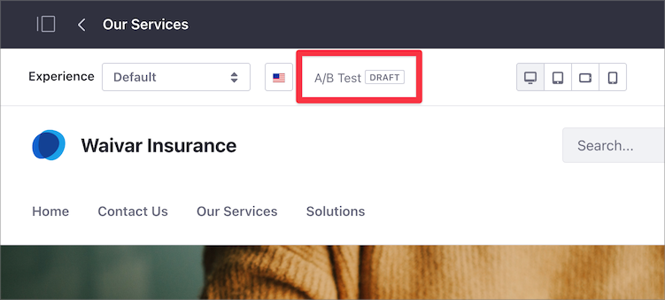
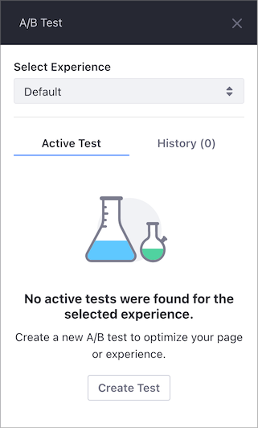
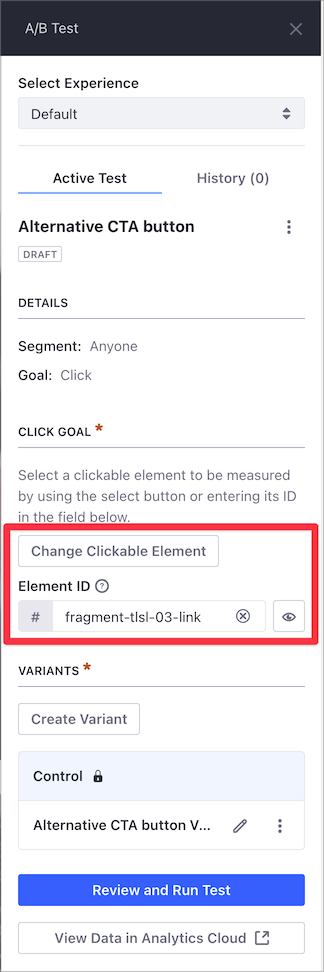
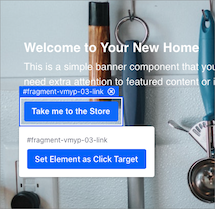

# Creating A/B Tests

Before creating A/B tests, remember these things:

- You can create a test for a default Experience or a personalized Experience mapped to a Segment.
- You can only create an A/B Test for one page or Experience at a time.
- You cannot edit an Experience that is part of a running A/B Test.
- You cannot create a test for an Experience that already has an active A/B Test running.
- When you delete a Content Page or Experience that is part of an A/B Test, you also delete the test.
- If you close the A/B Test side panel without [running the test](./running-and-monitoring-ab-tests.md), the test is saved as a draft.

   

To create the A/B test, [create the test](#creating-the-test) first, and then create one or more [test Variants](#creating-the-test-variant).

```important::
   Verify that your environment `meets the requirements <./verifying-ab-test-requirements.md>`_ for A/B Testing before creating the test.
```

## Creating the Test

1. Go to the Content Page you want to test. 
1. In the Control Menu, click *A/B Testing* ().
1. If you have other Experiences for the Content Page, select the Experience you want to test.

   

1. Click *Create Test*.
1. Enter a *Test Name* and optionally, a *Description*.
1. Select the goal to track with your test:

   - *Bounce Rate*: Percentage of those who visit, don't exhibit any activity (like *click* or *scroll*), and navigate away without visiting another page.
   - *Click*: Percentage of those who click on the page, per session.

1. Click *Save* to save the test as a *Draft* (not yet visible to visitors).

    ```note::
      You can always edit or delete the new A/B Test by clicking the *Actions* button next to the A/B Test name. Deleted tests are not recoverable (i.e., not sent to the Recycle Bin). These options are not available for an active running test.
    ```

## Creating the Test Variant

A test Variant is a customization of the Experience you want to optimize with A/B Testing. Each A/B Test must have at least one Variant.

1. Open the A/B Test sidebar panel for your Content Page.
1. If you selected the *Click* goal for the A/B Test, you must also select the element you want to test:
    1. Under the *Active Test* tab and *Click Goal* section, click *Select Clickable Element*.

         - You can target links, buttons, and input fields with an Element ID for the *Click* goal.
         - You can also enter the *Element ID* of the element you want to test.
         - To highlight the Page element selected, click the Preview () icon.
         - While the [test is running](./running-and-monitoring-ab-tests.md), the *Change Clickable Element* button is unavailable and the *Element ID* cannot be changed.

            

    1. Click the element you want to test on the Content Page.
    1. Click *Set Element as Click Target*.

        

         ```note::
            The click target element applies to the whole A/B Test and must be present in all Variants.
         ```

1. Under the *Variants* section, click *Create Variant*.
1. Enter a name for the Variant and click *Save*.
1. Click the *Edit* () button next to the variant's name. The current Content Page opens in editing mode as the baseline for the Variant.

1. Edit the Variant with the changes you want to test. For example, if you want to test different call-to-action text, update the button with the new text.
1. Click *Save Variant*.

After creating your test and test Variant, you can [run the test](./running-and-monitoring-ab-tests).

## Related Information

- [Running and Monitoring A/B Tests](./running-and-monitoring-ab-tests)
- [A/B Testing](./ab-testing.md)
- [Reviewing A/B Test Results and Publishing Test Variants](./reviewing-ab-test-results-and-publishing-test-variants.md)
