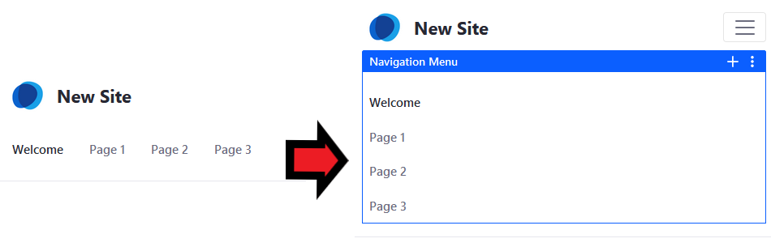
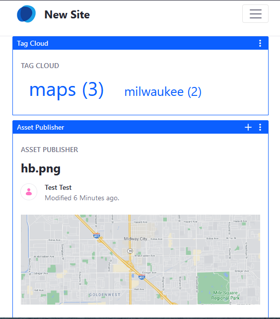
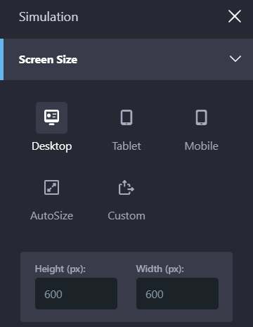

# Building a Responsive Site Overview

More than half of all page views in the world come from mobile devices like phones and tablets. Any site should look as good when viewed by a mobile device as it does on a desktop. Liferay DXP can help you provide the best experience possible no matter what device visits your site.

Out-of-the-box, Liferay uses responsive layouts: 

* DXP widgets and custom widgets that use Liferay's UI frameworks automatically scale to fit the screen size.

    

* UI elements like the navigation and Product Menu automatically adjust to remain usable on smaller screens.

    

* When the screen width is low, Liferay combines columns so that all content remains legible.

   

* For web developers, theme tools help ensure optimum mobile performance.

If you're using the default theme, all you need to do to display pages on mobile devices is create a page. There are also tools to verify that everything displays as intended. The Device Simulator () shows you how pages look on different devices.

## Using the Device Simulator

When creating a page or reviewing a page before it is published, you should test it using the Device Simulator found in the top right corner of every page. The simulator shows you the current page in a number of resolutions based on different display types. There are three predefined options:

**Desktop:** Fixes the width to display the page at full size.

**Tablet:** Puts your page in a tablet-sized box. 

**Mobile:** Puts your page in a smartphone-sized box.

There are also two options available to display:

**AutoSize:** Shrinks and grows the page based on the width of the browser window.

**Custom:** Enter a specific size for testing your page.

Because modern mobile browsers are built on the same technology as desktop browsers, the behavior you see in the simulator should match the experience of those on mobile devices. In addition to making sure the layout looks good and that all functionality remains, it's also important to make sure that automatic features---like how columns are combined at lower resolutions---don't have unintended effects.

## Designing Mobile Friendly Pages

Building pages that provide a good experience across all kinds of devices still means working across all levels of web development and publishing. Theme developers must create themes that use Liferay's frameworks to scale content well across all kinds of displays. Designers must have multiple screen sizes in mind when designing pages. And before anything is published, it must be thoroughly reviewed to make sure that it provides the best experience. 

## Creating Mobile Device Rules (7.2 only)

> Mobile Device Rules is available for Liferay 7.2 and prior only. Liferay Mobile Device Detection Lite is deprecated and removed in 7.3.

You can create mobile device rules that govern Site behavior on detection of a mobile device. There are many different devices, each with their own characteristics. To tell the difference between them, you need a way to find out the characteristics of the device. While some of the characteristics are provided by the device, most are not. For this reason, there are databases that contain information about thousands of devices. These databases make it possible to learn every detail about a device from the device type. Mobile Device Rules can connect to device databases so that you can use their device characteristics in your rules.

For more information on creating Mobile Device Rules (in Liferay 7.2 only), see [Creating Mobile Device Rules](./creating-mobile-device-rules.md).
