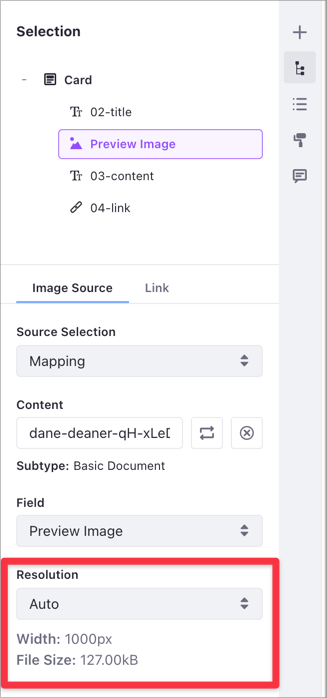

# Building Responsive Layouts with the Grid Fragment

> Availability: Liferay DXP 7.3+.

Liferay DXP [uses responsive design](./building-a-responsive-site.md) by default, but there are situations where you want additional and more granular control of the content layout. By using the [Grid Fragment](../../creating-pages/building-and-managing-content-pages/configuring-elements-on-content-pages.md#configuring-the-grid-fragment) in your Content Page, you gain precise control of the content layout for the different screen sizes in desktop and mobile devices. When you [edit a Content Page](../../creating-pages/building-and-managing-content-pages/adding-elements-to-content-pages.md), you can use the Grid Fragment (A) to outline your content and define customized layout styles (B) for the different target devices in the Device Display section (C). For example, you can customize the number of modules per row or the grid padding options for smartphone-size screens only.


Consider the following example. The Services section of your insurance company website provides potential customers an overview of the services you offer. This section uses a series of Card Fragments (A) inside a three-modules Grid Fragment (B), with information for three different services.


When you access this 'Services' Content Page from your computer, the grid layout shows the expected result. However, when you access the page from your smartphone, the result is not optimal because of the amount of text on each Card Fragment (C) and the grid's padding size (D). Using the Grid Fragment Styles, you can customize the number of cards to show on each module and modify styles for the best viewing experience on different screen sizes.


## Modifying the Layout of the Grid Fragment

1. Open and [edit your Content Page](../../creating-pages/building-and-managing-content-pages/adding-elements-to-content-pages.md) (or create a new [Content Page](./../../creating-pages/adding-pages/adding-a-page-to-a-site.md)).
1. [Configure the Grid Fragment](../../creating-pages/building-and-managing-content-pages/configuring-elements-on-content-pages.md#configuring-the-grid-fragment) on the Content Page.
1. In the Editing sidebar, click *Selection* and click the Grid Fragment you want to customize.
1. In the Device Display section of the Editing Toolbar, select the screen size you want to optimize.

    

1. In the Editing Sidebar, under the *Styles* column, select the preferred layout options for the screen size. For example, one module per row works much better for the *Portrait Phone* layout option.
1. Configure the image *Resolution* for the target screen size (available in Liferay DXP 7.4+), or leave the default *Auto* option to use [Adaptive Media](../../../content-authoring-and-management/documents-and-media/publishing-and-sharing/serving-device-and-screen-optimized-media/how-adaptive-media-works.md) .

    

1. Click *Publish*.
1. Optionally, click the *Simulation* () button on the main toolbar to see your changes on the target device.

    

```tip::
    You can save and reuse the Grid Fragment configuration of your choice in other Content Pages. For more information, see `Saving a Fragment Composition <../../displaying-content/using-fragments/saving-a-fragment-composition.md>`_.
```

## Additional Information

- [Building a Responsive Site Overview](./building-a-responsive-site.md)
- [Creating Content Page Compositions Using the Container Fragment](../../creating-pages/building-and-managing-content-pages/creating-content-page-compositions-using-the-container-fragment.md).
- [Configuring the Grid Fragment](../../creating-pages/building-and-managing-content-pages/configuring-elements-on-content-pages.md#configuring-the-grid-fragment)
- [Saving a Fragment Composition](../../displaying-content/using-fragments/saving-a-fragment-composition.md)
