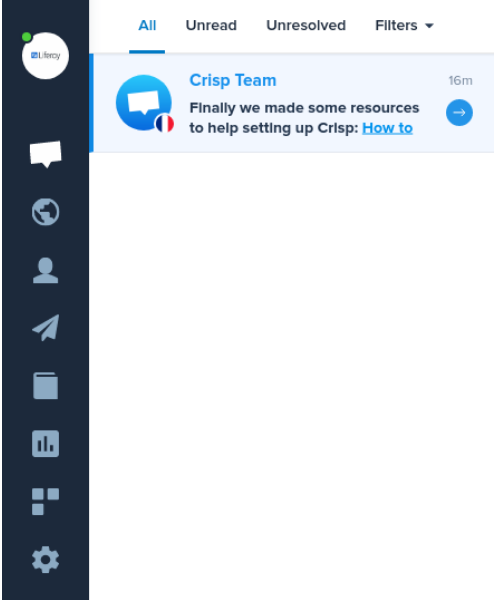
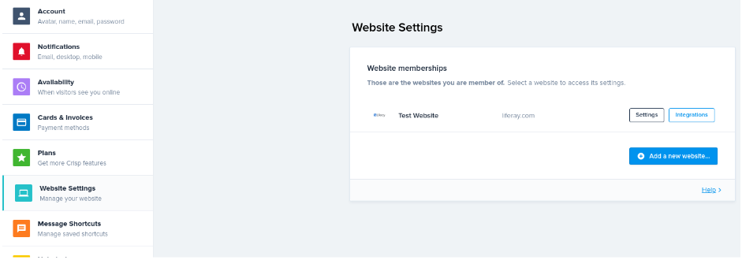
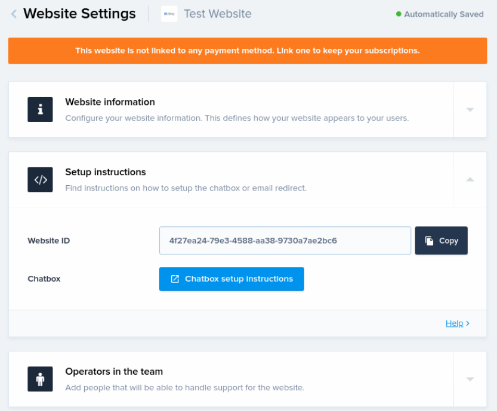

# Crisp

1. Once in the *Crisp* account dashboard, click on the *gear icon* on the side navigation bar. 

1. In the settings menu, click on *Website Settings* and choose which website you want to connect to, then click on *Settings*.

1. In this final step, expand *Setup instructions* and you shall see your Website ID. This is your Chat Provider Account ID for Crisp, now copy it to your Portal Instance Click to Chat Settings. 

