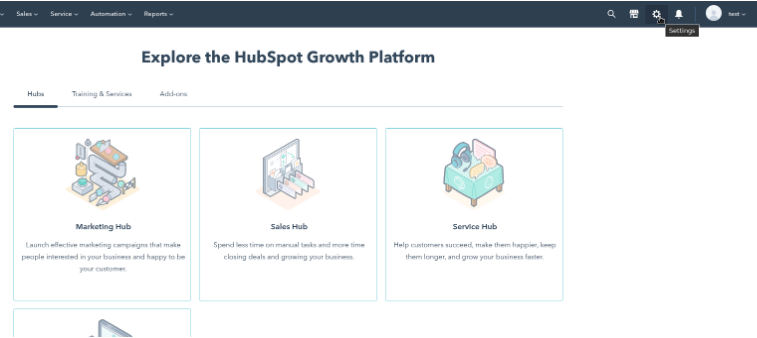
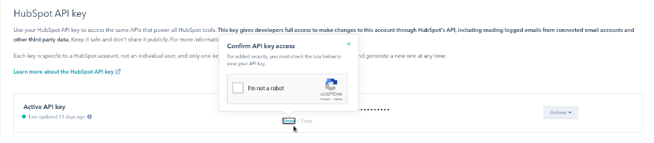

# Hubspot

For Hubspot you need two tokens, the chat provider token and the hubspot API Token.

 ### 1. **Chat Provider Token:**

On your home page, go to your profile name on the top right corner, select the *id-token* of the channel and add it to Liferay Portal.

  

### 1.2 **Hubspot API TOKEN**

On your Hubspot homepage, click the *Settings* button on the right top corner.

  

Click on the dropdown *Integrations* on the Account Setup section on the left side of the page. And click on the *Api key* button inside the dropdown.

  

See that your Api key is hidden by a security pattern. Click on the *show* button and pass the reCaptcha test to know your key and get access to it. (At the first time on this page you need to generate that key, just agree with the terms and conditions and pass the reCaptcha test when necessary).

  
