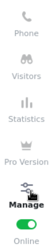
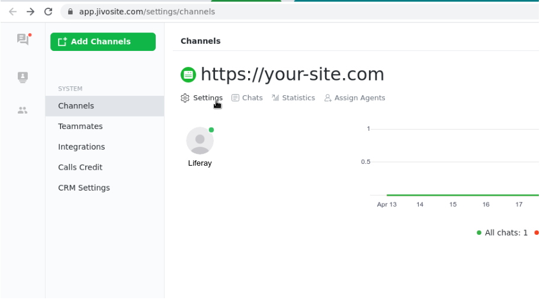
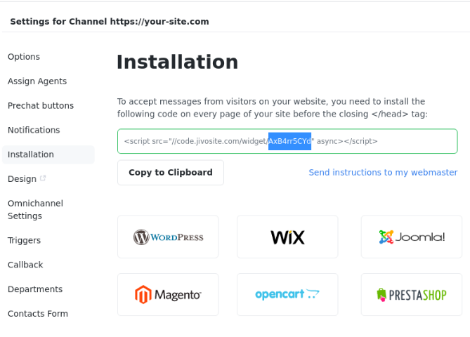

# Jivochat

1. On your *Jivochat* dashboard home, after configuring a channel, click on the *Manage* button on the left corner.

    

1. On the left top corner, inside your channel infos, click on *Settings*. 

    

1. Click on *installation* on the list on the left side of the page. Copy the token info after the Widget as you see above (without the quote marks).

    
