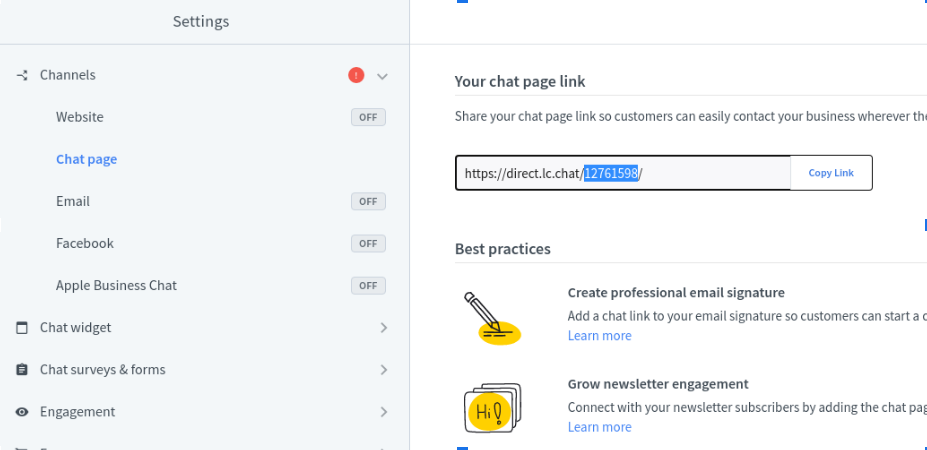

# LiveChat

1. On your *LiveChat* dashboard go to Settings by clicking on the *gear icon* on the left bottom corner. 
    

1. Click on *chat page*; under the channels expanded menu as shown below. 
    

1. Once you are under Chat Page settings, copy only the highlighted code. This is your Chat Provider Account ID for LiveChat, now copy it to your Portal Instance Click to Chat Settings. 
    
