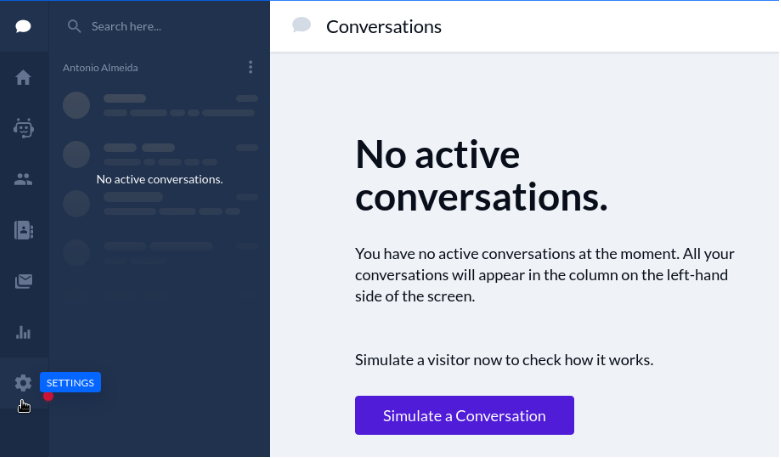
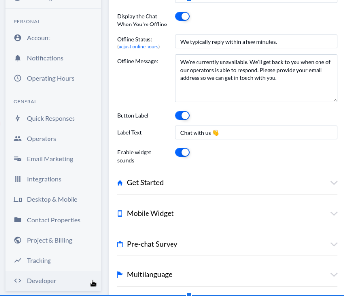
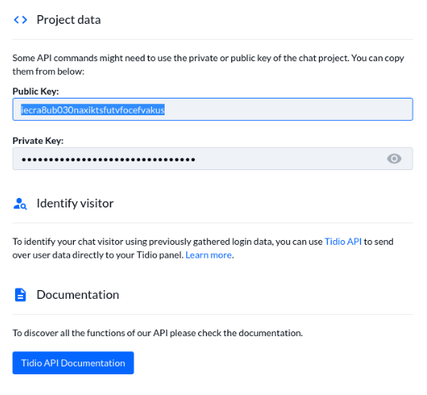

# Tidio

1. On your Tidio account home dashboard, go to the Settings Menu by clicking the *gear icon* on the left side navigation.

    

1. On the Settings Menu click on *Developer* under General.
  
    

1. Your Tidio key is under Public Key. This is your Chat Provider Account ID for Tidio, now you can copy it to your Portal Instance Click to Chat Settings.
  
    

