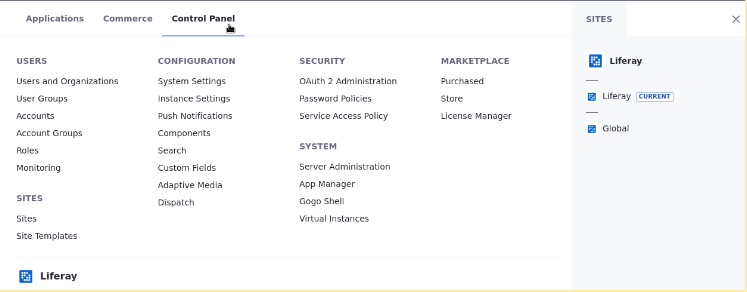
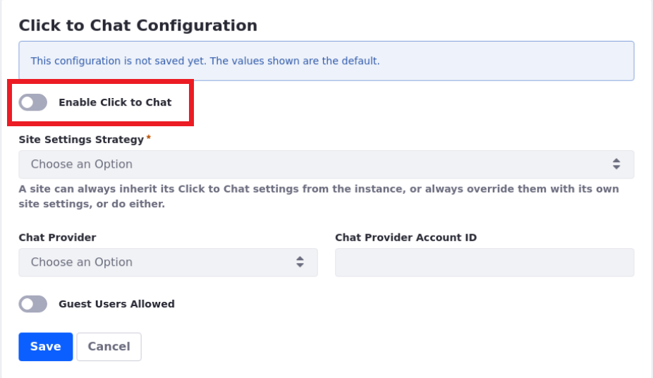
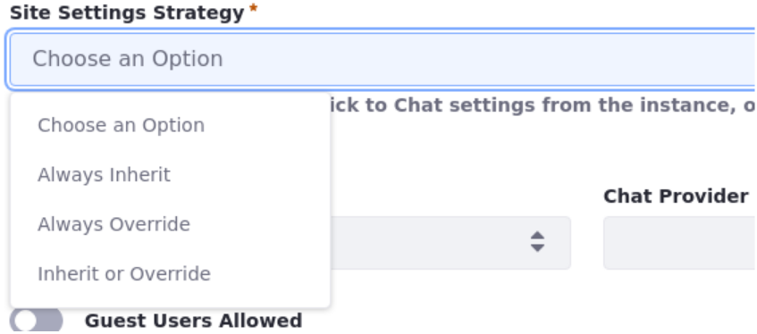
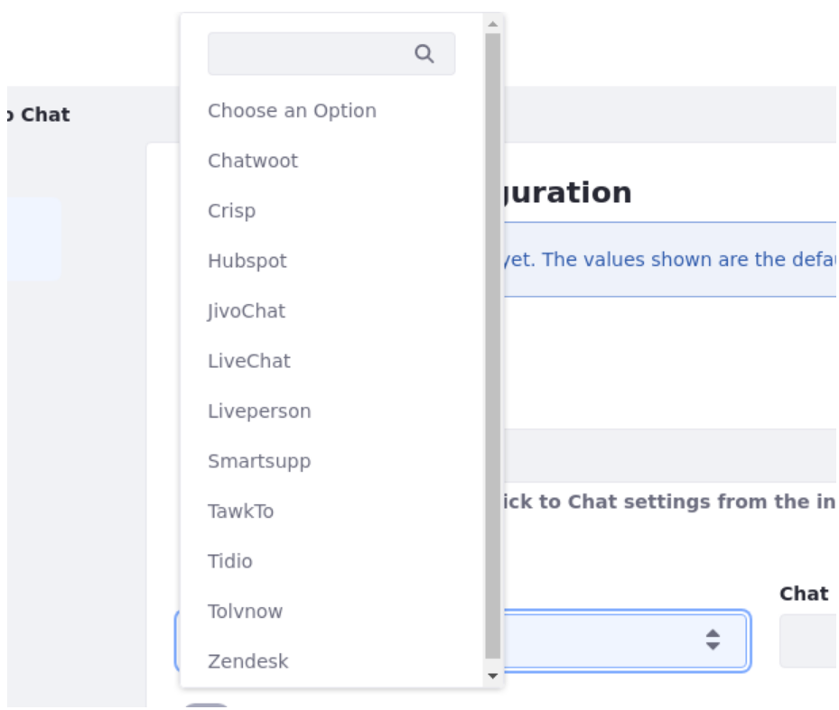

# Enabling Automated Live Chat Systems

 > Available: Liferay Portal 7.4 GA2+ 

Liferay now offers integration with a number of live support chat platforms. Enabling this integration adds a chat window to sites on your Liferay instance and can be used to enable improved support and site experience for your users.

## Enabling Click To Chat

To enable Click To Chat go to *Instance Settings*.

1. Go to the *Global Menu* () &rarr; *Control Panel* &rarr; *Instance Settings*.

    

1. Under the *Content and Data* section, click *Click To Chat*.

    

1. To enable Click to Chat for your instance, switch the *Enable Click to Chat* toggle.

    

1. Once enabled, you must select a [Site Settings](../../site_settings.html) Strategy. Your Site Settings strategy determines how Click to Chat is enabled across sites that exist on a given [Liferay instance](../../../system-administration/configuring-liferay/virtual-instances/understanding-virtual-instances.md).

    

   **Always Inherit**: Click To Chat is enabled for all sites on the instance and ignores configurations made in Site Settings.

   **Always Override**: Configuration for Click to Chat configured in Site Settings always takes priority over configurations made in Instance Settings.

   **Inherit or Override**: Sites inherit configuration from Instance Settings, unless configured otherwise in the site's Site Settings.

1. Select your chat provider and input the [Account ID or token](#getting-the-chat-provider-account-id-or-token) given to you by your Chat Provider.

    

1. (Optional) Click the *Guest Users Allowed* toggle to configure whether you want guest users (unauthenticated users) to have access to the Click to Chat feature for your sites.

1. Click *Save*.

Click To Chat integration with your live chat provider is now configured.

## Getting The Chat Provider Account ID or Token

If you are unsure how to get the Account ID or Token for your chat provider see the following articles for available Chat Providers:

* [Chatwoot](./getting-a-chat-provider-account-id/chatwoot.md)
* [Crisp](./getting-a-chat-provider-account-id/crisp.md)
* [Hubspot](./getting-a-chat-provider-account-id/hubspot.md)
* [Jivochat](./getting-a-chat-provider-account-id/jivochat.md)
* [LiveChat](./getting-a-chat-provider-account-id/livechat.md)
* [LivePerson](./getting-a-chat-provider-account-id/liveperson.md)
* [Smartsupp](./getting-a-chat-provider-account-id/smartsupp.md)
* [Tawk.to](./getting-a-chat-provider-account-id/tawk-to.md)
* [Tidio](./getting-a-chat-provider-account-id/tidio.md)
* [Zendesk](./getting-a-chat-provider-account-id/zendesk.md)
