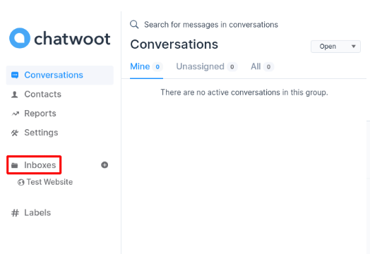
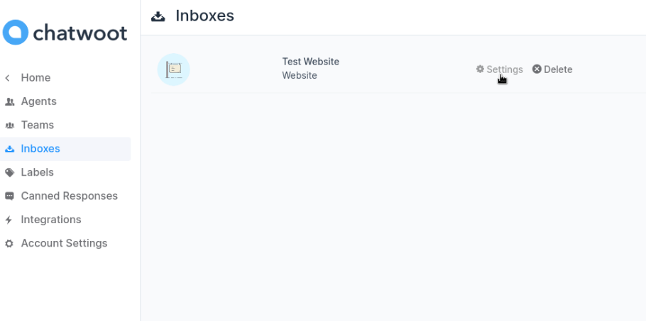
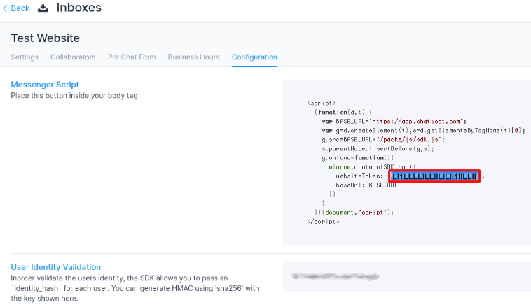

# Chatwoot

[Chatwoot](https://www.chatwoot.com/) is an open-source customer communication platform. This article documents how to locate your Chatwoot account ID in order to [enable integration](../enabling-automated-live-chat-systems.md) with your Liferay instance.

## Locating your Chatwoot Account ID

1. Log in to your [Chatwoot account](https://app.chatwoot.com/app/login).

1. Click *Inboxes* on the side navigation bar.

    

1. Click *Settings* to view Inbox configurations.

    

1. Click the *Configuration* menu tab. 

    Look for the field value for `websiteToken`. The value is highlighted in the screenshot and can be used as the Chat Provider Account ID to [enable automated live chat integration](../enabling-automated-live-chat-systems.md) with your Liferay instance.

    