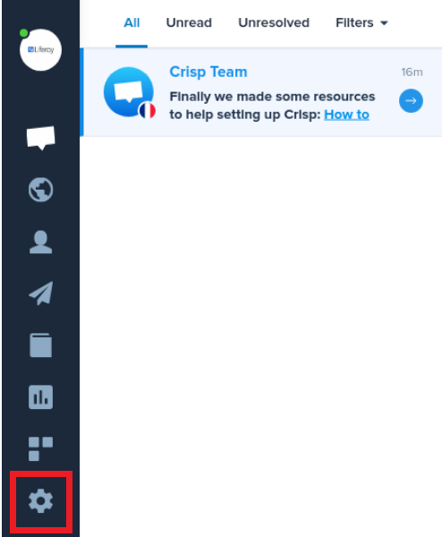
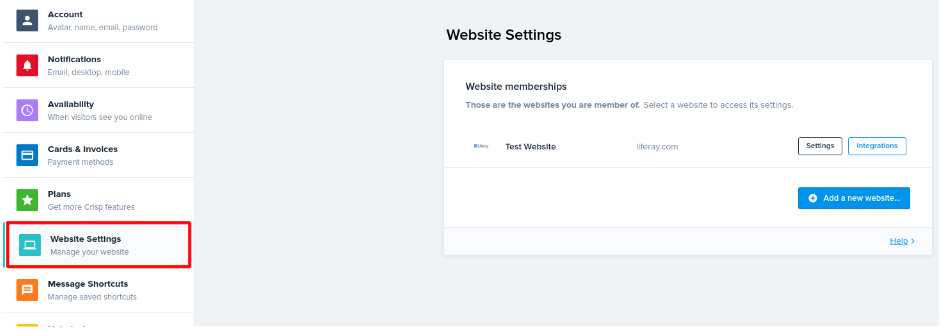
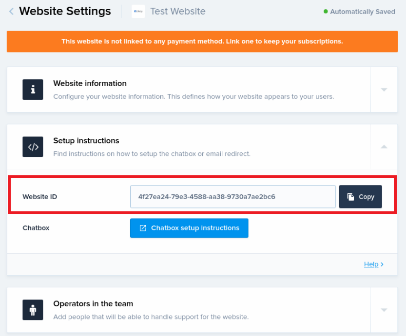

# Crisp

[Crisp](https://crisp.chat/) is a multi-channel messaging platform. This article documents how to locate your Crisp account ID in order to [enable integration](../enabling-automated-live-chat-systems.md) with your Liferay instance.

## Locating your Crisp Account ID

1. Log in to your [Crisp account](https://app.crisp.chat/initiate/login/).

1. Click the *Cog* in side navigation bar to access your Crisp account settings.

    

1. Click *Website Settings*, choose which website you want to connect to your Liferay instance, and click on *Settings*.

    

1. Click *Setup instructions*.

   Look for the Website ID field. The value provided, highlighted in the screenshot, can be used as the Chat Provider *Account ID* to [enable automated live chat integration](../enabling-automated-live-chat-systems.md) with your Liferay instance.

    